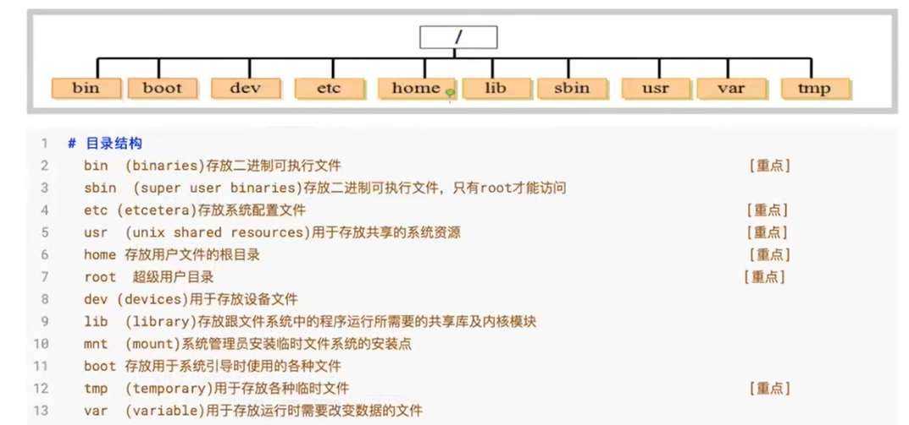
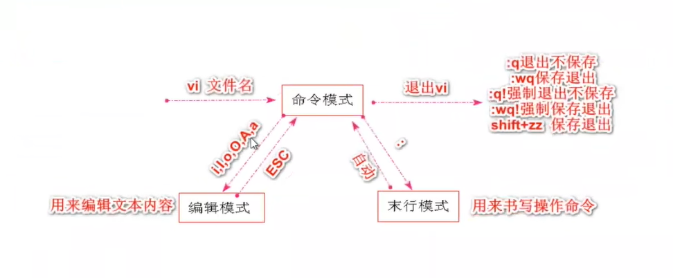

## Linux中目录结构



## 命令

 > 严格区分大小写

> 语法:命令 [-选项] [参数]

#### ls命令

```markdown
#ls 显示文件和目录列表(list)
常用参数
-l(long) 长格式显示文件和目录信息
-a(all)  显示所有文件和目录(包含隐藏文件和目录)
-R       递归显示指定目录下的文件清单，即会显示指定目录分支内各子目录的文件清单
```

> 命令能组合使用  ls -la 指定目录 查看当前目录中所有文件和目录详细信息

> 切换目录:cd 切换的目录
> pwd 显示当前所在目录
> cd/root(cd ~)(cd) 回到用户的家目录

#### 操作文件命令

```markdown
# 0.cd用来切换目录
# 1.pwd 显示当前工作目录(print working directory)
# 2.touch 创建空文件 
	touch a.txt b.txt
# 3.mkdir 创建目录(make directoriy)
	-p父目录不存在情况下先生成父目录(parents)  mkdir -p a/b/c    mkdir test
# 4.cp复制文件或目录(copy)
	cp 文件名 目录 		复制文件到指定目录中  cp a.txt test/
	cp -r 目录名 目录    复制指定目录到指定目录中  cp -r test/ a/b/c/
	-r递归处理，将指定目录下的文件与子目录-并拷贝(recursive)
# 5.mv移动文件或目录、文件或目录改名(move)
	mv 旧文件名 新文件名 	 文件改名
	mv 文件名 目录名 	      文件移动
	mv 目录名 不存在目录名   目录改名
	mv 目录名 已存在目录名   目录移动
# 6.rm 删除文件(remove)
	-r 同时删除该目录下的所有文件(recursive)
	-f 强制删除文件或目录(force)
# 7.rmdir删除空目录(remove directoriy)
# 8.cat 显示文本文件内容(catenate)  用来展示少量内容
# 9.more、less 分页显示文本文件内容
# 10.head、 tail查看文本中开头或结尾部分的内容
	head -n 5 a.log 查看a.log文件的前5行
# 11.tail -f b.1og 循环读取(fellow)
# 12.echo输出命令
	echo I love baby       				说明:用来向屏幕输出一句话
	echo I Love baby >> aa. txt			说明:将这段内容输入到文件中
```

#### 网络相关命令

````markdown
# 1.ip addr(ip a)查看IP地址
# 2.ping 测试网络连通性
ping 192.168.0.1
````

#### tar命令

````markdown
# tar命令
	-c 建立一个压缩文件的参数指令(create)
	-x 解开一个压缩文件的参数指令(extract)
	-z 是否需要用gzip 压缩
	-v 压缩的过程中显示文件(verbose)
	-f 使用档名，在f之后要立即接档名(file)
`通常组合使用:`
	tar -cvf aaa.tar file1.txt file2.txt		将file1和2打包成aa.tar
	tar -zcvf aaa.tar.gz file1.txt file2.txt	将file1和2打包成aa.tar并压缩
	tar -zxvf aaa.tar.gz file1.txt file2.txt	将aa.tar.gz解压
	
	tar -zxvf aaa.tar.gz -C 想解压到的目录
````

#### systemctl服务命令

````markdown
# systemctl system controll
	systemctl status 服务名  	说明:查看某个服务的运行状态
	systemctl start 服务名		说明:启动某个服务
	systemctl restart 服务名	说明:重启某个服务
	systemctl stop 服务名		说明:停止某个服务
````

#### 进程相关命令

````markdown
# 1.ps询在当前控制台上运行的进程
	ps -aux		说明:查询系统中所有运行的进程，包括后台进程，其中参数a是所有进程，参数x包括不占用控制台的进程，参数u显示用户。
	ps -ef		说明:查询系统中所有运行的进程，包括后台进程，而且可以显示出每个进程的父进程号。
	ps -aux|grep 进程/服务名
	grep命令是查找
	中间的|是管道命令 是指ps命令与grep同时执行
# 2.top命令动态显示系统进程
# 3.kill 杀死进程
	kill 3029 说明:上述命令中3029是进程号; 一般在执行kill命令之前，先用ps或pstree来查询一下将 要被杀掉的进程的进程号。
	kill -9 3029 说明:强制终止3029号进程的运行，其中参数-9代表强制的意思,实际上kill命令是向该进程发送信号，该进程接到信号后决定是否停止运行，有些守护进程必须要收到参数9才终止运行。
````

#### vi命令

````markdown
# vi / vim是Unix / Linux上最常用的文本编辑器而且功能非常强大。
````



````markdown
# 常用命令:
	i			在光标前插入
	I			在光标当前行开始插入
	a			在光标后插入
	A			在光标当前行末尾插入
	o			在光标当前行的下一-行插入新行
	O			在光标当前行的上一行插入新行
	----------------重点---------------------------
	:set nu		显示行号-末行模式
	:set nonu 	取消行号-末行
	gg			到文本的第一行
	G			到文本的最后一行
	:n			到文本的第n行
	----------------重点---------------------------
	u			undo,取消上一步操作
	Ctrl + r	redo,返回到undo之前
	----------------重点---------------------------
	Shift+ zz	保存退出，与":wq"作用相同
	:q			退出不保存
	:q!			强制退出不保存
	:wq			保存退出
	:wq!		强制保存退出
	
	
	查找
	输入斜杠"/"，这时屏幕会跳转到底部，输入栏出现"/"
	输入需要查找的关键字，回车键
	如果要继续查找下一个关键字，输入n
    查找上一个关键字，输入N（大写）
````

#### 软件相关命令

##### RPM命令

> RPM是RedHat Package Manager (RedHat软件包管理工具)的缩写，这一文件格式名称虽然打上了RedHat的标志，但是其原始设计理念是开放式的，现在包括RedHat、CentOS、 SUSE等Linux的分发版本都有采用，可以算是公认的行业标准了。RPM文件在Linux系统中的安装最为简便

````markdown
# rpm命令
	常用参数:
	i:安装应用程序(install)
	e:卸载应用程序(erase)
    vh:显示安装进度; (verbose hash)
	U:升级软件包; (update)
	qa:显示所有已安装软件包(query a1l)
	例子: rmp -ivh gcc-c++-4.4.7-3.el6.x86_64.rpm
````

##### YUM命令

> Yum (全称为Yellow dog Lbdater, Modified) 是一个在Fedora和RedHat以及SUSE、 Cent0S中的Shell前端软件包管理器。基於RPM包管理，能够从指定的服务器自动下载RPM包并且安装，可以自动处理依赖性关系，并且一次安装所有依赖的软件包，无须繁琐地一次次下载、安装。

````markdown
	yum install gcc-c++ 
	yum remove gcc-c++
	yum update gcc-C++
	yum install|remove|update 依赖名称
	使用YUM命令必须连接外部网络
````

#### 用户和组相关命令

````markdown
# 1.查看当前用户: whoami
# 2.查看登录用户: who 
	-m或am I只显示运行who命令的用户名、登录终端和登录时间
	-q或--count只 显示用户的登录账号和登录用户的数量
# 3.退出用户:
	exit
# 4.添加、删除组账号: groupadd、 groupdel
# 5.添加用户账号: useradd
	-g 指定组名称 说明:如果创建用户的时候，不指定组名，那么系统会自动创建一个和用户名一样的组名。
# 6.设置用户密码: passwd [用户名]
# 7.su切换用户
	sU root
````

#### 权限相关命令

> Linux文件有三种典型的权限，即r读权限、 w写权限和x执行权限。在长格式输出中在文件类型的后面有9列权限位，实际上这是针对不同用户而设定的。r=4, w=2, x=1

````markdown
# chmod
	字母法: chmod u/g/0/a +/-/= rwx文件
	[ u/g/o/a ]含义
	u user		表示该文件的所有者
	g group 	表示与该文件的所有者属于同一组( group )者，即用户组
	o other 	表示其他以外的人
	a all 		表示这三者皆是
	[ +-=]含义   增加权限
撤销权限
=
设定权限
rWx含义
r
read表示可读取，对于一一个目录，如果没有r权限，那么就意味着不能通过1s查看这个目录的内容。
W
write表示可写入，对于一一个目录，如果没有w权限，那么就意味着不能在目录下创建新的文件。
X
excute表示可执行，对于一一个目录，如果没有x权限，那么就意味着不能通过cd进入这个目录。

````

#### 虚拟机配置Linux系统中网络

```
开启centos自动ip获取：vi /etc/sysconfig/network-scripts/ifcfg-ens33
ONBOOT=yes
加载配置生效:1.重启linux 2.重启network
```

## 软件安装

### JDK

#### tar安装

````markdown
# 1.文件上传至linux
# 2.将tar.gz移动/复制到/usr目录下
	mv jdk.tar.gz /usr
# 3.进入、/usr目录，解压缩文件
	cd /usr
	tar -zxvf jdk.tar.gz
# 4.配置全局环境变量
	jdk home目录:/usr/jdk
	vi /etc/profile		文件末尾添加配置
	export JAVA_HOME=/usr/jdk
	export PATH=$PATH:$JAVA_HOME/bin
# 5.让系统重新加载profile
	source /etc/profile
````

#### rpm安装

```markdown
rpm -ivh jdk.rpm  会有一个临时环境变量
搜索rpm安装的jdk位置
	whereis java
	find /(目录) -name java
	默认目录:/usr/java/jdk
配置全局环境变量
...
```

> yum install vim 有语法高亮
>
> 查看：java -version

### Tomcat

```markdown
启动
进入bin目录
	./startup.sh
	
关闭防火墙（不会开机自启动）
	systemctl disable firewalld
	
jps:查看与java有关进程的启动状况
```

### Mysql

#### 环境准备

````markdown
# 1.卸载mariadb,否则安装mysql会出现冲突
	rpm -qa|grep mariadb
	rpm -evh 卸载mariadb-libs-5.5.68-1.el7.x86_64
	(rpm -evh --nodeps mariadb-libs-5.5.68-1.el7.x86_64 只卸载mariadb，不卸载依赖)
````

#### 在线安装

````markdown
# 1.添加官方的yum源创建并编辑mysq1-community.repo文件
vi /etc/yum.repos.d/mysql-community.repo
# 2.粘贴以下内容到源文件中
[mysql56-community]
name=MySQL 5.6 Community Server
baseurl=https://repo.mysql.com/yum/mysql-5.6-community/el/7/$basearch/
enabled=1
gpgcheck=0
gpgkey=file:///etc/pki/rpm-gpg/RPM-GPG-KEY-mysql
	顶格粘贴，前面不要有空格
	注意:如果需要安装mysq15.7只需要将baseur1修改即可
baseurl=http://repo.mysql.com/yum/mysql-5.7-community/el/7/Sbasearch/
# 3.安装mysq1
sudo yum install -y mysql-community-server
````

#### 设置root用户密码

````markdown
# 1.启动mysq1数据库
	[root@localhost mysq1]# systemctl start mysqld

# 2.修改mysq1数据库密码
	mysqladmin -u root -p password 回车输入原始密码在输入新的密码
	注意:5.7之前版本安装完成之后没有密码, mysq15.7之后的版本的初始密码是随机生成的，放在了/var /log/mysqld.log
	使用命令grep 'temporary password' /var/1og/mysqld.log读出来即可
# 3.登录mysql
	[root@localhost mysq1]# mysql -u root -p
````

安装完mysql，mysql数据库不允许远程连接，需要修改配置

````markdown
登录mysql
use mysql
select user,password,host from user;
grant all privileges on *.* to 'root'@'%' identified by '123456'//密码 with grant option;
flush privileges;刷新权限
````


