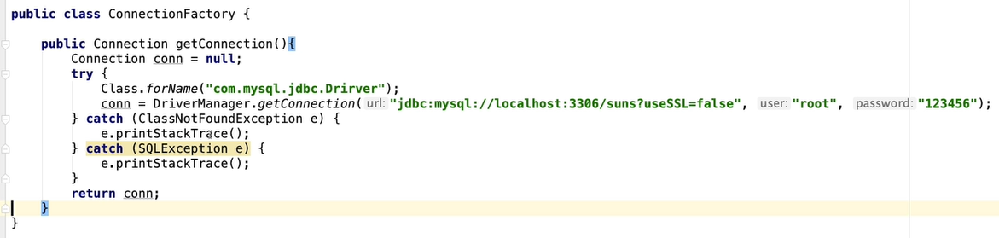

# Spring

## 一、 介绍

### 1.什么是Spring

````markdown
	Spring是一个轻量级的JavaEE解决方案,整合众多优秀的设计模式
````

- 轻量级

````markdown
	1、对于运行环境没有额外要求
	2、代码移植性高
````

- JavaEE解决方案


### 2.设计模式

````markdown
	1.广义概念
	面向对象设计中，解决特定问题的经典代码
	2．狭义概念
	GOF4人帮定义的23种设计模式:工厂、适配器、装饰器、门面、代理、模板...
````

### 3.工厂设计模式

#### 3.1什么是工厂设计模式

````markdown
	1.概念:通过工厂类创建对象
	UserDao userDao = new UserDaoImpl();
	
	好处:解耦合
	
	耦合:指的是代码间的强关联关系，一方的改变会影响到另一方
	问题:不利于代码维护
````

### 3.2 通用工厂设计


````markdown
	定义类型(类)
	通过配置文件的配置告知工厂( applicationContext.properties)
	key = value
	通过工厂获得类的对象
	Object ret = BeanFactory.getBean( "key" )
````

### 4.Spring核心API

- ApplicationContext

````markdown
	作用:Spring提供的ApplicationContext这个工厂，用于对象的创建
	好处:解耦合
````

- ApplicationContext接口类型

````markdown
	接口:屏蔽实现的差异
	非web环境:classPathXmlApplicationContext (main junit)
	web环境:XmlWebApplicationContext
````

- 重量级资源

````markdown
	ApplicationContext工厂的对象占用大量内存。
	不会频繁的创建对象∶一个应用只会创建一个工厂对象。
	ApplicationContext工厂:一定是线程安全的(多线程并发访问)
````

### 5.程序开发

```xml
<!--
配置HelloWorld所对应的bean，即将HelloWorld的对象交给Spring的IOC容器管理
通过bean标签配置IOC容器所管理的bean
属性：
id：设置bean的唯一标识
class：设置bean所对应类型的全类名
-->
<bean id="helloworld" class="HelloWorld"></bean>
```

```java
@Test
public void testHelloWorld(){
ApplicationContext ac = new
ClassPathXmlApplicationContext("applicationContext.xml");
HelloWorld helloworld = (HelloWorld) ac.getBean("helloworld");
helloworld.sayHello();
}
```

### 6.获取bean

#### ①方式一：根据id获取

由于 id 属性指定了 bean 的唯一标识，所以根据 bean 标签的 id 属性可以精确获取到一个组件对象。 

#### ②方式二：根据类型获取

```java
@Test
public void testHelloWorld(){
ApplicationContext ac = new
ClassPathXmlApplicationContext("applicationContext.xml");
HelloWorld bean = ac.getBean(HelloWorld.class);
bean.sayHello();
}
```

#### ③方式三：根据id和类型

```java
@Test
public void testHelloWorld(){
ApplicationContext ac = new
ClassPathXmlApplicationContext("applicationContext.xml");
HelloWorld bean = ac.getBean("helloworld", HelloWorld.class);
bean.sayHello();
}
```

#### ④注意

当根据类型获取bean时，要求IOC容器中指定类型的bean有且只能有一个

```xml
//报错,无法确定HelloWord类对应的是哪个Bean  报异常:NoUniqueBeanDefinitionException
<bean id="helloworldOne" class="HelloWorld"></bean>
<bean id="helloworldTwo" class="HelloWorld"></bean>
```

#### ⑤扩展

如果组件类实现了接口，根据接口类型可以获取 bean 吗？//ac.getBean(Person.class) Student implements Person

可以，前提是bean唯一

如果一个接口有多个实现类，这些实现类都配置了 bean，根据接口类型可以获取 bean 吗？

不行，因为bean不唯一

#### ⑥结论

根据类型来获取bean时，在满足bean唯一性的前提下，其实只是看：『对象 instanceof指定的类型』的返回结果，只要返回的是true就可以认定为和类型匹配，能够获取到。

### 7.Spring工厂的底层实现原理(简易)


## 二、注入(Injection)

### 1.什么是注入

````markdown
	通过Spring工厂及配置文件，为所创建对象的成员变量赋值
````

#### 1.1 为什么需要注入


### 2.Spring注入原理(简易)


### 3.Set注入

Spring通过底层调用对象属性对应的set方法，完成成员变量的赋值，这种方式我们也称之为set注入

````xml
<!-- property标签：通过组件类的setXxx()方法给组件对象设置属性 -->
<!-- name属性：指定属性名（这个属性名是getXxx()、setXxx()方法定义的，和成员变量无关）-->
<!-- value属性：指定属性值 -->
````


#### 3.1 JDK内置类型

String+8种基本数据类型

````xml
<value>Tom</value>
````

数组

````markdown
<list>
<value>suns@zparkhr.com.cn</value>
<value>liucy@zparkhr.com.cn</value>
<value>chenyn@zparkhr.com.cn</value>
</list>
````

set集合

````markdown
<set>
<value>asdfbgg</value>
<value>23456ty</value>
<value>lkijuytgf</value>
</set>
````

map集合

````markdown
<map>
<entry>
<key><value>10010</value></key>
<ref bean="teacherOne"></ref>
</entry>
<entry>
<key><value>10086</value></key>
<ref bean="teacherTwo"></ref>
</entry>
</map>
````

#### 3.2 用户自定义类型


#### 3.3 set注入简化


#### 3.4 p命名空间


### 4.构造注入

````java
//提供有参构造
public Student(Integer id, String name, Integer age, String sex) {
this.id = id;
this.name = name;
this.age = age;
this.sex = sex;
}
````

```xml
<bean id="studentTwo" class="Student">
<constructor-arg value="1002"></constructor-arg>
<constructor-arg value="李四"></constructor-arg>
<constructor-arg value="33"></constructor-arg>
<constructor-arg value="女"></constructor-arg>
</bean>
```

注意：
constructor-arg标签还有两个属性可以进一步描述构造器参数：
index属性：指定参数所在位置的索引（从0开始）
name属性：指定参数名

#### 4.1构造方法重载


### 5.特殊值处理

#### null值

```xml
<property name="name">  <null />  </property>
```

注意：

```xml
<property name="name" value="null"></property>
```

以上写法，为name所赋的值是字符串null

#### xml实体

```xml
<!-- 小于号在XML文档中用来定义标签的开始，不能随便使用 -->
<!-- 解决方案一：使用XML实体来代替 -->
<property name="expression" value="a &lt; b"/>
```

#### CDATA节

```xml
//<![CDATA[...]]>
<property name="expression">
<!-- 解决方案二：使用CDATA节 -->
<!-- CDATA中的C代表Character，是文本、字符的含义，CDATA就表示纯文本数据 -->
<!-- XML解析器看到CDATA节就知道这里是纯文本，就不会当作XML标签或属性来解析 -->
<!-- 所以CDATA节中写什么符号都随意 -->
<value><![CDATA[a < b]]></value>//快捷键大写CD
</property>
```

CDATA节是xml中的一个特殊的标签，因此不能卸载一个属性种。CDATA节其中的内容会原样解析

#### 级联属性赋值

````markdown
<bean id="studentFour" class="Student">
<property name="id" value="1004"></property>
<property name="name" value="赵六"></property>
<property name="age" value="26"></property>
<property name="sex" value="女"></property>
<!-- 一定先引用某个bean为属性赋值，才可以使用级联方式更新属性 -->
<property name="clazz" ref="clazzOne"></property>
<property name="clazz.clazzId" value="3333"></property>
<property name="clazz.clazzName" value="1班"></property>
</bean>
````


## 三、IOC(反转控制)和DI(依赖注入)

### IOC容器在Spring中的实现

Spring 的 IOC 容器就是 IOC 思想的一个落地的产品实现。IOC 容器中管理的组件也叫做 bean。在创建 bean 之前，首先需要创建 IOC 容器。Spring 提供了 IOC 容器的两种实现方式：

##### ①BeanFactory

这是 IOC 容器的基本实现，是 Spring内部使用的接口。面 向Spring本身，不提供给开发人员使用。

##### ②ApplicationContext

BeanFactory 的子接口，提供了更多高级特性。面向 Spring 的使用者，几乎所有场合都使用 ApplicationContext 而不是底层的 BeanFactory。

##### ③ApplicationContext的主要实现类

| 类型名                          | 简介                                                         |
| ------------------------------- | ------------------------------------------------------------ |
| ClassPathXmlApplicationContext  | 通过读取类路径下的 XML 格式的配置文件创建 IOC 容器对象       |
| FileSystemXmlApplicationContext | 通过文件系统路径读取 XML 格式的配置文件创建 IOC 容器对象     |
| ConfigurableApplicationContext  | ApplicationContext 的子接口，包含一些扩展方法 refresh() 和 close() ，让 ApplicationContext 具有启动、 关闭和刷新上下文的能力。 |
| WebApplicationContext           | 专门为 Web 应用准备，基于 Web 环境创建 IOC 容器对象，并将对象引入存入 ServletContext 域中。 |

### 3.1 反转控制(Inversion of Control)

````markdown
	控制:对成员变量赋值的控制权
	反转控制:把对成员变量赋值的控制权，从代码中反转(转移)到Spring工厂和配置文件中完成
	好处：解耦合
	底层实现：工厂设计模式
````

### 3.2 依赖注入(Dependency Injection)

````markdown
	注入:通过Spring的工厂及配置文件，为对象(bean，组件)的成员变量赋值
	
	依赖注入:当一个类需要另一个类时，就意味着依赖，一旦出现依赖，就可以把另一个类作为本类的成员变量，最终通过Spring配置文件进行注入(赋值)
	
	DI 是 IOC 的另一种表述方式：即组件以一些预先定义好的方式（例如：setter 方法）接受来自于容器的资源注入。
````


- IOC 就是一种反转控制的思想， 而 DI 是对 IOC 的一种具体实现

## 四、Spring创建复杂对象


什么是复杂对象

````markdown
	复杂对象:指的就是不能直接通过new构造方法创建的对象
	connection
	sqlSessionFactory
````

### Spring工厂创建复杂对象的三种方式

#### 4.1 FactoryBean接口

开发步骤

实现FactoryBean接口


spring配置文件配置

````markdown
<bean id="coon" class="com.test.ConnectionFactoryBean"></bean>
````

- 当把FactoryBean的实现类配置为bean时，会将当前类中getObject()所返回的对象交给IOC容器管理

通过这种机制，Spring可以帮我们把复杂组件创建的详细过程和繁琐细节都屏蔽起来，只把最简洁的使用界面展示给我们

- 细节

  如果就想获得FactoryBean类型的对象ctx.getBean("&conn")

  获得的就是ConnectionFactoryBean对象

-  isSingleton方法

  返回true只会创建一个复杂对象返回false每一次都会创建新的对象

  问题:根据这个对象的特点，决定是返回true (SqlSessionFactory)还是false (Connection)

**FactoryBean工作原理(简易)**

````xml
接口回调
1．为什么Spring规定FactoryBean接口实现并且 get0bject()?
2. ctx.getBean(" conn")获得是复杂对象Connection而没有获得ConnectionFactoryBean(&)

Spring内部运行流程
1．通过conn获得ConnectionFactoryBean类的对象，进而通过instanceof 判断出是FactoryBean接口的实现类2. Spring按照规定get0bject() ---> Connection
3．返回Connection
````


#### 4.2 实例工厂

````markdown
	避免Spring框架的侵入
	整合遗留系统
````

开发步骤

````xml
<bean id="connFactory" class="com.baizhiedu.factorybean.ConnectionFactory"></bean>
<bean id="conn" factory-bean="connFqctory" factory-method="getConnection" />
````



#### 4.3 静态工厂

````xml
<bean id="conn" class="com.baizhiedu.factorybean.StaticConnectionFactory" factory-method="getConnection"></bean>
````


## 五、Bean

### 5.1 bean的作用域

在Spring中可以通过配置bean标签的scope属性来指定bean的作用域范围，各取值含义参加下表：

| 取值              | 含义                                    | 创建对象的时机  |
| ----------------- | --------------------------------------- | --------------- |
| singleton（默认） | 在IOC容器中，这个bean的对象始终为单实例 | IOC容器初始化时 |
| prototype         | 这个bean在IOC容器中有多个实例           | 获取bean时      |

如果是在WebApplicationContext环境下还会有另外两个作用域（但不常用）：

| 取值    | 含义                 |
| ------- | -------------------- |
| request | 在一个请求范围内有效 |
| session | 在一个会话范围内有效 |

### 5.2 bean的生命周期

#### 5.2.1 什么是对象的生命周期

````markdown
	指的是一个对象创建、存活、消亡的一个完整过程
````

- 初始化阶段

````markdown
	Spring工广在创建完对象后，调用对象的初始化方法，完成对应的初始化操作
	1．初始化方法提供:程序员根据需求，提供初始化方法，最终完成初始化操作
	2．初始化方法调用:Spring工厂进行调用
````


- **细节**
  1. 如果一个对象即实现InitializingBean同时又提供的普通的初始化方法顺序

````markdown
    1. InitializingBean
    2．普通初始化方法
````

​		  2. 注入一定发生在初始化操作前

- 销毁阶段

````markdown
	Spring销毁对象前，会调用对象的销毁方法，完成销毁操作
	
	1. Spring什么时候销毁所创建的对象?
		ctx.close();
	2．销毁方法:程序员根据自己的需求，定义销毁方法，完成销毁操作
		调用:Spring工厂完成调用
````


- 销毁方法的操作只适用于scope="singleton"

### 5.3 具体的生命周期过程

- bean对象创建（调用无参构造器）

- 给bean对象设置属性(DI)
- bean对象初始化之前操作（由bean的后置处理器负责）
- bean对象初始化（需在配置bean时指定**初始化方法**）
- bean对象初始化之后操作（由bean的后置处理器负责）
- bean对象就绪可以使用
- bean对象销毁（需在配置bean时指定销毁方法）
- IOC容器关闭

## 六、bean的后置处理器

````markdown
	bean的后置处理器会在生命周期的初始化前后添加额外的操作，需要实现BeanPostProcessor接口，且配置到IOC容器中，需要注意的是，bean后置处理器不是单独针对某一个bean生效，而是针对IOC容器中所有bean都会执行
	BeanPostProcessor作用:对Spring工厂所创建的对象进行再加工
````

````java
public class MyBeanProcessor implements BeanPostProcessor {
@Override
public Object postProcessBeforeInitialization(Object bean, String beanName)
throws BeansException {
System.out.println("☆☆☆" + beanName + " = " + bean);
return bean;
}
@Override
public Object postProcessAfterInitialization(Object bean, String beanName)
throws BeansException {
System.out.println("★★★" + beanName + " = " + bean);
return bean;
}
}
````

在IOC容器中配置后置处理器：

```xml
<!-- bean的后置处理器要放入IOC容器才能生效 -->
<bean id="myBeanProcessor" class="MyBeanProcessor"/>
```


## 七、引入外部属性文件

### 创建外部属性文件jdbc.properties

```properties
jdbc.user=root
jdbc.password=123456
jdbc.url=jdbc:mysql://localhost:3306/ssm?serverTimezone=Asia/Shanghai&serverTimezone=UTF-8
jdbc.driver=com.mysql.cj.jdbc.Driver
```

### 引入属性文件

```xml
<!-- 引入外部属性文件 -->
<context:property-placeholder location="classpath:jdbc.properties"/>
```

### 配置bean

```xml
<bean id="druidDataSource" class="com.alibaba.druid.pool.DruidDataSource">
<property name="url" value="${jdbc.url}"/>
<property name="driverClassName" value="${jdbc.driver}"/>
<property name="username" value="${jdbc.user}"/>
<property name="password" value="${jdbc.password}"/>
</bean>
```

### 测试

```java
@Test
public void testDataSource() throws SQLException {
ApplicationContext ac = new ClassPathXmlApplicationContext("springdatasource.xml");
DataSource dataSource = ac.getBean(DataSource.class);
Connection connection = dataSource.getConnection();
System.out.println(connection);
}
```

## AOP

### 场景模拟

声明计算器接口Calculator，包含加减乘除的抽象方法

```java
public interface Calculator {
int add(int i, int j);
int sub(int i, int j);
int mul(int i, int j);
int div(int i, int j);
}
```

创建实现类

```java
public class CalculatorPureImpl implements Calculator {
@Override
public int add(int i, int j) {
int result = i + j;
System.out.println("方法内部 result = " + result);
return result;
}
@Override
public int sub(int i, int j) {
int result = i - j;
System.out.println("方法内部 result = " + result);
return result;
}
@Override
public int mul(int i, int j) {
int result = i * j;
System.out.println("方法内部 result = " + result);
return result;
}
@Override
public int div(int i, int j) {
int result = i / j;
System.out.println("方法内部 result = " + result);
return result;
}
}
```

创建带日志功能的实现类

```java
public class CalculatorLogImpl implements Calculator {
@Override
public int add(int i, int j) {
System.out.println("[日志] add 方法开始了，参数是：" + i + "," + j);
int result = i + j;
System.out.println("方法内部 result = " + result);
System.out.println("[日志] add 方法结束了，结果是：" + result);
return result;
}
@Override
public int sub(int i, int j) {
System.out.println("[日志] sub 方法开始了，参数是：" + i + "," + j);
int result = i - j;
System.out.println("方法内部 result = " + result);
System.out.println("[日志] sub 方法结束了，结果是：" + result);
return result;
}
@Override
public int mul(int i, int j) {
System.out.println("[日志] mul 方法开始了，参数是：" + i + "," + j);
int result = i * j;
System.out.println("方法内部 result = " + result);
System.out.println("[日志] mul 方法结束了，结果是：" + result);
return result;
}
@Override
public int div(int i, int j) {
System.out.println("[日志] div 方法开始了，参数是：" + i + "," + j);
int result = i / j;
System.out.println("方法内部 result = " + result);
System.out.println("[日志] div 方法结束了，结果是：" + result);
return result;
}
}
```

### 提出问题

#### ①现有代码缺陷

针对带日志功能的实现类，我们发现有如下缺陷：

- 对核心业务功能有干扰，导致程序员在开发核心业务功能时分散了精力
- 附加功能分散在各个业务功能方法中，不利于统一维护

#### ②解决思路

解决这两个问题，核心就是：解耦。我们需要把附加功能从业务功能代码中抽取出来。

#### ③困难

解决问题的困难：要抽取的代码在方法内部，靠以前把子类中的重复代码抽取到父类的方式没法解决。 所以需要引入新的技术。

### 代理设计模式

#### 概念

````markdown
	通过代理类，为原始类增加额外功能
	通过提供一个代理类，让我们在调用目标方法的时候，不再是直接对目标方法进行调用，而是通过代理类间接调用。让不属于目标方法核心逻辑的代码从目标方法中剥离出来——解耦。调用目标方法时先调用代理对象的方法，减少对目标方法的调用和打扰，同时让附加功能能够集中在一起也有利于统一维护
````

#### 相关术语

````markdown
	目标类、原始类：指业务类(核心功能--->业务运算 DAO调用)
	代理类 = 目标类 + 额外功能 + 目标类实现相同的接口(目标方法相同)
````

#### 静态代理

创建静态代理类：

```java
public class CalculatorStaticProxy implements Calculator {
// 将被代理的目标对象声明为成员变量
private Calculator target;
public CalculatorStaticProxy(Calculator target) {
this.target = target;
}
@Override
public int add(int i, int j) {
// 附加功能由代理类中的代理方法来实现
System.out.println("[日志] add 方法开始了，参数是：" + i + "," + j);
// 通过目标对象来实现核心业务逻辑
int addResult = target.add(i, j);
System.out.println("[日志] add 方法结束了，结果是：" + addResult);
return addResult;
}
    ...
}
```


静态代理确实实现了解耦，但是由于代码都写死了，完全不具备任何的灵活性。就拿日志功能来说，将来其他地方也需要附加日志，那还得再声明更多个静态代理类，那就产生了大量重复的代码，日志功能还是分散的，没有统一管理。

提出进一步的需求：将日志功能集中到一个代理类中，将来有任何日志需求，都通过这一个代理类来实现。这就需要使用动态代理技术了。

#### 动态代理


##### jdk

生产代理对象的工厂类：

```java
public class ProxyFactory {
private Object target;
public ProxyFactory(Object target) {
this.target = target;
}
public Object getProxy(){
/**
* newProxyInstance()：创建一个代理实例
* 其中有三个参数：
* 1、classLoader：加载动态生成的代理类的类加载器
* 2、interfaces：目标对象实现的所有接口的class对象所组成的数组
* 3、invocationHandler：设置代理对象实现目标对象方法的过程，即代理类中如何重写接
口中的抽象方法

ClssLoader作用
1.通过类加载器把对应的字节码文件加载到JVM
2.通过类加载器创建类的Class对象，近而创建这个类的对象
*/
ClassLoader classLoader = target.getClass().getClassLoader();
Class<?>[] interfaces = target.getClass().getInterfaces();
InvocationHandler invocationHandler = new InvocationHandler() {
@Override
public Object invoke(Object proxy, Method method, Object[] args)
throws Throwable {
/**
* proxy：代理对象
* method：代理对象需要实现的方法，即其中需要重写的方法
* args：method所对应方法的参数
*/
Object result = null;
try {
System.out.println("[动态代理][日志] "+method.getName()+"，参数："+ Arrays.toString(args));
result = method.invoke(target, args);
System.out.println("[动态代理][日志] "+method.getName()+"，结果："+ result);
} catch (Exception e) {
e.printStackTrace();
System.out.println("[动态代理][日志] "+method.getName()+"，异常："+e.getMessage());
} finally {
System.out.println("[动态代理][日志] "+method.getName()+"，方法执行完毕");
}
return result;
}
};
return Proxy.newProxyInstance(classLoader, interfaces,invocationHandler);
}
}
```

测试

```java
@Test
public void testDynamicProxy(){
ProxyFactory factory = new ProxyFactory(new CalculatorLogImpl());
Calculator proxy = (Calculator) factory.getProxy();
proxy.div(1,0);
//proxy.div(1,1);
}
```

##### cglib


jdk：通过原始对象的接口创建代理类(继承相同接口)

cglib：继承原始类创建代理类

### AOP概念及相关术语

#### 概述


AOP（Aspect Oriented Programming）是一种设计思想，是软件设计领域中的面向切面编程，它是面向对象编程的一种补充和完善，它以通过预编译方式和运行期动态代理方式实现在不修改源代码的情况下给程序动态统一添加额外功能的一种技术。

#### 相关术语

##### ①横切关注点

从每个方法中抽取出来的同一类非核心业务。在同一个项目中，我们可以使用多个横切关注点对相关方法进行多个不同方面的增强。

这个概念不是语法层面天然存在的，而是根据附加功能的逻辑上的需要：有十个附加功能，就有十个横切关注点。

##### ②通知

每一个横切关注点上要做的事情都需要写一个方法来实现，这样的方法就叫通知方法。即业务逻辑中的一些附加操作

前置通知：在被代理的目标方法前执行
返回通知：在被代理的目标方法成功结束后执行（寿终正寝）
异常通知：在被代理的目标方法异常结束后执行（死于非命）
后置通知：在被代理的目标方法最终结束后执行（盖棺定论）
环绕通知：使用try...catch...finally结构围绕整个被代理的目标方法，包括上面四种通知对应的所有位置

##### ③切面

切入点 + 额外功能

封装通知方法的类。

##### ④目标

被代理的目标对象。

##### ⑤代理

向目标对象应用通知之后创建的代理对象。

##### ⑥连接点

这也是一个纯逻辑概念，不是语法定义的。

把方法排成一排，每一个横切位置看成x轴方向，把方法从上到下执行的顺序看成y轴，x轴和y轴的交叉 点就是连接点。

**类里面哪些方法可以被增强，这些方法称为连接点**

##### ⑦切入点

**实际被真正增强的方法，称为切入点**,即额外功能加入的位置

定位连接点的方式

每个类的方法中都包含多个连接点，所以连接点是类中客观存在的事物（从逻辑上来说）。

如果把连接点看作数据库中的记录，那么切入点就是查询记录的 SQL 语句。

Spring 的 AOP 技术可以通过切入点定位到特定的连接点。

切点通过 org.springframework.aop.Pointcut 接口进行描述，它使用类和方法作为连接点的查询条件。

#### 作用

- 简化代码：把方法中固定位置的重复的代码抽取出来，让被抽取的方法更专注于自己的核心功能，提高内聚性。

- 代码增强：把特定的功能封装到切面类中，看哪里有需要，就往上套，被套用了切面逻辑的方法就被切面给增强了。

### 基于注解的AOP

- AspectJ：本质上是静态代理，将代理逻辑“织入”被代理的目标类编译得到的字节码文件，所以最终效果是动态的。weaver就是织入器。Spring只是借用了AspectJ中的注解。

#### 测试

##### ①添加依赖

在IOC所需依赖基础上再加入下面的依赖：

```xml
<!-- spring-aspects会帮我们传递过来aspectjweaver -->
<dependency>
<groupId>org.springframework</groupId>
<artifactId>spring-aspects</artifactId>
<version>5.3.1</version>
</dependency>
```

##### ②准备被代理的目标资源

接口：

```java
public interface Calculator {
int add(int i, int j);
int sub(int i, int j);
int mul(int i, int j);
int div(int i, int j);
}
```

实现类：

```java
@Component
public class CalculatorPureImpl implements Calculator {
@Override
public int add(int i, int j) {
int result = i + j;
System.out.println("方法内部 result = " + result);
return result;
}
@Override
public int sub(int i, int j) {
int result = i - j;
System.out.println("方法内部 result = " + result);
return result;
}
@Override
public int mul(int i, int j) {
int result = i * j;
System.out.println("方法内部 result = " + result);
return result;
}
@Override
public int div(int i, int j) {
int result = i / j;
System.out.println("方法内部 result = " + result);
return result;
}
}
```

##### 创建切面类并配置

切面类和目标类都需要交给IOC容器管理----注解+包扫描

```java
// @Aspect表示这个类是一个切面类
@Aspect
// @Component注解保证这个切面类能够放入IOC容器
@Component
public class LogAspect {
    
@Before("execution(public int com.annotation.CalculatorImpl.*(..))")
public void beforeMethod(JoinPoint joinPoint){
String methodName = joinPoint.getSignature().getName();
String args = Arrays.toString(joinPoint.getArgs());
System.out.println("Logger-->前置通知，方法名："+methodName+"，参数："+args);
}
    
@After("execution(* com.annotation.CalculatorImpl.*(..))")
public void afterMethod(JoinPoint joinPoint){
String methodName = joinPoint.getSignature().getName();
System.out.println("Logger-->后置通知，方法名："+methodName);
}
    
@AfterReturning(value = "execution(*com.annotation.CalculatorImpl.*(..))", 
                returning = "result")
public void afterReturningMethod(JoinPoint joinPoint, Object result){
String methodName = joinPoint.getSignature().getName();
System.out.println("Logger-->返回通知，方法名："+methodName+"，结果："+result);
}
    
@AfterThrowing(value = "execution(*com.annotation.CalculatorImpl.*(..))", 
               throwing = "ex")
public void afterThrowingMethod(JoinPoint joinPoint, Throwable ex){
String methodName = joinPoint.getSignature().getName();
System.out.println("Logger-->异常通知，方法名："+methodName+"，异常："+ex);
}
    
@Around("execution(* com.annotation.CalculatorImpl.*(..))")
public Object aroundMethod(ProceedingJoinPoint joinPoint){
String methodName = joinPoint.getSignature().getName();
String args = Arrays.toString(joinPoint.getArgs());
Object result = null;
try {
System.out.println("环绕通知-->目标对象方法执行之前");
//目标对象（连接点）方法的执行
result = joinPoint.proceed();
System.out.println("环绕通知-->目标对象方法返回值之后");
} catch (Throwable throwable) {
throwable.printStackTrace();
System.out.println("环绕通知-->目标对象方法出现异常时");
} finally {
System.out.println("环绕通知-->目标对象方法执行完毕");
}
return result;
}
}
```

在Spring的配置文件中配置：

```xml
<!--
基于注解的AOP的实现：
1、将目标对象和切面交给IOC容器管理（注解+扫描）
2、开启AspectJ的自动代理，为目标对象自动生成代理
3、将切面类通过注解@Aspect标识
-->
<context:component-scan base-package="com.annotation"></context:component-scan>
<aop:aspectj-autoproxy />
```

##### 通知

- 前置通知：使用@Before注解标识，在被代理的目标方法前执行

- 返回通知：使用@AfterReturning注解标识，在被代理的目标方法成功结束后执行（寿终正寝）
- 异常通知：使用@AfterThrowing注解标识，在被代理的目标方法异常结束后执行（死于非命）
- 后置通知：使用@After注解标识，在被代理的目标方法最终结束后执行（盖棺定论）
- 环绕通知：使用@Around注解标识，使用try...catch...finally结构围绕整个被代理的目标方法，包括上面四种通知对应的所有位置

##### 切入点表达式语法

````markdown
用 *号代替“权限修饰符”和“返回值”部分表示“权限修饰符”和“返回值”不限
在包名的部分，一个“*”号只能代表包的层次结构中的一层，表示这一层是任意的。
例如：*.Hello匹配com.Hello，不匹配com.atguigu.Hello
在包名的部分，使用“*..”表示包名任意、包的层次深度任意
在类名的部分，类名部分整体用*号代替，表示类名任意
在类名的部分，可以使用*号代替类名的一部分
例如：*Service匹配所有名称以Service结尾的类或接口
在方法名部分，可以使用*号表示方法名任意
在方法名部分，可以使用*号代替方法名的一部分
例如：*Operation匹配所有方法名以Operation结尾的方法
在方法参数列表部分，使用(..)表示参数列表任意
在方法参数列表部分，使用(int,..)表示参数列表以一个int类型的参数开头
在方法参数列表部分，基本数据类型和对应的包装类型是不一样的
切入点表达式中使用 int 和实际方法中 Integer 是不匹配的
在方法返回值部分，如果想要明确指定一个返回值类型，那么必须同时写明权限修饰符
例如：execution(public int ..Service.*(.., int)) 正确
例如：execution(* int ..Service.*(.., int)) 错误
````

###### ①声明

```java
@Pointcut("execution(* com.aop.annotation.*.*(..))")
public void pointCut(){}
```

###### ②在同一个切面中使用

```java
@Before("pointCut()")
public void beforeMethod(JoinPoint joinPoint){
String methodName = joinPoint.getSignature().getName();
String args = Arrays.toString(joinPoint.getArgs());
System.out.println("Logger-->前置通知，方法名："+methodName+"，参数："+args);
}
```

###### ③在不同切面中使用

```java
@Before("com.CommonPointCut.pointCut()")
public void beforeMethod(JoinPoint joinPoint){
String methodName = joinPoint.getSignature().getName();
String args = Arrays.toString(joinPoint.getArgs());
System.out.println("Logger-->前置通知，方法名："+methodName+"，参数："+args);
}
```

##### 获取通知的相关信息

###### ①获取连接点信息

获取连接点信息可以在通知方法的参数位置设置JoinPoint类型的形参

```java
@Before("execution(public int com.annotation.CalculatorImpl.*(..))")
public void beforeMethod(JoinPoint joinPoint){
//获取连接点的签名信息
String methodName = joinPoint.getSignature().getName();
//获取目标方法到的实参信息
String args = Arrays.toString(joinPoint.getArgs());
System.out.println("Logger-->前置通知，方法名："+methodName+"，参数："+args);
}
```

###### ②获取目标方法的返回值

@AfterReturning中的属性returning，用来将通知方法的某个形参，接收目标方法的返回值

```java
@AfterReturning(value = "execution(* com.annotation.CalculatorImpl.*(..))", 
                returning = "result")
public void afterReturningMethod(JoinPoint joinPoint, Object result){
String methodName = joinPoint.getSignature().getName();
System.out.println("Logger-->返回通知，方法名："+methodName+"，结果："+result);
}
```

###### ③获取目标方法的异常

@AfterThrowing中的属性throwing，用来将通知方法的某个形参，接收目标方法的异常

```java
@AfterThrowing(value = "execution(* com.annotation.CalculatorImpl.*(..))", 
               throwing = "ex")
public void afterThrowingMethod(JoinPoint joinPoint, Throwable ex){
String methodName = joinPoint.getSignature().getName();
System.out.println("Logger-->异常通知，方法名："+methodName+"，异常："+ex);
}
```

##### 环绕通知

```java
@Around("execution(* com.CalculatorImpl.*(..))")
public Object aroundMethod(ProceedingJoinPoint joinPoint){
String methodName = joinPoint.getSignature().getName();
String args = Arrays.toString(joinPoint.getArgs());
Object result = null;
try {
System.out.println("环绕通知-->目标对象方法执行之前");
//目标方法的执行，目标方法的返回值一定要返回给外界调用者
result = joinPoint.proceed();
System.out.println("环绕通知-->目标对象方法返回值之后");
} catch (Throwable throwable) {
throwable.printStackTrace();
System.out.println("环绕通知-->目标对象方法出现异常时");
} finally {
System.out.println("环绕通知-->目标对象方法执行完毕");
}
return result;
}
```

##### 切面的优先级

相同目标方法上同时存在多个切面时，切面的优先级控制切面的内外嵌套顺序。

- 优先级高的切面：外面 
- 优先级低的切面：里面

使用@Order注解可以控制切面的优先级：

- @Order(较小的数)：优先级高 
- @Order(较大的数)：优先级低


## 事务

````markdown
	概念：保证业务操作完整性的一种数据库机制
	特点：A C I D
	A:原子性
	C:一致性
	I:隔离性
	D:持久性
````

### 如何控制事务

````markdown
JDBC:
	Connection.setAutoCommit(false);
	Connection.commit();
	Connection.rollback( );
Mybatis:
	Mybatis自动开启事务
	sqlSession( Connection).commit();
	sqlSession(Connection).rollback();
	
结论:控制事务的底层都是Connection对象完成的。
````

### 声明式事务

#### JdbcTemplate

Spring 框架对 JDBC 进行封装，使用 JdbcTemplate 方便实现对数据库操作

##### ①加入依赖

```xml
<dependencies>
<!-- 基于Maven依赖传递性，导入spring-context依赖即可导入当前所需所有jar包 -->
<dependency>
<groupId>org.springframework</groupId>
<artifactId>spring-context</artifactId>
<version>5.3.1</version>
</dependency>
<!-- Spring 持久化层支持jar包 -->
<!-- Spring 在执行持久化层操作、与持久化层技术进行整合过程中，需要使用orm、jdbc、tx三个
jar包 -->
<!-- 导入 orm 包就可以通过 Maven 的依赖传递性把其他两个也导入 -->
<dependency>
<groupId>org.springframework</groupId>
<artifactId>spring-orm</artifactId>
<version>5.3.1</version>
</dependency>
<!-- Spring 测试相关 -->
<dependency>
<groupId>org.springframework</groupId>
<artifactId>spring-test</artifactId>
<version>5.3.1</version>
</dependency>
<!-- junit测试 -->
<dependency>
<groupId>junit</groupId>
<artifactId>junit</artifactId>
<version>4.12</version>
<scope>test</scope>
</dependency>
<!-- MySQL驱动 -->
<dependency>
<groupId>mysql</groupId>
<artifactId>mysql-connector-java</artifactId>
<version>8.0.27</version>
</dependency>
<!-- 数据源 -->
<dependency>
<groupId>com.alibaba</groupId>
<artifactId>druid</artifactId>
<version>1.1.6</version>
</dependency>
</dependencies>
```

##### ②创建jdbc.propertie

```properties
jdbc.driver=com.mysql.cj.jdbc.Driver
jdbc.url=jdbc:mysql://localhost:3306/test?serverTimezone=Asia/Shanghai
jdbc.username=root
jdbc.password=123456
```

##### ③配置Spring的配置文件

```xml
<!-- 导入外部属性文件 -->
<context:property-placeholder location="classpath:jdbc.properties" />
<!-- 配置数据源 -->
<bean id="druidDataSource" class="com.alibaba.druid.pool.DruidDataSource">
        <property name="driverClassName" value="${jdbc.driver}"></property>
        <property name="url" value="${jdbc.url}"></property>
        <property name="username" value="${jdbc.username}"></property>
        <property name="password" value="${jdbc.password}"></property>
    </bean>
<!-- 配置 JdbcTemplate -->
<bean id="jdbcTemplate" class="org.springframework.jdbc.core.JdbcTemplate">
<!-- 装配数据源 -->
<property name="dataSource" ref="druidDataSource"/>
</bean>
```

##### 测试

###### ①在测试类装配 JdbcTemplate

```java
//@RunWith指定当前测试类在spring的测试环境中执行，此时可通过注入的方式直接获得IOC容器中的bean
@RunWith(SpringJUnit4ClassRunner.class)
@ContextConfiguration("classpath:spring-jdbc.xml")
public class JDBCTemplateTest {
@Autowired
private JdbcTemplate jdbcTemplate;
}
```

###### ②测试增删改功能

```java
@Test
//测试增删改功能
public void testUpdate(){
String sql = "insert into t_emp values(null,?,?,?)";
int result = jdbcTemplate.update(sql, "张三", 23, "男");
System.out.println(result);
}
```

###### ③查询一条数据为实体类对象

```java
@Test
//查询一条数据为一个实体类对象
public void testSelectEmpById(){
String sql = "select * from t_emp where id = ?";
Emp emp = jdbcTemplate.queryForObject(sql, new BeanPropertyRowMapper<>
(Emp.class), 1);
System.out.println(emp);
}
```

###### ④查询多条数据为一个list集合

```java
@Test
//查询多条数据为一个list集合
public void testSelectList(){
String sql = "select * from t_emp";
List<Emp> list = jdbcTemplate.query(sql, new BeanPropertyRowMapper<>
(Emp.class));
list.forEach(emp -> System.out.println(emp));
}
```

###### ⑤查询单行单列的值

```java
@Test
//查询单行单列的值
public void selectCount(){
String sql = "select count(id) from t_emp";
Integer count = jdbcTemplate.queryForObject(sql, Integer.class);
System.out.println(count);
}
```

#### 声明式事务概念

##### 编程式事务

事务功能的相关操作全部通过自己编写代码来实现：

```java
Connection conn = ...;
try {
// 开启事务：关闭事务的自动提交
conn.setAutoCommit(false);
// 核心操作
// 提交事务
conn.commit();
}catch(Exception e){
// 回滚事务
conn.rollBack();
}finally{
// 释放数据库连接
conn.close();
}
```

编程式的实现方式存在缺陷：

- 细节没有被屏蔽：具体操作过程中，所有细节都需要程序员自己来完成，比较繁琐。 
- 代码复用性不高：如果没有有效抽取出来，每次实现功能都需要自己编写代码，代码就没有得到复用。

##### 声明式事务

既然事务控制的代码有规律可循，代码的结构基本是确定的，所以框架就可以将固定模式的代码抽取出 来，进行相关的封装。封装起来后，我们只需要在配置文件中进行简单的配置即可完成操作。

- 好处1：提高开发效率
- 好处2：消除了冗余的代码
- 好处3：框架会综合考虑相关领域中在实际开发环境下有可能遇到的各种问题，进行了健壮性、性能等各个方面的优化

- 编程式：自己写代码实现功能
- 声明式：通过配置让框架实现功能

#### 基于注解的声明式事务

##### ①加入依赖

```xml
<dependencies>
<!-- 基于Maven依赖传递性，导入spring-context依赖即可导入当前所需所有jar包 -->
<dependency>
<groupId>org.springframework</groupId>
<artifactId>spring-context</artifactId>
<version>5.3.1</version>
</dependency>
<!-- Spring 持久化层支持jar包 -->
<!-- Spring 在执行持久化层操作、与持久化层技术进行整合过程中，需要使用orm、jdbc、tx三个
jar包 -->
<!-- 导入 orm 包就可以通过 Maven 的依赖传递性把其他两个也导入 -->
<dependency>
<groupId>org.springframework</groupId>
<artifactId>spring-orm</artifactId>
<version>5.3.1</version>
</dependency>
<!-- Spring 测试相关 -->
<dependency>
<groupId>org.springframework</groupId>
<artifactId>spring-test</artifactId>
<version>5.3.1</version>
</dependency>
<!-- junit测试 -->
<dependency>
<groupId>junit</groupId>
<artifactId>junit</artifactId>
<version>4.12</version>
<scope>test</scope>
</dependency>
<!-- MySQL驱动 -->
<dependency>
<groupId>mysql</groupId>
<artifactId>mysql-connector-java</artifactId>
<version>8.0.27</version>
</dependency>
<!-- 数据源 -->
<dependency>
<groupId>com.alibaba</groupId>
<artifactId>druid</artifactId>
<version>1.1.6</version>
</dependency>
</dependencies>
```

##### ②创建jdbc.properties

```properties
jdbc.driver=com.mysql.cj.jdbc.Driver
jdbc.url=jdbc:mysql://localhost:3306/test?serverTimezone=UTC
jdbc.username=root
jdbc.password=123456
```

##### ③配置Spring的配置文件

```xml
<!--扫描组件-->
<context:component-scan base-package="com.annotation"></context:component-scan>
<!-- 导入外部属性文件 -->
<context:property-placeholder location="classpath:jdbc.properties" />
<!-- 配置数据源 -->
<bean id="druidDataSource" class="com.alibaba.druid.pool.DruidDataSource">
<property name="url" value="${jdbc.url}"/>
<property name="driverClassName" value="${jdbc.driver}"/>
<property name="username" value="${jdbc.username}"/>
<property name="password" value="${jdbc.password}"/>
</bean>
<!-- 配置 JdbcTemplate -->
<bean id="jdbcTemplate" class="org.springframework.jdbc.core.JdbcTemplate">
<!-- 装配数据源 -->
<property name="dataSource" ref="druidDataSource"/>
</bean>
```

##### ④创建表

```mysql
CREATE TABLE `t_book` (
`book_id` int(11) NOT NULL AUTO_INCREMENT COMMENT '主键',
`book_name` varchar(20) DEFAULT NULL COMMENT '图书名称',
`price` int(11) DEFAULT NULL COMMENT '价格',
`stock` int(10) unsigned DEFAULT NULL COMMENT '库存（无符号）',
PRIMARY KEY (`book_id`)
) ENGINE=InnoDB AUTO_INCREMENT=3 DEFAULT CHARSET=utf8;
insert into `t_book`(`book_id`,`book_name`,`price`,`stock`) values (1,'斗破苍
穹',80,100),(2,'斗罗大陆',50,100);
CREATE TABLE `t_user` (
`user_id` int(11) NOT NULL AUTO_INCREMENT COMMENT '主键',
`username` varchar(20) DEFAULT NULL COMMENT '用户名',
`balance` int(10) unsigned DEFAULT NULL COMMENT '余额（无符号）',
PRIMARY KEY (`user_id`)
) ENGINE=InnoDB AUTO_INCREMENT=2 DEFAULT CHARSET=utf8;
insert into `t_user`(`user_id`,`username`,`balance`) values (1,'admin',50);
```

##### ⑤创建组件

创建BookController：

```java
@Controller
public class BookController {
@Autowired
private BookService bookService;
public void buyBook(Integer bookId, Integer userId){
bookService.buyBook(bookId, userId);
}
}
```

创建接口BookService：

```java
public interface BookService {
void buyBook(Integer bookId, Integer userId);
}
```

创建实现类BookServiceImpl：

```java
@Service
public class BookServiceImpl implements BookService {
@Autowired
private BookDao bookDao;
@Override
public void buyBook(Integer bookId, Integer userId) {
//查询图书的价格
Integer price = bookDao.getPriceByBookId(bookId);
//更新图书的库存
bookDao.updateStock(bookId);
//更新用户的余额
bookDao.updateBalance(userId, price);
}
}
```

创建接口BookDao：

```java
public interface BookDao {
Integer getPriceByBookId(Integer bookId);
void updateStock(Integer bookId);
void updateBalance(Integer userId, Integer price);
}
```

创建实现类BookDaoImpl：

```java
@Repository
public class BookDaoImpl implements BookDao {
@Autowired
private JdbcTemplate jdbcTemplate;
@Override
public Integer getPriceByBookId(Integer bookId) {
String sql = "select price from t_book where book_id = ?";
return jdbcTemplate.queryForObject(sql, Integer.class, bookId);
}
@Override
public void updateStock(Integer bookId) {
String sql = "update t_book set stock = stock - 1 where book_id = ?";
jdbcTemplate.update(sql, bookId);
}
@Override
public void updateBalance(Integer userId, Integer price) {
String sql = "update t_user set balance = balance - ? where user_id =
?";
jdbcTemplate.update(sql, price, userId);
}
}
```

##### 测试无事务情况

###### ①创建测试类

```java
@RunWith(SpringJUnit4ClassRunner.class)
@ContextConfiguration("classpath:tx-annotation.xml")
public class TxByAnnotationTest {
@Autowired
private BookController bookController;
@Test
public void testBuyBook(){
bookController.buyBook(1, 1);
}
}
```

###### ②模拟场景

用户购买图书，先查询图书的价格，再更新图书的库存和用户的余额
假设用户id为1的用户，购买id为1的图书
用户余额为50，而图书价格为80
购买图书之后，用户的余额为-30，数据库中余额字段设置了无符号，因此无法将-30插入到余额字段
此时执行sql语句会抛出SQLException

###### ③观察结果

因为没有添加事务，图书的库存更新了，但是用户的余额没有更新。显然这样的结果是错误的，购买图书是一个完整的功能，更新库存和更新余额要么都成功要么都失败

##### 加入事务

###### ①添加事务配置

在Spring的配置文件中添加配置：

```xml
<bean id="transactionManager"
class="org.springframework.jdbc.datasource.DataSourceTransactionManager">
<property name="dataSource" ref="dataSource"></property>
</bean>
<!--
开启事务的注解驱动
通过注解@Transactional所标识的方法或标识的类中所有的方法，都会被事务管理器管理事务
-->
<!-- transaction-manager属性的默认值是transactionManager，如果事务管理器bean的id正好就
是这个默认值，则可以省略这个属性 -->
<tx:annotation-driven transaction-manager="transactionManager" />
```

注意：导入的名称空间需要 tx 结尾的那个。

###### ②添加事务注解

因为service层表示业务逻辑层，一个方法表示一个完成的功能，因此处理事务一般在service层处理

在BookServiceImpl的buybook()添加注解@Transactional

###### ③观察结果

由于使用了Spring的声明式事务，更新库存和更新余额都没有执行

##### @Transactional注解标识的位置

@Transactional标识在方法上，则只会影响该方法 
@Transactional标识的类上，则会影响类中所有的方法

#### 事务属性

描述事务特征的一系列值

##### 事务属性：只读

对一个查询操作来说，如果我们把它设置成只读，就能够明确告诉数据库，这个操作不涉及写操作。这样数据库就能够针对查询操作来进行优化。

```java
@Transactional(readOnly = true)
public void buyBook(Integer bookId, Integer userId) {
//查询图书的价格
Integer price = bookDao.getPriceByBookId(bookId);
//更新图书的库存
bookDao.updateStock(bookId);
//更新用户的余额
bookDao.updateBalance(userId, price);
//System.out.println(1/0);
}
```

注意:对增删改操作设置只读会抛出下面异常：Caused by: java.sql.SQLException: Connection is read-only. Queries leading to data modification are not allowed

##### 事务属性：超时

事务在执行过程中，有可能因为遇到某些问题，导致程序卡住，从而长时间占用数据库资源。而长时间 占用资源，大概率是因为程序运行出现了问题（可能是Java程序或MySQL数据库或网络连接等等）。此时这个很可能出问题的程序应该被回滚，撤销它已做的操作，事务结束，把资源让出来，让其他正常 程序可以执行。概括来说就是一句话：超时回滚，释放资源。

```java
@Transactional(timeout = 3)
public void buyBook(Integer bookId, Integer userId) {
try {
TimeUnit.SECONDS.sleep(5);
} catch (InterruptedException e) {
e.printStackTrace();
}
//查询图书的价格
Integer price = bookDao.getPriceByBookId(bookId);
//更新图书的库存
bookDao.updateStock(bookId);
//更新用户的余额
bookDao.updateBalance(userId, price);
//System.out.println(1/0);
}
```

执行过程中抛出异常：org.springframework.transaction.TransactionTimedOutException: Transaction timed out: deadline was Fri Jun 04 16:25:39 CST 2022

##### 事务属性：回滚策略/异常

声明式事务默认只针对运行时异常回滚，编译时异常不回滚。

可以通过@Transactional中相关属性设置回滚策略

- rollbackFor属性：需要设置一个Class类型的对象

- rollbackForClassName属性：需要设置一个字符串类型的全类名
- noRollbackFor属性：需要设置一个Class类型的对象
- rollbackFor属性：需要设置一个字符串类型的全类名

```java
@Transactional(noRollbackFor = ArithmeticException.class)
//@Transactional(noRollbackForClassName = "java.lang.ArithmeticException")
public void buyBook(Integer bookId, Integer userId) {
//查询图书的价格
Integer price = bookDao.getPriceByBookId(bookId);
//更新图书的库存
bookDao.updateStock(bookId);
//更新用户的余额
bookDao.updateBalance(userId, price);
System.out.println(1/0);
}
```

虽然购买图书功能中出现了数学运算异常（ArithmeticException），但是我们设置的回滚策略是，当出现ArithmeticException不发生回滚，因此购买图书的操作正常执行

##### 事务属性：事务隔离级别

数据库系统必须具有隔离并发运行各个事务的能力，使它们不会相互影响，避免各种并发问题。一个事务与其他事务隔离的程度称为隔离级别。SQL标准中规定了多种事务隔离级别，不同隔离级别对应不同 的干扰程度，隔离级别越高，数据一致性就越好，但并发性越弱。

隔离级别一共有四种：

- 读未提交：READ UNCOMMITTED

  允许Transaction01读取Transaction02未提交的修改。

- 读已提交：READ COMMITTED、

  要求Transaction01只能读取Transaction02已提交的修改。

- 可重复读：REPEATABLE READ

  确保Transaction01可以多次从一个字段中读取到相同的值，即Transaction01执行期间禁止其它事务对这个字段进行更新。

- 串行化：SERIALIZABLE

  确保Transaction01可以多次从一个表中读取到相同的行，在Transaction01执行期间，禁止其它事务对这个表进行添加、更新、删除操作。可以避免任何并发问题，但性能十分低下。

各个隔离级别解决并发问题的能力见下表：

| 隔离级别         | 脏读 | 不可重复读 | 幻读 |
| ---------------- | ---- | ---------- | ---- |
| READ UNCOMMITTED | 有   | 有         | 有   |
| READ COMMITTED   | 无   | 有         | 有   |
| REPEATABLE READ  | 无   | 无         | 有   |
| SERIALIZABLE     | 无   | 无         | 无   |

各种数据库产品对事务隔离级别的支持程度：

| 隔离级别         | Oracle  | MySQL   |
| ---------------- | ------- | ------- |
| READ UNCOMMITTED | ×       | √       |
| READ COMMITTED   | √(默认) | √       |
| REPEATABLE READ  | ×       | √(默认) |
| SERIALIZABLE     | √       | √       |

使用方式:

```java
@Transactional(isolation = Isolation.DEFAULT)//使用数据库默认的隔离级别
@Transactional(isolation = Isolation.READ_UNCOMMITTED)//读未提交
@Transactional(isolation = Isolation.READ_COMMITTED)//读已提交
@Transactional(isolation = Isolation.REPEATABLE_READ)//可重复读
@Transactional(isolation = Isolation.SERIALIZABLE)//串行化
```

##### 事务属性：事务传播行为


当事务方法被另一个事务方法调用时，必须指定事务应该如何传播。例如：方法可能继续在现有事务中运行，也可能开启一个新事务，并在自己的事务中运行。

###### 测试

创建接口CheckoutService：

```java
public interface CheckoutService {
void checkout(Integer[] bookIds, Integer userId);
}
```

创建实现类CheckoutServiceImpl：

```java
@Service
public class CheckoutServiceImpl implements CheckoutService {
@Autowired
private BookService bookService;
@Override
@Transactional
//一次购买多本图书
public void checkout(Integer[] bookIds, Integer userId) {
for (Integer bookId : bookIds) {
bookService.buyBook(bookId, userId);
}
}
}
```

在BookController中添加方法：

```java
@Autowired
private CheckoutService checkoutService;
public void checkout(Integer[] bookIds, Integer userId){
checkoutService.checkout(bookIds, userId);
}
```

在数据库中将用户的余额修改为100元

###### 结果

可以通过@Transactional中的propagation属性设置事务传播行为

修改BookServiceImpl中buyBook()上，注解@Transactional的propagation属性

@Transactional(propagation = Propagation.REQUIRED)，默认情况，表示如果当前线程上有已经开 启的事务可用，那么就在这个事务中运行。经过观察，购买图书的方法buyBook()在checkout()中被调 用，checkout()上有事务注解，因此在此事务中执行。所购买的两本图书的价格为80和50，而用户的余 额为100，因此在购买第二本图书时余额不足失败，导致整个checkout()回滚，即只要有一本书买不 了，就都买不了

@Transactional(propagation = Propagation.REQUIRES_NEW)，表示不管当前线程上是否有已经开启 的事务，都要开启新事务。同样的场景，每次购买图书都是在buyBook()的事务中执行，因此第一本图 书购买成功，事务结束，第二本图书购买失败，只在第二次的buyBook()中回滚，购买第一本图书不受 影响，即能买几本就买几本


#### 基于XML的声明式事务

将Spring配置文件中去掉tx:annotation-driven 标签，并添加配置：

```xml
<aop:config>
<!-- 配置事务通知和切入点表达式 -->
<aop:advisor advice-ref="txAdvice" pointcut="execution(*
com.atguigu.spring.tx.xml.service.impl.*.*(..))"></aop:advisor>
</aop:config>
<!-- tx:advice标签：配置事务通知 -->
<!-- id属性：给事务通知标签设置唯一标识，便于引用 -->
<!-- transaction-manager属性：关联事务管理器 -->
<tx:advice id="txAdvice" transaction-manager="transactionManager">
<tx:attributes>
<!-- tx:method标签：配置具体的事务方法 -->
<!-- name属性：指定方法名，可以使用星号代表多个字符 -->
<tx:method name="get*" read-only="true"/>
<tx:method name="query*" read-only="true"/>
<tx:method name="find*" read-only="true"/>
<!-- read-only属性：设置只读属性 -->
<!-- rollback-for属性：设置回滚的异常 -->
<!-- no-rollback-for属性：设置不回滚的异常 -->
<!-- isolation属性：设置事务的隔离级别 -->
<!-- timeout属性：设置事务的超时属性 -->
<!-- propagation属性：设置事务的传播行为 -->
<tx:method name="save*" read-only="false" rollbackfor="java.lang.Exception" propagation="REQUIRES_NEW"/>
<tx:method name="update*" read-only="false" rollbackfor="java.lang.Exception" propagation="REQUIRES_NEW"/>
<tx:method name="delete*" read-only="false" rollbackfor="java.lang.Exception" propagation="REQUIRES_NEW"/>
</tx:attributes>
</tx:advice>
```

注意：基于xml实现的声明式事务，必须引入aspectJ的依赖

```xml
<dependency>
<groupId>org.springframework</groupId>
<artifactId>spring-aspects</artifactId>
<version>5.3.1</version>
</dependency>
```

## Spring注解

和 XML 配置文件一样，注解本身并不能执行，注解本身仅仅只是做一个标记，具体的功能是框架检测 到注解标记的位置，然后针对这个位置按照注解标记的功能来执行具体操作。

本质上：所有一切的操作都是Java代码来完成的，XML和注解只是告诉框架中的Java代码如何执行。

### 注解的作用

- 替换XML这种配置形式,简化配置
- 替换接口，实现调用双方的契约性

````markdown
	通过注解的方式，在功能调用者和功能提供者之间达成约定，进而进行功能的调用。因为注解应用更为方便灵活，所以在现在的开发中，更推荐通过注解的形式完成
````

### 基础注解

#### 对象创建相关注解

##### @Component：将类标识为普通组件

@Controller：将类标识为控制层组件

@Service：将类标识为业务层组件

@Repository：将类标识为持久层组件

默认情况

类名首字母小写就是bean的id。例如：UserController类对应的bean的id就是userController。

自定义bean的id

可通过标识组件的注解的value属性设置自定义的bean的id

@Service("userService")//默认为userServiceImpl public class UserServiceImpl implements UserService {}

##### @Scope

````markdown
作用:控制简单对象创建次数
注意:不添加@Scope Spring提供默认值singleton
<bean id="" class="" scope="singleton/ prototype" />
````

##### @Lazy

````markdown
作用:延迟创建单实例对象
注意:一旦使用了@Lazy注解后，Spring会在使用这个对象时候，进行这个对象的创建
<bean id=" "class="" lazy="false" />
````

##### 生命周期方法相关注解

````markdown
1．初始化相关方法 @PostConstruct
InitializingBean
<bean init-method="" />
2．销毁方法@PreDestroy
DisposableBean
<bean destory-method=""/>
注意:1．上述的2个注解并不是Spring提供的，JSR(JavaEE规范)250
    2．再一次的验证，通过注解实现了接口的契约性
````

#### 注入相关注解

##### @Autowired

````markdown
细节
	可以标记在成员变量、构造器和set方法上
	基于类型的注入:注入对象的类型,必须与目标成员变量类型相同或者是其子类(实现类)
	
	@Qualifier @Autowired 基于名字进行注入
	基于名字的注入:注入对象的id值，必须与Qualifier注解中设置的名字相同

	JavaEE规范中类似功能的注解
	JSR250 @Resouce(name="userDAOImpl") 基于名字进行注入
	@Autowired()
	@Qualifier("userDAOImpl")

````

##### @Value

````markdown
细节
	不能应用在静态成员变量上
	@Value + Properties不能注入集合类型
````

##### @PropertySource

````markdown
	作用:用于替换Spring配置文件中的<context:property-placeholder location=""/>标签
````


### 高级注解

#### @Configuration


#### @Bean

````markdown
创建对象
	简单对象
	直接能够通过new方式创建的对象
	User UserService UserDAO
	复杂对象
	不能通过new的方式直接创建的对象
	Connection sq1SessionFactory
````


排除

````markdown
<context:component-scan base-package="com.baizhiedu">
<context:exclude-filter type="assignable" expression=" com.baizhiedu.bean.User" /></context:component-scan>
@componentScan( basePackages = "com.baizhiedu.scan",
excludeFilters = {@CcomponentScan.Filter(type= FilterType.ANNOTATION,value=(Service.class}),
@ComponentScan.Filter(type= FilterType.ASPECTJ.pattern = "* ..User1")})
type = FilterType.ANNOTATION         value
				 .ASSIGNABLE_TYPE	 value
				 .ASPECTJ			 pattern
				 .REGEX				 pattern
				 .cUSTOM			 value
````

包含

````markdown
<context:component-scan base-package=" com.baizhiedu" use-default-filters="false">
<context:include-filter type="" expression=""/>
</context:component-scan>
@ComponentScan(basePackages = "com.baizhiedu.scan",
useDefaultFilters = false,
includeFilters = {@ComponentScan.Filter(type= FilterType.ANNOTATION,value={Service.class)})
type = FilterType.ANNOTATION         value
				 .ASSIGNABLE_TYPE	 value
				 .ASPECTJ			 pattern
				 .REGEX				 pattern
				 .cUSTOM			 value
````


