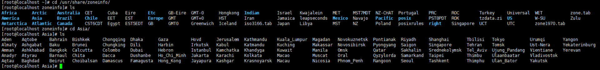

# SpringBoot

## HelloWorld项目

需求：浏览发送/hello请求，响应 “Hello，Spring Boot 2”

### 创建maven工程

#### 引入依赖

```xml
<parent>
	<groupId>org.springframework.boot</groupId>
	<artifactId>spring-boot-starter-parent</artifactId>
	<version>2.3.7.RELEASE</version>
</parent>

<dependencies>
	<dependency>
		<groupId>org.springframework.boot</groupId>
		<artifactId>spring-boot-starter-web</artifactId>
	</dependency>
</dependencies>
```

#### 创建主程序

```java
import org.springframework.boot.SpringApplication;
import org.springframework.boot.autoconfigure.SpringBootApplication;

@SpringBootApplication
public class MainApplication {

    public static void main(String[] args) {
        SpringApplication.run(MainApplication.class, args);
    }
}
```

#### 编写业务

```java
import org.springframework.web.bind.annotation.RequestMapping;
import org.springframework.web.bind.annotation.RestController;

@RestController
public class HelloController {
    @RequestMapping("/hello")
    public String handle01(){
        return "Hello, Spring Boot 2!";
    }
}
```

#### 运行&测试

- 运行`MainApplication`类

- 浏览器输入`http://localhost:8080/hello`，将会输出`Hello, Spring Boot 2!`。

  [更多配置信息](https://docs.spring.io/spring-boot/docs/2.3.7.RELEASE/reference/html/appendix-application-properties.html#common-application-properties-server)

## yaml的用法

同以前的properties用法

YAML 是 "YAML Ain't Markup Language"（YAML 不是一种标记语言）的递归缩写。在开发的这种语言时，YAML 的意思其实是："Yet Another Markup Language"（仍是一种标记语言）。 

**非常适合用来做以数据为中心的配置文件**。

### 基本语法

- key: value；kv之间有空格
- 大小写敏感
- 使用缩进表示层级关系
- 缩进不允许使用tab，只允许空格
- 缩进的空格数不重要，只要相同层级的元素左对齐即可
- '#'表示注释
- 字符串无需加引号，如果要加，单引号''、双引号""表示字符串内容会被 转义、不转义

### 数据类型

- 字面量：单个的、不可再分的值。date、boolean、string、number、null

```yaml
k: v
```

- 对象：键值对的集合。map、hash、set、object 
- map不能@Value直接注入，需要#{}   -----@Value("#{${maps}}")     maps: "{a:1,b:2}"

```yaml
#行内写法：  

k: {k1:v1,k2:v2,k3:v3}

#或

k: 
  k1: v1
  k2: v2
  k3: v3
```

- 数组：一组按次序排列的值。array、list、queue

```yaml
#行内写法：  

k: [v1,v2,v3]
k: v1,v2,v3
#或者

k:
 - v1
 - v2
 - v3
```

### 实例

```java
@Data
public class Person {
    private String userName;
    private Boolean boss;
    private Date birth;
    private Integer age;
    private Pet pet;
    private String[] interests;
    private List<String> animal;
    private Map<String, Object> score;
    private Set<Double> salarys;
    private Map<String, List<Pet>> allPets;
}

@Data
public class Pet {
    private String name;
    private Double weight;
}
```

用yaml表示以上对象

```yaml
person:
  userName: zhangsan
  boss: false
  birth: 2019/12/12 20:12:33
  age: 18
  pet: 
    name: tomcat
    weight: 23.4
  interests: [篮球,游泳]
  animal: 
    - jerry
    - mario
  score:
    english: 
      first: 30
      second: 40
      third: 50
    math: [131,140,148]
    chinese: {first: 128,second: 136}
  salarys: [3999,4999.98,5999.99]
  allPets:
    sick:
      - {name: tom}
      - {name: jerry,weight: 47}
    health: [{name: mario,weight: 47}]
```


## @SpringBootApplication


## 配置文件切换

配置文件命名：application-xxx.yml

主配置文件中配置：

````yaml
spring: 
 profiles: 
  active: xxx
````


启动某路径的配置文件


## @Value

作用:通过注解将常量、配置文件中的值、其他bean的属性值注入到变量中，作为变量的初始值

- 不能用于静态属性

**(1)常量注入**

````java
@Value("normal")
private String normal; // 注入普通字符串

@Value("classpath:com/spring/configinject/config.txt")
private Resource resourceFile; // 注入文件资源

@Value("http://www.baidu.com")
private Resource testUrl; // 注入URL资源
````

**(2)bean属性、系统属性、表达式注入@Value("#{}")**

````java
bean属性注入需要注入者和被注入者属于同一个IOC容器，或者父子IOC容器关系，在同一个作用域内。

@Value("#{beanInject.another}")
private String fromAnotherBean; // 注入其他Bean属性：注入beanInject对象的属性another，类具体定义见下面

@Value("#{systemProperties['os.name']}")
private String systemPropertiesName; // 注入操作系统属性

@Value("#{ T(java.lang.Math).random() * 100.0 }")
private double randomNumber; //注入表达式结果
````

**（3）配置文件属性注入@Value("${}")**

````java
@Value("#{}")读取配置文件中的值，注入到变量中去。配置文件分为默认配置文件application.properties和自定义配置文件
    •application.properties。application.properties在spring boot启动时默认加载此文件
•自定义属性文件。自定义属性文件通过@PropertySource加载。@PropertySource可以同时加载多个文件，也可以加载单个文件。如果相同第一个属性文件和第二属性文件存在相同key，则最后一个属性文件里的key启作用。加载文件的路径也可以配置变量，如下文的${anotherfile.configinject}，此值定义在第一个属性文件config.properties

第一个属性文件config.properties内容如下： 
${anotherfile.configinject}作为第二个属性文件加载路径的变量值
book.name=bookName
anotherfile.configinject=placeholder
第二个属性文件config_placeholder.properties内容如下：
book.name.placeholder=bookNamePlaceholder
下面通过@Value(“${app.name}”)语法将属性文件的值注入bean属性值

@Component
// 引入自定义配置文件。
@PropertySource({"classpath:com/spring/configinject/config.properties",
 // 引入自定义配置文件。${anotherfile.configinject}则是config.properties文件中的第二个属性值，会被替换为config_placeholder.properties。
"classpath:com/spring/configinject/config_${anotherfile.configinject}.properties"})
public class ConfigurationFileInject{
    @Value("${app.name}")
    private String appName; // 这里的值来自application.properties，spring boot启动时默认加载此文件
    @Value("${book.name}")
    private String bookName; // 注入第一个配置文件config.properties的第一个属性

    @Value("${book.name.placeholder}")
    private String bookNamePlaceholder; // 注入第二个配置外部文件属性

}
````

Date类型：默认日期格式 yyyy/mm/dd HH:MM:ss

## @ConfigurationProperties

修饰范围：类

用来将指定前缀的属性注入到当前属性名一致的属性中

必须提供set方法

## 热部署-devtools

添加依赖：

```xml
<dependencies>
    <dependency>
        <groupId>org.springframework.boot</groupId>
        <artifactId>spring-boot-devtools</artifactId>
        <optional>true</optional>
    </dependency>
</dependencies>
```

## 日志

SpringBoot框架中默认日志级别info


````yml
logging:
  level:
    root: debug
  file:
    name: log.txt
    path: d:/
````

- 如果同时配置name和path属性，则只有name属性生效

声明日志对象

private static final Logger log = LoggerFactory.getLogger(当前类的Class对象);

### Logback

SpringBoot默认内置了Logback日志框架，Spring Boot 集成logback需要添加 `spring-boot-starter-logging` 依赖，而此依赖已经在 `spring-boot-starter` 中添加过了，所以不用再添加此依赖了

#### 配置详解

默认情况下，SpringBoot会用Logback来记录日志，并用INFO级别输出到控制台。 配置Logback常用节点结构图：


##### configuration

根节点 `<configuration>` 下面包含三个属性：

- scan: 当此属性设置为true时，配置文件如果发生改变，将会被重新加载，**默认值为true**。
- scanPeriod: 设置监测配置文件是否有修改的时间间隔，如果没有给出时间单位，默认单位是毫秒。当scan为true时，此属性生效。**默认的时间间隔为1分钟**。
- debug: 当此属性设置为true时，将打印出logback内部日志信息，实时查看logback运行状态。**默认值为false**。示例：

```xml
<configuration scan="true" scanPeriod="60 seconds" debug="false">
<!--其他配置省略-->
</configuration>
```

##### appender

`<appender>`：负责写日志的组件，它有两个必要属性name和class。name指定appender名称，class指定appender的全限定名。

##### ConsoleAppender

`ConsoleAppender` 把日志输出到控制台，有以下子节点：

`<encoder>` ：对日志进行格式化

`<target>`：字符串System.out（默认）或者System.err

示例：把 >=DEBUG 级别的日志都输出到控制台

```xml
<configuration>
　　　<appender name="STDOUT" class="ch.qos.logback.core.ConsoleAppender">
　　　　　 <encoder>
　　　　　　　　　<pattern>%-4relative [%thread] %-5level %logger{35} - %msg %n</pattern>
　　　　　 </encoder>
　　　</appender>

　　　<root level="DEBUG">
　　　　　　<appender-ref ref="STDOUT" />
　　　</root>
</configuration>
```

##### FileAppender

`<FileAppender>`：把日志添加到文件，有以下子节点：

- `<file>`：被写入的文件名，可以是相对目录，也可以是绝对目录，如果上级目录不存在会自动创建，没有默认值。
- `<append>` ：如果是 true，日志被追加到文件结尾，如果是 false，清空现存文件，默认是true。
- `<encoder>` ：对记录事件进行格式化。
- `<prudent>` ：如果是 true，日志会被安全的写入文件，即使其他的FileAppender也在向此文件做写入操作，效率低，默认是 false。

示例：把 >= DEBUG 级别的日志都输出到 testFile.log 文件：

```xml
<configuration>
　　　　　　<appender name="FILE" class="ch.qos.logback.core.FileAppender">
　　　　　　　　<file>testFile.log</file>
　　　　　　　　<append>true</append>
　　　　　　　　<encoder>
　　　　　　　　　　<pattern>%-4relative [%thread] %-5level %logger{35} - %msg%n</pattern>
　　　　　　　　</encoder>
　　　　　　</appender>

　　　　　　<root level="DEBUG">
　　　　　　<appender-ref ref="FILE" />
　　　　　　</root>
　　　　</configuration>
```

##### RollingFileAppender

`<RollingFileAppender>` ：滚动记录文件，先将日志记录到指定文件，当符合某个条件时，将日志记录到其它文件。有以下子节点：

- `<file>` ：被写入的文件名，可以是相对目录，也可以是绝对目录，如果上级目录不存在会自动创建，没有默认值。
- `<append>` ：如果是 true，日志被追加到文件结尾，如果是 false，清空现存文件，默认是true。
- `<rollingPolicy>` : 当发生滚动时，决定RollingFileAppender的行为，涉及文件移动和重命名。属性class定义具体的滚动策略类

###### TimeBasedRollingPolicy

`class="ch.qos.logback.core.rolling.TimeBasedRollingPolicy`： 最常用的滚动策略，它根据时间来制定滚动策略，既负责滚动也负责出发滚动。有以下子节点：

- ：必要节点，包含文件名及“%d”转换符，“%d”可以包含一个java.text.SimpleDateFormat指定的时间格式，如：%d{yyyy-MM}。
  如果直接使用 %d，默认格式是 yyyy-MM-dd。RollingFileAppender的file字节点可有可无，通过设置file，可以为活动文件和归档文件指定不同位置，当前日志总是记录到file指定的文件（活动文件），活动文件的名字不会改变；
  如果没设置file，活动文件的名字会根据fileNamePattern 的值，每隔一段时间改变一次。“/”或者“\”会被当做目录分隔符。
- : 可选节点，控制保留的归档文件的最大数量，超出数量就删除旧文件。假设设置每个月滚动，且是6，则只保存最近6个月的文件，删除之前的旧文件。注意，删除旧文件是，那些为了归档而创建的目录也会被删除。

###### SizeBasedTriggeringPolicy

`class="ch.qos.logback.core.rolling.SizeBasedTriggeringPolicy` ： 查看当前活动文件的大小，如果超过指定大小会告知RollingFileAppender 触发当前活动文件滚动。只有一个节点:

- : 这是活动文件的大小，默认值是10MB。
- ：当为true时，不支持FixedWindowRollingPolicy。支持TimeBasedRollingPolicy，但是有两个限制，1不支持也不允许文件压缩，2不能设置file属性，必须留空。
- : 告知 RollingFileAppender 合适激活滚动。

###### FixedWindowRollingPolicy

`class="ch.qos.logback.core.rolling.FixedWindowRollingPolicy` 根据固定窗口算法重命名文件的滚动策略。有以下子节点：

- : 窗口索引最小值
- : 窗口索引最大值，当用户指定的窗口过大时，会自动将窗口设置为12。
- : 必须包含“%i”例如，假设最小值和最大值分别为1和2，命名模式为 mylog%i.log,会产生归档文件mylog1.log和mylog2.log。还可以指定文件压缩选项，例如，mylog%i.log.gz 或者 没有log%i.log.zip

示例：每天生成一个日志文件，保存30天的日志文件：

```xml
<configuration>
　　　　　　　　　　<appender name="FILE" class="ch.qos.logback.core.rolling.RollingFileAppender">
　　　　　　　　　　　　<rollingPolicy class="ch.qos.logback.core.rolling.TimeBasedRollingPolicy">
　　　　　　　　　　　　　　<fileNamePattern>logFile.%d{yyyy-MM-dd}.log</fileNamePattern>
　　　　　　　　　　　　　　<maxHistory>30</maxHistory>
　　　　　　　　　　　　</rollingPolicy>
　　　　　　　　　　　　<encoder>
　　　　　　　　　　　　　　<pattern>%-4relative [%thread] %-5level %logger{35} - %msg%n</pattern>
　　　　　　　　　　　　</encoder>
　　　　　　　　　　</appender>

　　　　　　　　　　<root level="DEBUG">
　　　　　　　　　　　　<appender-ref ref="FILE" />
　　　　　　　　　　</root>
　　　　　　　　</configuration>
```

##### logger

`<logger>` ：用来设置某一个包或具体的某一个类的日志打印级别、以及指定。

仅有一个name属性，一个可选的level和一个可选的addtivity属性。

可以包含零个或多个元素，标识这个appender将会添加到这个logger。

- name: 用来指定受此loger约束的某一个包或者具体的某一个类。
- level: 用来设置打印级别，大小写无关：TRACE, DEBUG, INFO, WARN, ERROR, ALL和OFF，还有一个特殊值INHERITED或者同义词NULL，代表强制执行上级的级别。 如果未设置此属性，那么当前loger将会继承上级的级别。
- addtivity: 是否向上级logger传递打印信息。默认是true。可以包含零个或多个元素，标识这个appender将会添加到这个logger。

###### `<root>`

子节点:它也是元素，但是它是根logger,是所有的上级。只有一个level属性，因为name已经被命名为"root",且已经是最上级了。

level: 用来设置打印级别，大小写无关：TRACE, DEBUG, INFO, WARN, ERROR, ALL和OFF，不能设置为INHERITED或者同义词NULL。 默认是DEBUG。

同一样，可以包含零个或多个元素，标识这个appender将会添加到这个logger。

示例：常用logger配置：

```xml
<!-- show parameters for hibernate sql 专为 Hibernate 定制 -->
<logger name="org.hibernate.type.descriptor.sql.BasicBinder" level="TRACE" />
<logger name="org.hibernate.type.descriptor.sql.BasicExtractor" level="DEBUG" />
<logger name="org.hibernate.SQL" level="DEBUG" />
<logger name="org.hibernate.engine.QueryParameters" level="DEBUG" />
<logger name="org.hibernate.engine.query.HQLQueryPlan" level="DEBUG" />

<!--myibatis log configure-->
<logger name="com.apache.ibatis" level="TRACE"/>
<logger name="java.sql.Connection" level="DEBUG"/>
<logger name="java.sql.Statement" level="DEBUG"/>
<logger name="java.sql.PreparedStatement" level="DEBUG"/>
```

###### `<contextName>`

子节点：用来设置上下文名称，每个logger都关联到logger上下文，默认上下文名称为default。但可以使用设置成其他名字，用于区分不同应用程序的记录。一旦设置，不能修改。

示例：

```xml
<configuration scan="true" scanPeriod="60 seconds" debug="false">
     <contextName>myAppName</contextName>
　　  <!--其他配置省略-->
</configuration>
```

###### `<property>`

子节点 ：用来定义变量值，它有两个属性name和value，通过定义的值会被插入到 logger 上下文中，可以通过 `${}` 来使用变量。　　

name: 变量的名称
value: 的值时变量定义的值

示例：

```xml
<configuration scan="true" scanPeriod="60 seconds" debug="false">
　　　<property name="APP_Name" value="myAppName" />
　　　<contextName>${APP_Name}</contextName>
　　　<!--其他配置省略-->
</configuration>
```

###### `<timestamp>`

子节点 ：获取时间戳字符串，他有两个属性key和datePattern。

key: 标识此 的名字；
　　　　datePattern: 设置将当前时间（解析配置文件的时间）转换为字符串的模式，遵循java.txt.SimpleDateFormat的格式。

示例：

```xml
<configuration scan="true" scanPeriod="60 seconds" debug="false">
　　　　　　<timestamp key="bySecond" datePattern="yyyyMMdd'T'HHmmss"/>
　　　　　　<contextName>${bySecond}</contextName>
　　　　　　<!-- 其他配置省略-->
    </configuration>
```

#### 完整配置

在application.properties中通过 `logging.config=classpath:xxx.xml` 来指定配置文件。

````xml
<?xml version="1.0" encoding="UTF-8"?>
<configuration debug="false">

    <!--定义日志文件的存储地址，如果是在window中可以使用/开头的绝对地址，在linux中不要使用 / 开头的地址，因为其表示绝对地址，linux中要使用相对地址时 不要以 盘符开头即可-->
    <property name="logPath" value="/logs" />
    <!--日志文件保留天数，最长支持30天-->
    <property name="MaxHistory" value="30"/>
    <!--日志文件最大的大小，支持KB，MB-->
    <property name="MaxFileSize" value="100MB"/>

    <!--控制台日志， 控制台输出 -->
    <appender name="STDOUT" class="ch.qos.logback.core.ConsoleAppender">
        <encoder class="ch.qos.logback.classic.encoder.PatternLayoutEncoder">
            <!--格式化输出：%d表示日期，%thread表示线程名，%-5level：级别从左显示5个字符宽度,%msg：日志消息，%n是换行符-->
            <pattern>%d{yyyy-MM-dd HH:mm:ss.SSS} [%thread] %-5level %logger{50} - %msg%n</pattern>
        </encoder>
    </appender>

    <!--文件日志， 按照每天生成日志文件 -->
    <appender name="FILE" class="ch.qos.logback.core.rolling.RollingFileAppender">
        <rollingPolicy class="ch.qos.logback.core.rolling.TimeBasedRollingPolicy">
            <!--日志文件输出的文件名-->
            <FileNamePattern>${logPath}/TestWeb.log.%d{yyyy-MM-dd}.log</FileNamePattern>
            <!--日志文件保留天数-->
            <MaxHistory>${MaxHistory}</MaxHistory>
        </rollingPolicy>
        <encoder class="ch.qos.logback.classic.encoder.PatternLayoutEncoder">
            <!--格式化输出：%d表示日期，%thread表示线程名，%-5level：级别从左显示5个字符宽度%msg：日志消息，%n是换行符-->
            <pattern>%d{yyyy-MM-dd HH:mm:ss.SSS} [%thread] %-5level %logger{50} - %msg%n</pattern>
        </encoder>
        <!--日志文件最大的大小-->
        <triggeringPolicy class="ch.qos.logback.core.rolling.SizeBasedTriggeringPolicy">
            <MaxFileSize>${MaxFileSize}</MaxFileSize>
        </triggeringPolicy>
    </appender>

    <!-- show parameters for hibernate sql 专为 Hibernate 定制 -->
    <logger name="org.hibernate.type.descriptor.sql.BasicBinder" level="TRACE" />
    <logger name="org.hibernate.type.descriptor.sql.BasicExtractor" level="DEBUG" />
    <logger name="org.hibernate.SQL" level="DEBUG" />
    <logger name="org.hibernate.engine.QueryParameters" level="DEBUG" />
    <logger name="org.hibernate.engine.query.HQLQueryPlan" level="DEBUG" />

    <!--mybatis log configure-->
    <logger name="com.apache.ibatis" level="TRACE"/>
    <logger name="java.sql.Connection" level="DEBUG"/>
    <logger name="java.sql.Statement" level="DEBUG"/>
    <logger name="java.sql.PreparedStatement" level="DEBUG"/>

    <!-- 日志输出级别 -->
    <root level="DEBUG">
        <appender-ref ref="STDOUT" />
        <appender-ref ref="FILE"/>
    </root>
</configuration>
````

##### 过滤掉某些级别的信息

我们把debug，error，info等级别的日志，都分开，分别打印输出在不同的文件中。

需要做的就是，在不同的 日志级别中 过滤掉即可。

````xml
<?xml version="1.0" encoding="utf-8" ?>

<configuration>
    <!-- 控制台输出日志 -->
    <appender name="consoleLog" class="ch.qos.logback.core.ConsoleAppender">
        <layout class="ch.qos.logback.classic.PatternLayout">
            <pattern>
                %d - %msg%n   <!-- 控制台打印日志文件体 时间-信息 -->
            </pattern>
        </layout>
    </appender>

    <!-- 输出info级别的日志 -->
    <appender name="infoLog" class="ch.qos.logback.core.rolling.RollingFileAppender">
        <!-- 在info中过滤掉掉 error 级别的信息 -->
        <filter class="ch.qos.logback.classic.filter.LevelFilter">
            <level>ERROR</level>
            <onMatch>DENY</onMatch>  <!-- 如果命中就禁止这条日志 -->
            <onMismatch>ACCEPT</onMismatch>  <!-- 如果没有命中就使用这条规则 -->
        </filter>

        <encoder>
            <pattern>
               %msg%n
            </pattern>
        </encoder>
        <!-- 滚动策略 -->
        <rollingPolicy class="ch.qos.logback.core.rolling.TimeBasedRollingPolicy">
            <!-- 设置info日志路径 -->
            <fileNamePattern>E:\\IntelliJ IDEA\\logback\\info.%d.log</fileNamePattern>
        </rollingPolicy>
    </appender>

    <!-- 输出error级别的日志 -->
    <appender name="errorLog" class="ch.qos.logback.core.rolling.RollingFileAppender">
        <!-- 过滤日志 -->
        <filter class="ch.qos.logback.classic.filter.ThresholdFilter">
            <level>ERROR</level>
        </filter>

        <encoder>
            <pattern>
                %msg%n
            </pattern>
        </encoder>
        <!-- 滚动策略 -->
        <rollingPolicy class="ch.qos.logback.core.rolling.TimeBasedRollingPolicy">
            <!-- 设置error日志路径 -->
            <fileNamePattern>E:\\IntelliJ IDEA\\logback\\error.%d.log</fileNamePattern>
        </rollingPolicy>
    </appender>

    <!-- 设置默认日志级别为INFO，一般都设置为info -->
    <root level="info">
        <appender-ref ref="consoleLog"/>
        <appender-ref ref="infoLog"/>
        <appender-ref ref="errorLog"/>
    </root>
</configuration>
````

## AOP

````xml
		<dependency>
            <groupId>org.springframework.boot</groupId>
            <artifactId>spring-boot-starter-aop</artifactId>
        </dependency>
````

````java
@Retention(RetentionPolicy.RUNTIME)
@Target(ElementType.METHOD)//加在方法上
public @interface AopAnnotation {
}
````

````java
@Configuration
@Aspect
public class UsersAop {

    @Before("execution(* com.demo.boot_three.controller.*.*(..))")
    public void Before(JoinPoint joinPoint){
        System.out.println("before");
        //System.out.println(joinPoint.getTarget());
    }

    //基于注解的切入点表达式
    @Around("@annotation(com.demo.boot_three.annotation.AopAnnotation)")  
    public Object aroundMethod(ProceedingJoinPoint joinPoint){
    String methodName = joinPoint.getSignature().getName();
    String args = Arrays.toString(joinPoint.getArgs());
    Object result = null;
    try {
    System.out.println("环绕通知-->目标对象方法执行之前");
    //目标方法的执行，目标方法的返回值一定要返回给外界调用者
    result = joinPoint.proceed();
    System.out.println("环绕通知-->目标对象方法返回值之后");
    } catch (Throwable throwable) {
    throwable.printStackTrace();
    System.out.println("环绕通知-->目标对象方法出现异常时");
    } finally {
    System.out.println("环绕通知-->目标对象方法执行完毕");
    }
    return result;
    }
}

````

## 文件上传和下载

**配置文件**

````yaml
spring:
  servlet:
    multipart:
      max-file-size: 100MB
      max-request-size: 100MB
      
#默认spring boot 文件上传单个文件的大小为1MB  单个文件的最大大小:max-file-size
#默认spring boot 文件上传总文件的大小为10MB   文件的总大小:max-request-size
````

### 上传

文件上传要求form表单的请求方式必须为post，并且添加属性enctype="multipart/form-data" 

SpringMVC中将上传的文件封装到MultipartFile对象中，通过此对象可以获取文件相关信息

MultipartFile对项目与表单name一致，或者对象为null

**单文件上传**

**页面**

````html
<!DOCTYPE html>
<html lang="en" xmlns:th="http://www.thymeleaf.org">
<head>
    <meta charset="UTF-8">
    <title>UploadFile</title>
</head>
<body>

<form action="/upLoad" enctype="multipart/form-data" method="post">
    单文件上传:<input type="file" name="upLoadSingle" value="单文件"><br>
    	 <input type="submit" name="提交">
</form>

</body>
</html>
````

````java
@RestController
public class TestFileController {
    @Value("${file.upLoadFile}")
    private String upLoadFile;

    @RequestMapping("/upLoadSingle")
    private String upLoadSingle(MultipartFile upLoadSingle) throws IOException {
        upLoadSingle.transferTo(new File(upLoadFile,upLoadSingle.getOriginalFilename()));

        return "success";
    }
}
````

**多文件上传**

**页面**

````html
<!DOCTYPE html>
<html lang="en" xmlns:th="http://www.thymeleaf.org">
<head>
    <meta charset="UTF-8">
    <title>upLoad</title>
</head>
<body>

<form method="post" action="/upLoadMulti" enctype="multipart/form-data">
    多文件上传：<input type="file" name="upLoadFiles" multiple><br>
    <input type="submit" name="提交" value="多文件上传">
</form>

</body>
</html>
````

````java
@RestController
public class TestFileController {
    @Value("${file.upLoadFile}")
    private String upLoadFile;

    @RequestMapping(value = "/upLoadMulti",method = RequestMethod.POST)
    private String upLoadMulti(MultipartFile[] upLoadMulti) throws IOException {
        ArrayList<String> list = new ArrayList<>();
        for (MultipartFile multipartFile: upLoadMulti) {
            File file = new File(upLoadFile);
            //判断文件夹是否存在，存在就不需要重新创建，不存在就创建
            if (!file.exists()){
                file.mkdirs();
            }
            multipartFile.transferTo(new File(file,multipartFile.getOriginalFilename()));
            list.add(file.getAbsolutePath() + "\\" + multipartFile.getOriginalFilename());
        }

        return "success";
    }
}
````

### 下载

**页面**

````html
<a href="/DownLoad?filename=你好.txt">你好.txt</a>
````

````java
@RequestMapping("/DownLoad")
    public void downLoad(@RequestParam("filename") String fileName, HttpServletResponse response) throws IOException {
        File file = new File(upLoadFile,fileName);
        //判断文件夹是否存在
        if (!file.exists()){
            response.getWriter().write("下载的文件不存在");
            return "false";
        }
        FileInputStream fileInputStream = new FileInputStream(file);
        //获取响应流之前,设置响应头，以附件形式下载    URLEncoder.encode()防止文件名乱码
        /*
		1、Content-Disposition的作用：告知浏览器以何种方式显示响应返回的文件，用浏览器打开还是以附件的形式下载到本地保存
		2、attachment表示以附件方式下载   inline表示在线打开 attachment表示以附件形式下载
		"Content-Disposition: inline; filename=文件名.mp3"
		3、filename表示文件的默认名称，因为网络传输只支持URL编码的相关支付，因此需要将文件名URL编码后进行传输,前端收到后需要反编码才能获取到真正的名称
		*/
        /*	注意:文件名字如果是中文会出现乱码：解决办法：
				1、将name 替换为 new String(filename.getBytes(), "ISO8859-1");
				2、将name 替换为 URLEncoder.encode(filename, "utf-8");
        */
        response.setHeader("Content-Disposition","inline;filename="+ URLEncoder.encode(fileName,"UTF-8"));
        ServletOutputStream outputStream = response.getOutputStream();
        int len = 0;
        byte[] buf = new byte[1024];
        while ((len = fileInputStream.read(buf)) != -1){
            outputStream.write(buf,0,len);
        }
        outputStream.flush();
        fileInputStream.close();

        //替换代码:
        //FileCopyUtils.copy(fileInputStream,outputStream);
    }
````

下载方法返回值为void或者String 但return ""

````markdown
一次请求，一个request对应一个response，下载文件需要用到response将文件以流的形式响应，无法再用response进行页面跳转
````

## 拦截器


## 全局异常处理


## CORS跨域

定义:跨域资源共享(Cross-origin resource sharing)

它允许浏览器向跨源服务器，发出XMLHttpRequest(ajax)请求，从而克服了**AJAX只能同源使用的限制**。

**同源策略**

同源策略[same origin policy]是浏览器的一个安全功能，不同源的客户端脚本在没有明确授权的情况下，不能读写对方资源。同源策略是浏览器安全的基石。

**源**

源[origin]就是协议、域名和端口号。例如: http://www.baidu.com:80这个URL。

**同源**

若地址里面的协议、域名和端口号均相同则属于同源。

````markdown
同源举例
例如判断下面的URL是否与 http://www.a.com/test/index.html同源
http://www.a.com/dir/page.htm1 --------->同源
http://www.child.a.com/test/index.html ->不同源,域名不相同
https://www.a.com/test/index.html ------>不同源。协议不相同
http://www.a.com:8880/test/index.html -->不同源。端口号不相同
````

**哪些操作不受同源限制**

页面中的链接,重定向以及表单提交是不会受到同源策略限制的;
跨域资源的引入是可以的。如嵌入到页面中的<script src=" ..."></script> ,  , <link> ,<iframe>等。

**哪些操作会受到同源限制**
ajax
出现跨域:Access-Control-Allow-Origin

````markdown
浏览器发送跨站请求时，在发送POST请求之前它会先发送一个OPTION请求试探一下服务器的反应。如果服务器支持CORS请求，那服务器返回的响应头(headers)中就会包含浏览器所需的一些header信息(Access-Control-Allow-Origin、Access-Control-Allow-Methods、Access-Control-Allow-Headers、Access-Control-Allow-Credentials)，然后浏览器就发送POST请求；如果服务器不支持CORS的话就不会返回那些header信息，收不到所需的header浏览器终止发送POST请求，然后报出CORS error。

Springboot处理客户端请求的流程如图所示：请求从浏览器发出，最先通过过滤器链，然后通过Dispatcher Servlet，然后通过拦截器，最后才到达处理请求的控制器上。我们只要让Springboot在受到OPTIONS试探请求时，过滤器或者在拦截器上给浏览器返回一下它需要的那几个header信息就可以了。
````


### 解决

1 在控制器上添加注解CrossOrigin让CorsInterceptor拦截器来处理

 @CrossOrigin(origins = "允许跨域的域名",allowCredentials = "true",allowedHeaders = "*")

2 

````java
import org.springframework.context.annotation.Bean;
import org.springframework.context.annotation.Configuration;
import org.springframework.web.bind.annotation.CrossOrigin;
import org.springframework.web.cors.CorsConfiguration;
import org.springframework.web.cors.UrlBasedCorsConfigurationSource;
import org.springframework.web.filter.CorsFilter;

@CrossOrigin
@Configuration
public class CorsConfig {
    @Bean
    public CorsFilter corsFilter(){
        UrlBasedCorsConfigurationSource source = new UrlBasedCorsConfigurationSource();
        CorsConfiguration corsConfiguration = new CorsConfiguration();
        corsConfiguration.addAllowedOrigin("*");//允许任何域名使用
        corsConfiguration.addAllowedHeader ("*");//允许任何头
        corsConfiguration.addAllowedMethod("*");// 3允许任何方法(post、get等)
        source.registerCorsConfiguration("/**", corsConfiguration);//4处理所有请求的跨域配置
        return new CorsFilter(source);
    }
}
````

3

````java
@Configuration
public class MyMvcConfig implements WebMvcConfigurer{
    @Override
    public void addCorsMappings(CorsRegistry registry) {
        registry.addMapping("/**") //对那些请求路径有效
                .allowedOrigins("*")
                .allowedHeaders("*")
                .allowedMethods("*")
                .allowCredentials(true)//表示是否允许 cookie
                .maxAge(10000);
    }
}
````

4

````java
@Component
@Order(Ordered.HIGHEST_PRECEDENCE)
public class RestCorsFilter implements Filter {

    public RestCorsFilter() {
    }

    @Override
    public void doFilter(ServletRequest req, ServletResponse res, FilterChain chain) throws IOException, ServletException {
        HttpServletResponse response = (HttpServletResponse) res;
        HttpServletRequest request = (HttpServletRequest) req;
        response.setHeader("Access-Control-Allow-Origin", "*");
        response.setHeader("Access-Control-Allow-Credentials","true");
        response.setHeader("Access-Control-Allow-Methods", "POST, GET, OPTIONS");
        response.setHeader("Access-Control-Max-Age", "31536000");
        response.setHeader("Access-Control-Allow-Headers", "*");
        if ("OPTIONS".equalsIgnoreCase(request.getMethod())) {
            response.setStatus(HttpServletResponse.SC_OK);
        } else {
            chain.doFilter(req, res);
        }
    }

    @Override
    public void init(FilterConfig filterConfig) {
    }

    @Override
    public void destroy() {
    }
}
````

因为过滤器链中有很多过滤器，为了防止爱管闲事的某个过滤器拦截CORS请求，所以我们用Order(Ordered.HIGHEST_PRECEDENCE)来把我们的过滤器排到最前面，Ordered.HIGHEST_PRECEDENCE是过滤器链的最高等级排位，有这个注解的过滤器会排在最前面。

**有Spring Security的情况**

Spring Security由一堆验证授权过滤器组成，他们会以SecurityFilterChain的方式加入到我们的过滤器链：


上图所示，Spring Security加入后情况有了些变化(红色部分)，刚才的第1、3种解决方式在这种情况下会失效，因为Spring Security会在过滤器链拦截CORS试探请求，请求无法到达Interceptor拦截器那边。而我们的第4种解决方式倒是可以继续用，因为我们给过滤器设置了最高等级的排位，他会排在在Spring Security的过滤器之前处理CORS请求。

Spring Security提供了非常便捷的方式让我们处理CORS，我们只要在Security Adapter 中配置一下cors就可以：

````java
@Configuration
@EnableWebSecurity
public class SecurityTestConfig extends WebSecurityConfigurerAdapter {
    @Override
    protected void configure(HttpSecurity http) throws Exception {
        http
                .cors().configurationSource(corsConfigurationSource()) // 这里
                .and()
                ...
    }
    CorsConfigurationSource corsConfigurationSource(){
        CorsConfiguration corsConfiguration = new CorsConfiguration();
        corsConfiguration.setAllowCredentials(true);
        corsConfiguration.setAllowedHeaders(Arrays.asList("*"));
        corsConfiguration.setAllowedMethods(Arrays.asList("*"));
        corsConfiguration.setAllowedOrigins(Arrays.asList("*"));
        corsConfiguration.setMaxAge(3600L);
        UrlBasedCorsConfigurationSource source = new UrlBasedCorsConfigurationSource();
        source.registerCorsConfiguration("/**",corsConfiguration);
        return source;
    }
}
````

在http security config方法中添加.cors()， 这会让Spring Security全局搜索可用的CORS配置，接着我们给他configurationSource让他直接用我们给的CORS配置

## Jackson

依赖实体类提供属性的get方法，即属性要提供get方法，否则无法转化,get方法修饰符public


### date-format日期格式化

````xml
date-format: yyyy-MM-dd HH:mm:ss
````

**这种方式默认只对Date生效，对于java8的LocalDate，LocalDateTime是不生效的**

### time-zone时区

`time-zone`字段也是和日期字段类型，使用不同的时区,最终日期类型字段响应的结果会不一样

时区的表示方法有两种：

- 指定时区的名称，例如：`Asia/Shanghai`,`America/Los_Angeles`
- 通过格林威治平时`GMT`针对时分秒做`+`或者`-`自定义操作

时区名称如果不是很清楚的话，一般在Linux服务器的`/usr/share/zoneinfo`目录可以进行查看，如下图：



- LocalDateTime、LocalDate类型的字段，Jackson的时区设置不会对该字段产生影响(因为这两个日期类型自带时区属性)

- Date、Calendar类型的字段受Jackson序列化框架的时区设置影响

另外一种方式是通过格林威治平时(GMT)做加减法，主要有两种格式支持：

GMT+HHMM或者GMT-HHMM或者GMT+H:其中HH代表的是小时数，MM代表的是分钟数，取值范围是0-9,例如我们常见的GMT+8代表东八区，也就是北京时间
GMT+HH:MM或者GMT-HH:MM:其中HH代表的是小时数，MM代表的是分钟数，取值范围是0-9，和上面意思差不多

````java
public class TimeTest {
    public static void main(String[] args) {
        LocalDateTime localDateTime=LocalDateTime.now();
        DateTimeFormatter dateTimeFormatter=DateTimeFormatter.ofPattern("yyyy-MM-dd HH:mm:ss");
        System.out.println(localDateTime.format(dateTimeFormatter));
        System.out.println(LocalDateTime.now(ZoneId.of("GMT+0901")).format(dateTimeFormatter));
        System.out.println(LocalDateTime.now(ZoneId.of("GMT+09:01")).format(dateTimeFormatter));
    }
}
````

### locale本地化

JSON序列化时Locale的变量设置

### visibility访问级别

Jackson支持从私有字段中读取值,但是默认情况下不这样做,如果我们的项目中存在不同的序列化反序列化需求，那么我们可以在配置文件中对`visibility`进行配置

若get方法为private，则对应字段不会被序列化，解决方法：

````xml
visibility:
      getter: any
````

### property-naming-strategy属性命名策略

通常比较常见的java代码中的实体类属性一般都是[驼峰命名法(Camel-Case)](https://baike.baidu.com/item/骆驼命名法/7794053?fromtitle=驼峰命名法&fromid=7560610&fr=aladdin)，但是Jackson序列化框架也提供了更多的序列化策略，而`property-naming-strategy`就是配置该属性的。

#### 规则

**SNAKE_CASE**

SNAKE_CASE主要包含的规则,详见SnakeCaseStrategy：

java属性名称中所有大写的字符都会转换为两个字符，下划线和该字符的小写形式，例如userName会转换为user_name,对于连续性的大写字符，近第一个进行下划线转换，后面的大小字符则是小写，例如theWWW会转换为the_www
对于首字母大写的情况，近转成小写，例如:Results会转换为results，并不会转换为_results
针对属性中已经包含下划线的情况，仅做小写转换处理
下划线出现在首位的情况下，会被去除处理，例如属性名：_user会被转换为user
**UPPER_CAMEL_CASE**

`UPPER_CAMEL_CASE`顾名思义，驼峰命名法的规则，只是首字母会转换为大写，详见[UpperCamelCaseStrategy](https://www.javadoc.io/doc/com.fasterxml.jackson.core/jackson-databind/latest/com/fasterxml/jackson/databind/PropertyNamingStrategy.UpperCamelCaseStrategy.html)

**LOWER_CAMEL_CASE**

`LOWER_CAMEL_CASE`效果和`UPPER_CAMEL_CASE`正好相反，其首字母会变成小写，详见[LowerCamelCaseStrategy](https://www.javadoc.io/doc/com.fasterxml.jackson.core/jackson-databind/latest/com/fasterxml/jackson/databind/PropertyNamingStrategies.LowerCamelCaseStrategy.html)

**LOWER_CASE**

`LOWER_CASE`从命名来看很明显，将属性名全部转为小写，详见[LowerCaseStrategy](https://www.javadoc.io/doc/com.fasterxml.jackson.core/jackson-databind/latest/com/fasterxml/jackson/databind/PropertyNamingStrategy.LowerCaseStrategy.html)

**KEBAB_CASE**

`KEBAB_CASE`策略和`SNAKE_CASE`规则类似，只是下划线变成了横线`-`,详见[KebabCaseStrategy](https://www.javadoc.io/doc/com.fasterxml.jackson.core/jackson-databind/latest/com/fasterxml/jackson/databind/PropertyNamingStrategy.KebabCaseStrategy.html)

**LOWER_DOT_CASE**

`LOWER_DOT_CASE`策略和`KEBAB_CASE`规则相似，只是由横线变成了点`.`，详见[LowerDotCaseStrategy](https://www.javadoc.io/doc/com.fasterxml.jackson.core/jackson-databind/latest/com/fasterxml/jackson/databind/PropertyNamingStrategy.LowerDotCaseStrategy.html)

### defaultPropertyInclusion序列化包含的属性配置

该属性是一个枚举配置，主要包含：

- ALWAYS:顾名思义，始终包含，和属性的值无关
- NON_NULL:值非空的属性才会包含属性
- NON_ABSENT:值非空的属性，或者Optional类型的属性非空
- NON_EMPTY: 空值的属性不包含
- NON_DEFAULT：不使用jackson的默认规则对该字段进行序列化,详见示例
- CUSTOM:自定义规则
- USE_DEFAULTS:配置使用该规则的属性字段，将会优先使用class上的注解规则，否则会使用全局的序列化规则

`CUSTOM`自定义规则是需要开发者在属性字段上使用`@JsonInclude`注解，并且指定`valueFilter`属性，该属性需要传递一个`Class`，示例如下：

````java
//User.java
//指定value级别是CUSTOM
@JsonInclude(value = JsonInclude.Include.CUSTOM, valueFilter = StringFilter.class)
private String name;
````

`StringFilter`则是判断非空的依据，该依据由开发者自己定义，返回`true`将会被排除，`false`则不会排除，示例如下：

````java
//自定义非空判断规则
public class StringFilter {
    @Override
    public boolean equals(Object other) {
        if (other == null) {
            // Filter null's.
            return true;
        }

        // Filter "custom_string".
        return "custom_string".equals(other);
    }
````

### Spring Boot针对Jackson的约定配置做的事情

在Spring Boot的`spring-boot-autoconfigure-x.x.jar`包中，我们可以看到Spring Boot框架针对jackson的处理源码，如下图：


主要包含三个类：

- JacksonProperties:Spring Boot框架提供jackson的配置属性类，即开发者在application.yml配置文件中的配置项属性
- JacksonAutoConfiguration:Jackson的默认注入配置类
- Jackson2ObjectMapperBuilderCustomizer:自定义用于注入jackson的配置辅助接口

核心类是`JacksonAutoConfiguration.java`,该类是Spring Boot框架将Jackson相关实体Bean注入Spring容器的关键配置类。其主要作用：

- 注入Jackson的ObjectMapper实体Bean到Spring容器中
- 注入ParameterNamesModule实体Bean到Spring容器中
- 注入Jackson2ObjectMapperBuilder实体Bean
- 注入JsonComponentModule实体Bean
- 注入StandardJackson2ObjectMapperBuilderCustomizer实体Bean，该类是上面Jackson2ObjectMapperBuilderCustomizer的实现类，主要用于接收JacksonProperties属性，将Jackson的外部配置属性接收，然后最终执行customize方法，构建ObjectMapper所需要的Jackson2ObjectMapperBuilder属性，最终为ObjectMapper属性赋值准备

**总结**：通过一系列的方法，最终构造一个生产级别可用的`ObjectMapper`对象，供在Spring Boot框架中对Java对象实现序列化与反序列化操作。

### Jackson常见注解使用示例

#### 序列化

##### @JsonAnyGetter

`@JsonAnyGetter`注解运行可以灵活的使用`Map`类型的作为属性字段

实体类

````java
public class ExtendableBean {

    public String name;
    private Map<String, String> properties;

    @JsonAnyGetter
    public Map<String, String> getProperties() {
        return properties;
    }

    public ExtendableBean(String name) {
        this.name = name;
        this.properties=new HashMap<String, String>();
    }


    public void add(String key,String value){
        this.properties.put(key,value);
    }
}
````

通过序列化该实体Bean，我们将会得到`Map`属性中的所有`Key`作为属性值，测试序列化代码如下：

````java
@Test
public void whenSerializingUsingJsonAnyGetter_thenCorrect()
  throws JsonProcessingException {
 
    ExtendableBean bean = new ExtendableBean("My bean");
    bean.add("attr1", "val1");
    bean.add("attr2", "val2");

    String result = new ObjectMapper().writeValueAsString(bean);
 
    assertThat(result, containsString("attr1"));
    assertThat(result, containsString("val1"));
}
````

最终输出结果如下：

````
{
    "name":"My bean",
    "attr2":"val2",
    "attr1":"val1"
}
````

如果不使用`@JsonAnyGetter`注解，那么最终序列化结果将会在`properties`属性下面，结果如下：

````
{
    "name": "My bean",
    "properties": {
        "attr2": "val2",
        "attr1": "val1"
    }
}
````

##### @JsonGetter

`@JsonGetter`注解是一个替代`@JsonProperty`的注解，可以将一个方法标注为`getter`方法

例如下面的示例中，我们通过注解`@JsonGetter`将方法`getTheName()`作为属性`name`的`getter`方法

````java
public class MyBean {
    public int id;
    private String name;

    @JsonGetter("name")
    public String getTheName() {
        return name;
    }
}
````

##### @JsonPropertyOrder

可以通过使用`@JsonPropertyOrder`注解来指定属性的序列化顺序

实体bean定义如下：

````java
@JsonPropertyOrder({ "name", "id" })
public class MyBean {
    public int id;
    public String name;
}
````

最终序列化结果为：

````
{
    "name":"My bean",
    "id":1
}
````

也可以通过`@JsonPropertyOrder(alphabetic=true)`来指定按照字母排序，那么响应结果将是

````
{
    "id":1,
    "name":"My bean"
}
````

##### @JsonRawValue

`@JsonRawValue`注解可以指定字符串属性类为json，如下代码：

````java
public class RawBean {
    public String name;

    @JsonRawValue
    public String json;
}
````

创建`RawBean`的示例，给属性`json`赋值,代码如下：

````java
 RawBean bean = new RawBean("My bean", "{\"attr\":false}");

String result = new ObjectMapper().writeValueAsString(bean);
````

最终序列化结果如下：

````
{
    "name":"My bean",
    "json":{
        "attr":false
    }
}
````

##### @JsonValue

`@JsonValue`注解主要用于序列化整个实例对象的单个方法，例如，在一个枚举类中，`@JsonValue`注解进行标注，代码如下：

````java
public enum  TypeEnumWithValue {
    TYPE1(1, "Type A"), TYPE2(2, "Type 2");

    private Integer id;
    private String name;

    TypeEnumWithValue(Integer id, String name) {
        this.id = id;
        this.name = name;
    }

    @JsonValue
    public String getName() {
        return name;
    }
}
````

测试代码如下：

````java
String enumAsString = new ObjectMapper().writeValueAsString(TypeEnumWithValue.TYPE1);
System.out.println(enumAsString);
````

最终通过序列化代码得到的结果将是：

````
"Type A"
````

##### @JsonSerialize

`@JsonSerialize`注解允许开发者自定义序列化实现,来看代码实现

````java
public class EventWithSerializer {
    public String name;

    @JsonSerialize(using = CustomDateSerializer.class)
    public Date eventDate;
    
    public Date publishDate;
    
    //getter and setter...
}
````

在上面的代码中，针对`eventDate`字段，我们通过使用`@JsonSerialize`注解，自定义了一个序列化实现类`CustomDateSerializer`,该类实现如下：

````java
//CustomDateSerializer.java
public class CustomDateSerializer extends StdSerializer<Date> {

    private static SimpleDateFormat formatter 
      = new SimpleDateFormat("dd-MM-yyyy hh:mm:ss");

    public CustomDateSerializer() { 
        this(null); 
    } 

    public CustomDateSerializer(Class<Date> t) {
        super(t); 
    }

    @Override
    public void serialize(
      Date value, JsonGenerator gen, SerializerProvider arg2) 
      throws IOException, JsonProcessingException {
        gen.writeString(formatter.format(value));
    }
}
````

最终序列化的结果格式如下：

````
{
    "name": "名称",
    "eventDate": "24-03-2021 06:14:32",
    "publishDate": 1616580872574
}
````

从结果我们可以得知，针对某个特定的字段序列化的方式，我们可以完全自定义

#### 反序列化

#####  @JsonCreator

`@JsonCreator`配合`@JsonProperty`注解能到达在反序列化实体对象时，指定不变更属性名称的效果

例如有如下JSON:

````
{
    "id":1,
    "theName":"My bean"
}
````

在实体类中，我们没有属性名称是`theName`，但我们想把`theName`属性反序列化时赋值给`name`，此时实体类对象结构如下：

````java
public class BeanWithCreator {
    public int id;
    public String name;

    @JsonCreator
    public BeanWithCreator(
      @JsonProperty("id") int id, 
      @JsonProperty("theName") String name) {
        this.id = id;
        this.name = name;
    }
}
````

在`BeanWithCreator`的构造函数中添加`@JsonCreator`注解，并且配合`@JsonProperty`注解进行属性指向，最终反序列化代码如下：

````java
@Test
public void whenDeserializingUsingJsonCreator_thenCorrect()
  throws IOException {
 
    String json = "{\"id\":1,\"theName\":\"My bean\"}";

    BeanWithCreator bean = new ObjectMapper()
      .readerFor(BeanWithCreator.class)
      .readValue(json);
    assertEquals("My bean", bean.name);
}
````

##### @JacksonInject

`@JacksonInject`注解可以指定反序列化对象时，属性值不从来源JSON获取，而从`injection`中获取

实体类如下：

````java
public class BeanWithInject {
    @JacksonInject
    public int id;
    
    public String name;
}
````

反序列化代码

````java
@Test
public void whenDeserializingUsingJsonInject_thenCorrect() throws IOException {
    String json = "{\"name\":\"My bean\"}";
    
    InjectableValues inject = new InjectableValues.Std().addValue(int.class, 1);
    BeanWithInject bean = new ObjectMapper().reader(inject)
      .forType(BeanWithInject.class)
      .readValue(json);
    
    assertEquals("My bean", bean.name);
    assertEquals(1, bean.id);
}
````

##### @JsonAlias

`@JsonAlias`注解作用于可以指定一个别名与JSON数据中的字段进行对于，最终反序列化时，能将该值最终反序列化时赋值给对象

实体如下：

````java
public class AliasBean {
    @JsonAlias({ "fName", "f_name" })
    private String firstName;   
    private String lastName;
}
````

上面的代码中，`firstName`字段通过`@JsonAlias`注解指定了两个别名字段，意思是反序列化时可以从JSON中读取`fName`或者`f_name`的值赋值到`firstName`中

测试代码如下：

````java
@Test
public void whenDeserializingUsingJsonAlias_thenCorrect() throws IOException {
    String json = "{\"fName\": \"John\", \"lastName\": \"Green\"}";
    AliasBean aliasBean = new ObjectMapper().readerFor(AliasBean.class).readValue(json);
    assertEquals("John", aliasBean.getFirstName());
}
````

##### @JsonDeserialize

`@JsonDeserialize`注解和序列化注解`@JsonSerialize`的效果是一致的，作用于反序列化时，针对特定的字段，存在差异化的序列化效果

````java
public class EventWithSerializer {
    public String name;

    @JsonDeserialize(using = CustomDateDeserializer.class)
    public Date eventDate;
}
````

`CustomDateDeserializer`代码如下：

````java
public class CustomDateDeserializer
  extends StdDeserializer<Date> {

    private static SimpleDateFormat formatter
      = new SimpleDateFormat("dd-MM-yyyy hh:mm:ss");

    public CustomDateDeserializer() { 
        this(null); 
    } 

    public CustomDateDeserializer(Class<?> vc) { 
        super(vc); 
    }

    @Override
    public Date deserialize(
      JsonParser jsonparser, DeserializationContext context) 
      throws IOException {
        
        String date = jsonparser.getText();
        try {
            return formatter.parse(date);
        } catch (ParseException e) {
            throw new RuntimeException(e);
        }
    }
}
````

最终，反序列化JSON，时，得到`eventDate`字段，测试代码如下：

````java
@Test
public void whenDeserializingUsingJsonDeserialize_thenCorrect()
  throws IOException {
 
    String json
      = "{"name":"party","eventDate":"20-12-2014 02:30:00"}";

    SimpleDateFormat df
      = new SimpleDateFormat("dd-MM-yyyy hh:mm:ss");
    EventWithSerializer event = new ObjectMapper()
      .readerFor(EventWithSerializer.class)
      .readValue(json);
    
    assertEquals(
      "20-12-2014 02:30:00", df.format(event.eventDate));
}
````

#### 属性注解

##### @JsonIgnoreProperties

使用`@JsonIgnoreProperties`注解作用于class级别中可以达到在序列化时忽略一个或多个字段的效果

实体代码如下：

````java
@JsonIgnoreProperties({ "id" })
public class BeanWithIgnore {
    public int id;
    public String name;
}
````

最终在序列化`BeanWithIgnore`实体对象时，字段`id`将会被忽略

##### @JsonIgnore

`@JsonIgnore`注解作用与属性级别中，在序列化时可以忽略该字段

实体代码如下：

````java
public class BeanWithIgnore {
    @JsonIgnore
    public int id;

    public String name;
}
````

最终在序列化`BeanWithIgnore`实体对象时，字段`id`将会被忽略

##### @JsonIgnoreType

@JsonIgnoreType指定忽略类型属性

public class User {
    public int id;
    public Name name;

```java
@JsonIgnoreType
public static class Name {
    public String firstName;
    public String lastName;
}
//在上面的示例中，类型Name将会被忽略
```
##### @JsonInclude

使用`@JsonInclude`注解可以排除属性值中包含`empty/null/default`的属性

````java
@JsonInclude(Include.NON_NULL)
public class MyBean {
    public int id;
    public String name;
}
````

在`MyBean`中使用了`Include.NON_NULL`则代表该实体对象序列化时不会包含空值

#### 常规注解

##### @JsonProperty

我们可以添加`@JsonProperty`批注以在JSON中指示属性名称。

当实体对象中没有标准的`getter/setter`方法时，我们可以使用该注解进行指定属性名称已方便jackson框架进行序列化/反序列化

````java
public class MyBean {
    public int id;
    private String name;

    @JsonProperty("name")
    public void setTheName(String name) {
        this.name = name;
    }

    @JsonProperty("name")
    public String getTheName() {
        return name;
    }
}
````

##### @JsonFormat

针对日期字段可以通过使用`@JsonFormat`注解进行格式化输出

````java
public class EventWithFormat {
    public String name;

    @JsonFormat(shape = JsonFormat.Shape.STRING,pattern = "yyyy-MM-dd HH:mm:ss")
    public Date eventDate;
}
````


## 部署

打包插件

````xml

<plugins>
     <plugin>
          <groupId>org.springframework.boot</groupId>
          <artifactId>spring-boot-maven-plugin</artifactId>
     </plugin>
</plugins>
````

### jar

```
<packaging>jar</packaging> 默认jar
```

启动

java -jar 对应jar文件名 nohup &

nohup的意思不挂服务，常驻的意思  &表示执行命令后要生成日志文件

### war

````
<packaging>war</packaging>
````


````xml
<!-- 排除springboot内置的tomcat干扰 -->
<dependency>	
	<groupId>org.springframework.boot</groupId>
    <artifactId>spring-boot-starter-tomcat</artifactId>
	<scope>provided</scope>
</dependency>

<!--去掉使用内嵌tomcat解析jsp-->
        <dependency>
            <groupId>org.apache.tomcat.embed</groupId>
            <artifactId>tomcat-embed-jasper</artifactId>
            <scope>provided</scope>     <!--去掉使用内嵌tomcat解析jsp-->
        </dependency>
````

修改启动类

如果是war包发布，需要增加SpringBootServletInitializer子类，并重写其configure方法， 或者将main函数所在的类继承SpringBootServletInitializer，并重写configure方法

````java
@SpringBootApplication
@MapperScan("com.test.boot6.mapper")
public class Boot6Application extends SpringBootServletInitializer {

    public static void main(String[] args) {
        SpringApplication.run(Boot6Application.class, args);
    }

    @Override
    protected SpringApplicationBuilder configure(SpringApplicationBuilder builder) {
        return builder.sources(Boot6Application.class);
    }
}
````

暂待、不会
