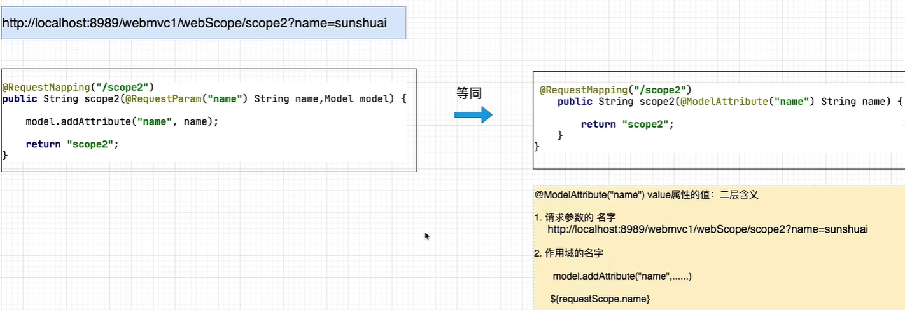
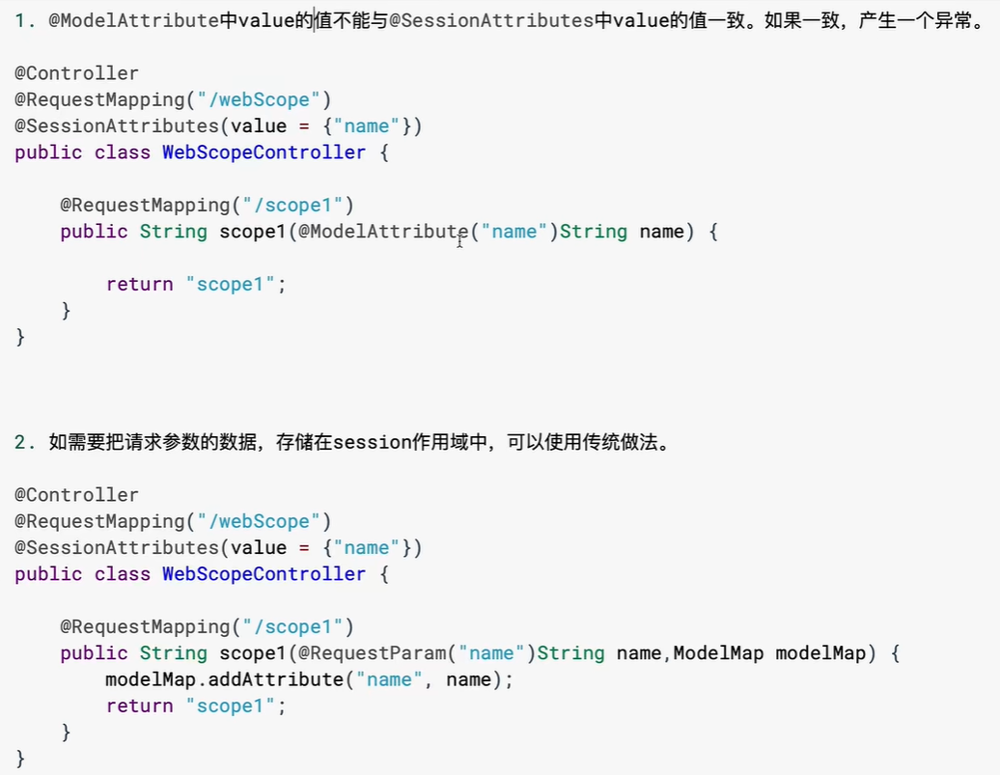

# SpringMVC

## 引

### 什么是SpringMVC

````markdown
	概念: SpringMVC是基于Spring Framework衍生而来的一个MVC框架,是 Spring 为表述层开发提供的一整套完备的解决方案。主要解决了原有MVC框架开发过程中，控制器(Controller)的问题。
	表述层表示前台页面和后台 servlet
````

- SpringMVC是一个MVC框架

`````markdown
MVC是一个架构思想，在JavaEE开发中多用于Web开发。

应用MVC架构思想开发应用，会把一个项目划分为了3个层次，M(Model)模型层, V(View)视图层，C(Controller)控制层
M：Model，模型层，指工程中的JavaBean，作用是处理数据
JavaBean分为两类：

- 一类称为实体类Bean：专门存储业务数据的，如 Student、User 等
- 一类称为业务处理 Bean：指 Service 或 Dao 对象，专门用于处理业务逻辑和数据访问

V：View，视图层，指工程中的html或jsp等页面，作用是与用户进行交互，展示数据
C：Controller，控制层，指工程中的servlet，作用是接收请求和响应浏览器

MVC的工作流程： 用户通过视图层发送请求到服务器，在服务器中请求被Controller接收，Controller 调用相应的Model层处理请求，处理完毕将结果返回到Controller，Controller再根据请求处理的结果 找到相应的View视图，渲染数据后最终响应给浏览器

	MVC这种分层开发，体现了面向对象各司其职的设计思想，也更加有利于后续的项目维护(修改).
`````

- **原有控制器的实现技术**

​	Servlet   [基于Java Model2模式]
​	Struts2 中的Action

- **Servlet实现控制器存在的问题**

​		控制器的核心作用
````markdown
	接受用户的请求，调用业务功能(Service)，并根据处理结果控制程序的运行流程。
````


**控制器存在的问题**

接受client请求参数

````markdown
	代码冗余
	只能接受字符串类型的数据，需要手工进行类型转换
	无法自动封装对象
````


调用业务对象(Service)
````java
Userservice userService = new UserServiceImpl();//耦合代码
boolean isLogin = userService.login(name,password);
````

通过new的方式获得业务对象(service)，存在耦合
流程跳转(页面跳转)

````markdown
	跳转路径耦合
	与视图层技术的耦合
````

## 入门案例

### 创建maven工程

```xml
<dependencies>
<!-- SpringMVC -->
<dependency>
<groupId>org.springframework</groupId>
<artifactId>spring-webmvc</artifactId>
<version>5.3.1</version>
</dependency>
<!-- 日志 -->
<dependency>
<groupId>ch.qos.logback</groupId>
<artifactId>logback-classic</artifactId>
<version>1.2.3</version>
</dependency>
<!-- ServletAPI -->
<dependency>
<groupId>javax.servlet</groupId>
<artifactId>javax.servlet-api</artifactId>
<version>3.1.0</version>
<scope>provided</scope>
</dependency>
<!-- Spring5和Thymeleaf整合包 -->
<dependency>
<groupId>org.thymeleaf</groupId>
<artifactId>thymeleaf-spring5</artifactId>
<version>3.0.12.RELEASE</version>
</dependency>
</dependencies>
```

### 配置web.xml

注册SpringMVC的前端控制器DispatcherServlet

#### ①默认配置方式

此配置作用下，SpringMVC的配置文件默认位于WEB-INF下，默认名称为- servlet.xml，例如，以下配置所对应SpringMVC的配置文件位于WEB-INF下，文件名为springMVCservlet.xml

```xml
<!-- 配置SpringMVC的前端控制器，对浏览器发送的请求统一进行处理 -->
<servlet>
<servlet-name>springMVC</servlet-name>
<servlet-class>org.springframework.web.servlet.DispatcherServlet</servletclass>
</servlet>
<servlet-mapping>
<servlet-name>springMVC</servlet-name>
<!--
设置springMVC的核心控制器所能处理的请求的请求路径
/所匹配的请求可以是/login或.html或.js或.css方式的请求路径
但是/不能匹配.jsp请求路径的请求
-->
<url-pattern>/</url-pattern>
</servlet-mapping>
```

#### ②扩展配置方式

可通过init-param标签设置SpringMVC配置文件的位置和名称，通过load-on-startup标签设置 SpringMVC前端控制器DispatcherServlet的初始化时间

```xml
<!-- 配置SpringMVC的前端控制器，对浏览器发送的请求统一进行处理 -->
<servlet>
<servlet-name>springMVC</servlet-name>
<servlet-class>org.springframework.web.servlet.DispatcherServlet</servletclass>
<!-- 通过初始化参数指定SpringMVC配置文件的位置和名称 -->
<init-param>
<!-- contextConfigLocation为固定值 -->
<param-name>contextConfigLocation</param-name>
<!-- 使用classpath:表示从类路径查找配置文件，例如maven工程中的
src/main/resources -->
<param-value>classpath:springMVC.xml</param-value>
</init-param>
<!--
作为框架的核心组件，在启动过程中有大量的初始化操作要做
而这些操作放在第一次请求时才执行会严重影响访问速度
因此需要通过此标签将启动控制DispatcherServlet的初始化时间提前到服务器启动时
-->
<load-on-startup>1</load-on-startup>
</servlet>
<servlet-mapping>
<servlet-name>springMVC</servlet-name>
<!--
设置springMVC的核心控制器所能处理的请求的请求路径
/所匹配的请求可以是/login或.html或.js或.css方式的请求路径
但是/不能匹配.jsp请求路径的请求
-->
<url-pattern>/</url-pattern>
</servlet-mapping>
```

> <url-pattern>标签中使用/和/ *的区别：
>
> /所匹配的请求可以是/login或.html或.js或.css方式的请求路径，但是/不能匹配.jsp请求路径的请求,因此就可以避免在访问jsp页面时，该请求被DispatcherServlet处理，从而找不到相应的页面
> / *则能够匹配所有请求，例如在使用过滤器时，若需要对所有请求进行过滤，就需要使用/ *的写法

### 创建请求控制器

由于前端控制器对浏览器发送的请求进行了统一的处理，但是具体的请求有不同的处理过程，因此需要 创建处理具体请求的类，即请求控制器

请求控制器中每一个处理请求的方法成为控制器方法

因为SpringMVC的控制器由一个POJO（普通的Java类）担任，因此需要通过@Controller注解将其标识 为一个控制层组件，交给Spring的IoC容器管理，此时SpringMVC才能够识别控制器的存在

```java
@Controller
public class HelloController {
}
```

#### 创建SpringMVC的配置文件

```xml
<!-- 自动扫描包 -->
<context:component-scan base-package="com.atguigu.mvc.controller"/>
<!-- 配置Thymeleaf视图解析器 -->
<bean id="viewResolver"
class="org.thymeleaf.spring5.view.ThymeleafViewResolver">
<property name="order" value="1"/>
<property name="characterEncoding" value="UTF-8"/>
<property name="templateEngine">
<bean class="org.thymeleaf.spring5.SpringTemplateEngine">
<property name="templateResolver">
<bean
class="org.thymeleaf.spring5.templateresolver.SpringResourceTemplateResolver">
<!-- 视图前缀 -->
<property name="prefix" value="/WEB-INF/templates/"/>
<!-- 视图后缀 -->
<property name="suffix" value=".html"/>
<property name="templateMode" value="HTML5"/>
<property name="characterEncoding" value="UTF-8" />
</bean>
</property>
</bean>
</property>
</bean>
<!--
处理静态资源，例如html、js、css、jpg
若只设置该标签，则只能访问静态资源，其他请求则无法访问
此时必须设置<mvc:annotation-driven/>解决问题
-->
<mvc:default-servlet-handler/>
<!-- 开启mvc注解驱动 -->
<mvc:annotation-driven>
<mvc:message-converters>
<!-- 处理响应中文内容乱码 -->
<bean
class="org.springframework.http.converter.StringHttpMessageConverter">
<property name="defaultCharset" value="UTF-8" />
<property name="supportedMediaTypes">
<list>
<value>text/html</value>
<value>application/json</value>
</list>
</property>
</bean>
</mvc:message-converters>
</mvc:annotation-driven>
```

### 测试HelloWorld

#### ①实现对首页的访问

在请求控制器中创建处理请求的方法

```java
// @RequestMapping注解：处理请求和控制器方法之间的映射关系
// @RequestMapping注解的value属性可以通过请求地址匹配请求，/表示的当前工程的上下文路径
// localhost:8080/springMVC/
@RequestMapping("/")
public String index() {
//设置视图名称
return "index";
}
```

#### ②通过超链接跳转到指定页面

在主页index.html中设置超链接

```java
<!DOCTYPE html>
<html lang="en" xmlns:th="http://www.thymeleaf.org">
<head>
<meta charset="UTF-8">
<title>首页</title>
</head>
<body>
<h1>首页</h1>
<a th:href="@{/hello}">HelloWorld</a><br/>
</body>
</html>
```

在请求控制器中创建处理请求的方法

```java
@RequestMapping("/hello")
public String HelloWorld() {
return "target";
}
```

### 总结

浏览器发送请求，若请求地址符合前端控制器的url-pattern，该请求就会被前端控制器 DispatcherServlet处理。前端控制器会读取SpringMVC的核心配置文件，通过扫描组件找到控制器， 将请求地址和控制器中@RequestMapping注解的value属性值进行匹配，若匹配成功，该注解所标识的 控制器方法就是处理请求的方法。处理请求的方法需要返回一个字符串类型的视图名称，该视图名称会 被视图解析器解析，加上前缀和后缀组成视图的路径，通过Thymeleaf对视图进行渲染，最终转发到视图所对应页面

## @RequestMapping注解

### @RequestMapping注解的功能

从注解名称上我们可以看到，@RequestMapping注解的作用就是将请求和处理请求的控制器方法关联起来，建立映射关系。

SpringMVC 接收到指定的请求，就会来找到在映射关系中对应的控制器方法来处理这个请求。

### @RequestMapping注解的位置

@RequestMapping标识一个类：设置映射请求的请求路径的初始信息

@RequestMapping标识一个方法：设置映射请求请求路径的具体信息

```java
@Controller
@RequestMapping("/test")
public class RequestMappingController {
//此时请求映射所映射的请求的请求路径为：/test/testRequestMapping
@RequestMapping("/testRequestMapping")
public String testRequestMapping(){
return "success";
}
}
```

### @RequestMapping注解的value属性

@RequestMapping注解的value属性通过请求的请求地址匹配请求映射

@RequestMapping注解的value属性是一个字符串类型的数组，表示该请求映射能够匹配多个请求地址 所对应的请求

@RequestMapping注解的value属性必须设置，至少通过请求地址匹配请求映射

```html
<a th:href="@{/testRequestMapping}">测试@RequestMapping的value属性->/testRequestMapping</a><br>
<a th:href="@{/test}">测试@RequestMapping的value属性-->/test</a><br>
@RequestMapping(
value = {"/testRequestMapping", "/test"}
)
public String testRequestMapping(){
return "success";
}
```

### @RequestMapping注解的method属性

@RequestMapping注解的method属性通过请求的请求方式（get或post）匹配请求映射

@RequestMapping注解的method属性是一个RequestMethod类型的数组，表示该请求映射能够匹配 多种请求方式的请求

若当前请求的请求地址满足请求映射的value属性，但是请求方式不满足method属性，则浏览器报错 405：Request method 'POST' not supported

```html
<a th:href="@{/test}">测试@RequestMapping的value属性-->/test</a><br>
<form th:action="@{/test}" method="post">
<input type="submit">
</form>
```

```java
@RequestMapping(
value = {"/testRequestMapping", "/test"},
method = {RequestMethod.GET, RequestMethod.POST}
)
public String testRequestMapping(){
return "success";
}
```

> 注：
> 1、对于处理指定请求方式的控制器方法，SpringMVC中提供了@RequestMapping的派生注解
> 处理get请求的映射-->@GetMapping
> 处理post请求的映射-->@PostMapping
> 处理put请求的映射-->@PutMapping
> 处理delete请求的映射-->@DeleteMapping
> 2、常用的请求方式有get，post，put，delete
> 但是目前浏览器只支持get和post，若在form表单提交时，为method设置了其他请求方式的字符
> 串（put或delete），则按照默认的请求方式get处理
> 若要发送put和delete请求，则需要通过spring提供的过滤器HiddenHttpMethodFilter，在
> RESTful部分会讲到

### @RequestMapping注解的params属性（了解）

@RequestMapping注解的params属性通过请求的请求参数匹配请求映射
@RequestMapping注解的params属性是一个字符串类型的数组，可以通过四种表达式设置请求参数 和请求映射的匹配关系
"param"：要求请求映射所匹配的请求必须携带param请求参数
"!param"：要求请求映射所匹配的请求必须不能携带param请求参数
"param=value"：要求请求映射所匹配的请求必须携带param请求参数且param=value
"param!=value"：要求请求映射所匹配的请求必须携带param请求参数但是param!=value

```html
<a th:href="@{/test(username='admin',password=123456)">
测试@RequestMapping的params属性-->/test</a><br>
```

```java
@RequestMapping(
value = {"/testRequestMapping", "/test"}
,method = {RequestMethod.GET, RequestMethod.POST}
,params = {"username","password!=123456"}
)
public String testRequestMapping(){
return "success";
}
```

> 注：

> 若当前请求满足@RequestMapping注解的value和method属性，但是不满足params属性，此时 页面回报错400：Parameter conditions "username, password!=123456" not met for actual request parameters: username={admin}, password={123456}

### @RequestMapping注解的headers属性（了解）

@RequestMapping注解的headers属性通过请求的请求头信息匹配请求映射
@RequestMapping注解的headers属性是一个字符串类型的数组，可以通过四种表达式设置请求头信息和请求映射的匹配关系
"header"：要求请求映射所匹配的请求必须携带header请求头信息
"!header"：要求请求映射所匹配的请求必须不能携带header请求头信息
"header=value"：要求请求映射所匹配的请求必须携带header请求头信息且header=value
"header!=value"：要求请求映射所匹配的请求必须携带header请求头信息且header!=value
若当前请求满足@RequestMapping注解的value和method属性，但是不满足headers属性，此时页面显示404错误，即资源未找到

### SpringMVC支持ant风格的路径

？：表示任意的单个字符

*：表示任意的0个或多个字符

**：表示任意层数的任意目录

注意：在使用* *时，只能使用/**/xxx的方式

### SpringMVC支持路径中的占位符（重点）

原始方式：/deleteUser?id=1

rest方式：/user/delete/1

SpringMVC路径中的占位符常用于RESTful风格中，当请求路径中将某些数据通过路径的方式传输到服务器中，就可以在相应的@RequestMapping注解的value属性中通过占位符{xxx}表示传输的数据，在通过@PathVariable注解，将占位符所表示的数据赋值给控制器方法的形参

```html
<a th:href="@{/testRest/1/admin}">测试路径中的占位符-->/testRest</a><br>
```

```java
@RequestMapping("/testRest/{id}/{username}")
public String testRest(@PathVariable("id") String id, 
                       @PathVariable("username")String username){
System.out.println("id:"+id+",username:"+username);
return "success";
}
//最终输出的内容为-->id:1,username:admin
```

## SpringMVC获取请求参数

### 通过ServletAPI获取

将HttpServletRequest作为控制器方法的形参，此时HttpServletRequest类型的参数表示封装了当前请求的请求报文的对象

```java
@RequestMapping("/testParam")
public String testParam(HttpServletRequest request){
String username = request.getParameter("username");
String password = request.getParameter("password");
System.out.println("username:"+username+",password:"+password);
return "success";
}
```

### 通过控制器方法的形参获取请求参数

在控制器方法的形参位置，设置和请求参数同名的形参，当浏览器发送请求，匹配到请求映射时，在 DispatcherServlet中就会将请求参数赋值给相应的形参

```html
<a th:href="@{/testParam(username='admin',password=123456)}">
测试获取请求参数-->/testParam</a><br>
```

```java
@RequestMapping("/testParam")
public String testParam(String username, int password){
System.out.println("username:"+username+",password:"+password);
return "success";
}
```

> 注：
> 若请求所传输的请求参数中有多个同名的请求参数，此时可以在控制器方法的形参中设置字符串
> 数组或者字符串类型的形参接收此请求参数
> 若使用字符串数组类型的形参，此参数的数组中包含了每一个数据
> 若使用字符串类型的形参，此参数的值为每个数据中间使用逗号拼接的结果
>
> SpringMVC底层针对于age接受数据时会自动调用int password= Integer.parseInt("123456" );即常见类型转换
>
> 常见类型泛指:8种基本类型及其包装器，String等常见类型。Date日期等特殊类型，默认不支持，需要程序员自定义类型转换器
>
> 基本类型尽量使用包装类，若<a th:href="@{/testParam(username='admin'}">password没有提交数据，默认为null，int类型无法存储null，会报错

### @RequestParam

@RequestParam是将请求参数和控制器方法的形参创建映射关系
@RequestParam注解一共有三个属性：
value：指定为形参赋值的请求参数的参数名
required：设置是否必须传输此请求参数，默认值为true
若设置为true时，则当前请求必须传输value所指定的请求参数，若没有传输该请求参数，且没有设置defaultValue属性，则页面报错400：Required String parameter 'xxx' is not present；若设置为false，则当前请求不是必须传输value所指定的请求参数，若没有传输，则注解所标识的形参的值为null
defaultValue：不管required属性值为true或false，当value所指定的请求参数没有传输或传输的值为""时，则使用默认值为形参赋值

不能与POJO类型的参数联用

### @RequestHeader

@RequestHeader是将请求头信息和控制器方法的形参创建映射关系

@RequestHeader注解一共有三个属性：value、required、defaultValue，用法同@RequestParam

### @CookieValue

@CookieValue是将cookie数据和控制器方法的形参创建映射关系

@CookieValue注解一共有三个属性：value、required、defaultValue，用法同@RequestParam

### 通过POJO获取请求参数

**什么是POJO**

````markdown
POJ0全程叫做Plain Ordinary Java 0bject(简单的Java对象)
POJ0类型对象的特点是:
1．类型中如果存在成员变量，必须提供set get方法。
2．提供默认无参构造
3．可以实现Serializable，也可以不实现
4．不实现容器或者框架所规定的接口
````

可以在控制器方法的形参位置设置一个实体类类型的形参，此时若浏览器传输的请求参数的参数名和实体类中的属性名一致，那么请求参数就会为此属性赋值

```html
<form th:action="@{/testpojo}" method="post">
用户名：<input type="text" name="username"><br>
密码：<input type="password" name="password"><br>
性别：<input type="radio" name="sex" value="男">男
     <input type="radio"name="sex" value="女">女<br>
年龄：<input type="text" name="age"><br>
邮箱：<input type="text" name="email"><br>
<input type="submit">
</form>
```

```java
@RequestMapping("/testpojo")
public String testPOJO(User user){
System.out.println(user);
return "success";
}
//最终结果-->User{id=null, username='张三', password='123', age=23, sex='男',
email='123@qq.com'}
```


### 解决获取请求参数的乱码问题

解决获取请求参数的乱码问题，可以使用SpringMVC提供的编码过滤器CharacterEncodingFilter，但是必须在web.xml中进行注册

```xml
<!--配置springMVC的编码过滤器-->
<filter>
<filter-name>CharacterEncodingFilter</filter-name>
<filterclass>org.springframework.web.filter.CharacterEncodingFilter</filter-class>
<init-param>
<param-name>encoding</param-name>
<param-value>UTF-8</param-value>
</init-param>
<init-param>
<param-name>forceEncoding</param-name>
<param-value>true</param-value>
</init-param>
</filter>

<filter-mapping>
<filter-name>CharacterEncodingFilter</filter-name>
<url-pattern>/*</url-pattern>
</filter-mapping>
```

> 注：SpringMVC中处理编码的过滤器一定要配置到其他过滤器之前，否则无效

## 类型转换器

````markdown
在SpringMVC启动时，会通过<mvc:annotation-driven/>把FormattingConversionServiceFactoryBean。引入到SpringMVC体系中。FormattingConversionServiceFactoryBean存储了SpringMVC中所有的内置类型转换器。后续client提交请求参数时，如果对应控制器方法形参不是字符串类型，那么FormattingConversionServiceFactoryBean就会调用对应的类型转化器，进行类型辅换，最终完成控制器方法形参的赋值。
````

## 接受其他请求数据

### 动态参数收集

#### 单值动态参数收集

````markdown
http://localhost:8989/param/param2/param1?name=qwer
http://localhost:8989/param/param2/param1?age=10
两次请求参数名不同

@RequestMapping("param")
public String param10(@RequestParam Map<String，String> param) {
return "param1";
}
注意∶如果需要接受动态参数，必须保证Map的形参前面加入@RequestParam注解，否则接受不到数据。
````

#### 多值动态参数收集

````markdown
http://localhost:8989/param/param10?id=1&id=2&id=3
第一种解决思路:
@RequestMapping("/param1")
public String param1(int[] id) {
for (int i : ids) {
System.out.println("i = " +i);
return "result1";
}
问题:
http://localhost:8989/param/param10?id=1&id=2&id=3
http://localhost:8989/param/param10?name=qwer1&name=qwer2&name=qwer3
第二种解决思路:
@RequestMapping("/param11")
public String param11(@RequestParam MultiValueMap<String,String> params) {
system.out.println("ParamController.param11");
return "param1 " ;
}
````

## 域对象共享数据

### 使用ServletAPI向request域对象共享数据

```java
@RequestMapping("/testServletAPI")
public String testServletAPI(HttpServletRequest request){
request.setAttribute("testScope", "hello,servletAPI");
return "success";
}
```

### 使用ModelAndView向request域对象共享数据

```java
@RequestMapping("/testModelAndView")
public ModelAndView testModelAndView(){
/**
* ModelAndView有Model和View的功能
* Model主要用于向请求域共享数据
* View主要用于设置视图，实现页面跳转
*/
ModelAndView mav = new ModelAndView();
//向请求域共享数据
mav.addObject("testScope", "hello,ModelAndView");
//设置视图，实现页面跳转
mav.setViewName("success");
return mav;
}

注意: SpringNVC处理跳转页面与作用域时，把相应的内容最终都会封装到ModelAndView中，所以ModelAndView返回值的这种处理更加底层，而返回String的处理仅仅是简化了开发。
```

### 使用Model向request域对象共享数据

```java
@RequestMapping("/testModel")
public String testModel(Model model){
model.addAttribute("testScope", "hello,Model");
return "success";
}
```

### 使用map向request域对象共享数据

```java
@RequestMapping("/testMap")
public String testMap(Map<String, Object> map){
map.put("testScope", "hello,Map");
return "success";
}
```

### 使用ModelMap向request域对象共享数据

```java
@RequestMapping("/testModelMap")
public String testModelMap(ModelMap modelMap){
modelMap.addAttribute("testScope", "hello,ModelMap");
return "success";
}
```

### Model、ModelMap、Map的关系

##### Model、ModelMap、Map类型的参数其实本质上都是 BindingAwareModelMap 类型的

```java
public interface Model{}
public class ModelMap extends LinkedHashMap<String, Object> {}
public class ExtendedModelMap extends ModelMap implements Model {}
public class BindingAwareModelMap extends ExtendedModelMap {}

public String method(Model model) SpringMVC   BingdingAwareModelMap
								  WebFlux     ConcurrentMode
    在源码中SpringMVC不建议使用BindingAwareModelMap。其原因是因为如果直接使用BindingAwareModelMap的话，会存在耦合。MVC开发时使用BindingAwareModelNap，而WebFlux开发时使用的是ConcurrentModel。如果替换Web的实现方案，直接使用BindingAwareModelMap话，不利于项目的维护，得修改代码。所以更加建议使用Model接口处理。更推荐Model
    
    如果redirect跳转，数据该如何传递?
SpringVC会自动的把Model或者ModelMap中的数据，通过?的形式在url上进行拼接，从而传递数据。
```

### 向session域共享数据

```java
@RequestMapping("/testSession")
public String testSession(HttpSession session){
session.setAttribute("testSessionScope", "hello,session");
return "success";
}
```

### 向application域共享数据

```java
@RequestMapping("/testApplication")
public String testApplication(HttpSession session){
ServletContext application = session.getServletContext();
application.setAttribute("testApplicationScope", "hello,application");
return "success";
}
```

### @SessionAttributes

将数据存储到session作用域中

````java
@Controller
@RequestMapping("/webScope")
@SessionAttributes (value = "name")
public class WebScopeController {
@RequestMapping("/scope1")
public String scope1 (Model model) {
mode1.addAttribute("name","xiaohei");
    return "scope1" ;
	}
}

@Controller
@RequestMapping("/webScope")
@SessionAttributes(value = {"name","sex"})
public class WebScopeController {
@RequestMapping("/scope1")
public String scope1 (Model model) {
	model.addAttribute ("name","xiaohei");
    model.addAttribute("age","10");
	model.addAttribute("sex","female");
    return "scope1 ";
	}
}

@Controller
@RequestMapping("/webScope")
@SessionAttributes(value = {"name","sex","address"})
//目前modelMap或者model中没有address,没有问题，不会报错
public class WebScopeController {
@RequestMapping("/scope1")
public String scope1 (Model model) {
	model.addAttribute ("name","xiaohei");
    model.addAttribute("age","10");
	model.addAttribute("sex","female");
    return "scope1 ";
	}
}


注意：
    Model、ModelMap在把name的数据通过@SessionAttributes存储在Session作用域中的同时在Request作用域中也会存储此时Request作用域、Session作用域存储的是一个对象的引用(可以节省内存占用)
    @SessionAttributes注解只能使用在类上，用于在多个请求之间传递参数，类似于Session的Attribute，但不完全一样，一般来说@SessionAttributes设置的参数只用于暂时的传递（存入sessionAttributeStore），而不是长期的保存，长期保存的数据还是要放到Session中。
````

### 删除session作用域中的数据

````java
为什么要主动删除Session作用域中的数据?
因为HttpSession对象会长期驻留内存.所以他存储的数据，在不需要时，要及时删除，避免过多的侵占服务器内存资源。Request作用域没有这个要求，因为它的生命周期非常短暂

删除Session作用域数据的应用场景
1．在Session作用域存储的数据，一旦使用完成，立即删除
2．把登录的标记，从session中删除【注销】
3．清空购物车

删除Session作用域中数据的核心代码
session.removeAttribute("name") ;


@RequestMapping("/scope8")
public String scopeB (SessionStatus sessionStatus) {
if(!sessionStatus.isComplete()){
sessionStatus.setComplete();
	}
return "scope0";
}

注意：
    这个方法只是清除SessionAttribute里的参数，而不会应用Session中的参数
````

**为什么SpringMVC没有提供application作用域?**

````markdown
因为application作用域(ServletContext)这个作用域是全局唯一的。在开发应用中，多于与存储全局唯一的对象，被框架底层封装。在应用开发时，程序员基本不会使用其进行业务操作。
````

### @ModelAttribute

````markdown
SpringMVC通过@ModelAttribute注解:接受请求参数的同时，把对应的数据存储到request作用域中。

@RequestMapping("/scope2")
public String scope2(@ModelAttribute("name") String name){
return "scope2";
}
````



**细节**

````markdown
如果传递的是简单变量请求参数:@ModelAttribute中的value属性，必须与超级链接或者表单的key名字保持一致。
如果传递的是POJ0类型的请求参数:则没有上述要求，但是@ModelAttribute中的value属性，会作为request作用域的名字
````



## 页面跳转


## SpringMVC的视图

SpringMVC中的视图是View接口，视图的作用渲染数据，将模型Model中的数据展示给用户

SpringMVC视图的种类很多，默认有转发视图和重定向视图

当工程引入jstl的依赖，转发视图会自动转换为JstlView

若使用的视图技术为Thymeleaf，在SpringMVC的配置文件中配置了Thymeleaf的视图解析器，由此视图解析器解析之后所得到的是ThymeleafView

### ThymeleafView

当控制器方法中所设置的视图名称没有任何前缀时，此时的视图名称会被SpringMVC配置文件中所配置的视图解析器解析，视图名称拼接视图前缀和视图后缀所得到的最终路径，会通过转发的方式实现跳转

```java
@RequestMapping("/testHello")
public String testHello(){
return "hello";
}
```

### 转发视图

SpringMVC中默认的转发视图是InternalResourceView

SpringMVC中创建转发视图的情况：

当控制器方法中所设置的视图名称以"forward:"为前缀时，创建InternalResourceView视图，此时的视图名称不会被SpringMVC配置文件中所配置的视图解析器解析，而是会将前缀"forward:"去掉，剩余部分作为最终路径通过转发的方式实现跳转

例如"forward:/"，"forward:/employee"

```java
@RequestMapping("/testForward")
public String testForward(){
return "forward:/testHello";
}
```

### 重定向视图

##### SpringMVC中默认的重定向视图是RedirectView

当控制器方法中所设置的视图名称以"redirect:"为前缀时，创建RedirectView视图，此时的视图名称不会被SpringMVC配置文件中所配置的视图解析器解析，而是会将前缀"redirect:"去掉，剩余部分作为最终路径通过重定向的方式实现跳转
例如"redirect:/"，"redirect:/employee"

```java
@RequestMapping("/testRedirect")
public String testRedirect(){
return "redirect:/testHello";
}
```

> 注：
>
> 重定向视图在解析时，会先将redirect:前缀去掉，然后会判断剩余部分是否以/开头，若是则会自动拼接上下文路径

### 视图控制器view-controller

##### 当控制器方法中，仅仅用来实现页面跳转，即只需要设置视图名称时，可以将处理器方法使用view-

##### controller标签进行表示

```xml
<!--
path：设置处理的请求地址
view-name：设置请求地址所对应的视图名称
-->
<mvc:view-controller path="/testView" view-name="success"></mvc:view-controller>
```

> 注：
>
> 当SpringMVC中设置任何一个view-controller时，其他控制器中的请求映射将全部失效，此时需
>
> 要在SpringMVC的核心配置文件中设置开启mvc注解驱动的标签：<mvc:annotation-driven />

## RESTful

### RESTful简介

REST：Representational State Transfer，表现层资源状态转移。

##### ①资源


资源是一种看待服务器的方式，即，将服务器看作是由很多离散的资源组成。每个资源是服务器上一个可命名的抽象概念。因为资源是一个抽象的概念，所以它不仅仅能代表服务器文件系统中的一个文件、数据库中的一张表等等具体的东西，可以将资源设计的要多抽象有多抽象，只要想象力允许而且客户端应用开发者能够理解。与面向对象设计类似，资源是以名词为核心来组织的，首先关注的是名词。一个资源可以由一个或多个URI来标识。URI既是资源的名称，也是资源在Web上的地址。对某个资源感兴趣的客户端应用，可以通过资源的URI与其进行交互。

##### ②资源的表述


资源的表述是一段对于资源在某个特定时刻的状态的描述。可以在客户端-服务器端之间转移（交换）。资源的表述可以有多种格式，例如HTML/XML/JSON/纯文本/图片/视频/音频等等。资源的表述格式可以通过协商机制来确定。请求-响应方向的表述通常使用不同的格式。

##### ③状态转移


状态转移说的是：在客户端和服务器端之间转移（transfer）代表资源状态的表述。通过转移和操作资源的表述，来间接实现操作资源的目的。

### RESTful的实现

具体说，就是 HTTP 协议里面，四个表示操作方式的动词：GET、POST、PUT、DELETE。

它们分别对应四种基本操作：GET 用来获取资源，POST 用来新建资源，PUT 用来更新资源，DELETE 用来删除资源。

REST 风格提倡 URL 地址使用统一的风格设计，从前到后各个单词使用斜杠分开，不使用问号键值对方 式携带请求参数，而是将要发送给服务器的数据作为 URL 地址的一部分，以保证整体风格的一致性。

| 操作     | 传统方式         | REST风格                |
| -------- | ---------------- | ----------------------- |
| 查询操作 | getUserById?id=1 | user/1-->get请求方式    |
| 保存操作 | saveUser         | user-->post请求方式     |
| 删除操作 | deleteUser?id=1  | user/1-->delete请求方式 |
| 更新操作 | updateUser       | user-->put请求方式      |

### HiddenHttpMethodFilter

由于浏览器只支持发送get和post方式的请求，那么该如何发送put和delete请求呢？

SpringMVC 提供了 HiddenHttpMethodFilter 帮助我们将 POST 请求转换为 DELETE 或 PUT 请求

HiddenHttpMethodFilter 处理put和delete请求的条件：

a>当前请求的请求方式必须为post

b>当前请求必须传输请求参数_method 

```
 <input type="hidden" name="_method" value="put">
```

满足以上条件，HiddenHttpMethodFilter 过滤器就会将当前请求的请求方式转换为请求参数 _method的值，因此请求参数_method的值才是最终的请求方式

在web.xml中注册HiddenHttpMethodFilter

```xml
<filter>
<filter-name>HiddenHttpMethodFilter</filter-name>
<filter-class>org.springframework.web.filter.HiddenHttpMethodFilter</filterclass>
</filter>
<filter-mapping>
<filter-name>HiddenHttpMethodFilter</filter-name>
<url-pattern>/*</url-pattern>
</filter-mapping>
```

> 注：
>
> 目前为止，SpringMVC中提供了两个过滤器：CharacterEncodingFilter和 HiddenHttpMethodFilter
>
> 在web.xml中注册时，必须先注册CharacterEncodingFilter，再注册HiddenHttpMethodFilter
>
> 原因：
>
> - 在 CharacterEncodingFilter 中通过 request.setCharacterEncoding(encoding) 方法设置字 符集的
>
> - request.setCharacterEncoding(encoding) 方法要求前面不能有任何获取请求参数的操作
>
> - 而 HiddenHttpMethodFilter 恰恰有一个获取请求方式的操作：
>
> - ```
>   String paramValue = request.getParameter(this.methodParam);
>   ```

## RESTful案例

### 准备工作

和传统 CRUD 一样，实现对员工信息的增删改查。

```java
package com.atguigu.mvc.bean;
public class Employee {
private Integer id;
private String lastName;
private String email;
//1 male, 0 female
private Integer gender;
public Integer getId() {
return id;
}
public void setId(Integer id) {
this.id = id;
}
public String getLastName() {
return lastName;
}
public void setLastName(String lastName) {
this.lastName = lastName;
}
public String getEmail() {
return email;
}
public void setEmail(String email) {
this.email = email;
}
public Integer getGender() {
return gender;
}
public void setGender(Integer gender) {
this.gender = gender;
}
public Employee(Integer id, String lastName, String email, Integer
gender) {
super();
this.id = id;
this.lastName = lastName;
this.email = email;
this.gender = gender;
}
public Employee() {
}
}
```

准备dao模拟数据

```java
package com.atguigu.mvc.dao;
import java.util.Collection;
import java.util.HashMap;
import java.util.Map;
import com.atguigu.mvc.bean.Employee;
import org.springframework.stereotype.Repository;
@Repository
public class EmployeeDao {
private static Map<Integer, Employee> employees = null;
static{
employees = new HashMap<Integer, Employee>();
employees.put(1001, new Employee(1001, "E-AA", "aa@163.com", 1));
employees.put(1002, new Employee(1002, "E-BB", "bb@163.com", 1));
employees.put(1003, new Employee(1003, "E-CC", "cc@163.com", 0));
employees.put(1004, new Employee(1004, "E-DD", "dd@163.com", 0));
employees.put(1005, new Employee(1005, "E-EE", "ee@163.com", 1));
}
private static Integer initId = 1006;
public void save(Employee employee){
if(employee.getId() == null){
employee.setId(initId++);
}
employees.put(employee.getId(), employee);
}
public Collection<Employee> getAll(){
return employees.values();
}
public Employee get(Integer id){
return employees.get(id);
}
public void delete(Integer id){
employees.remove(id);
}
}
```

### 功能清单

| 功能                | URL 地址    | 请求方式 |
| ------------------- | ----------- | -------- |
| 访问首页√           | /           | GET      |
| 查询全部数据√       | /employee   | GET      |
| 删除√               | /employee/2 | DELETE   |
| 跳转到添加数据页面√ | /toAdd      | GET      |
| 执行保存√           | /employee   | POST     |
| 跳转到更新数据页面√ | /employee/2 | GET      |
| 执行更新√           | /employee   | PUT      |

## SpringMVC处理ajax请求

### @RequestBody

@RequestBody可以获取请求体信息，使用@RequestBody注解标识控制器方法的形参，当前请求的请求体就会为当前注解所标识的形参赋值

```html
<!--此时必须使用post请求方式，因为get请求没有请求体-->
<form th:action="@{/test/RequestBody}" method="post">
用户名：<input type="text" name="username"><br>
密码：<input type="password" name="password"><br>
<input type="submit">
</form>
```

```java
@RequestMapping("/test/RequestBody")
public String testRequestBody(@RequestBody String requestBody){
System.out.println("requestBody:"+requestBody);
return "success";
}
```

输出结果：requestBody:username=admin&password=123456

### @RequestBody获取json格式的请求参数

在使用了axios发送ajax请求之后，浏览器发送到服务器的请求参数有两种格式：

1、name=value&name=value...，此时的请求参数可以通过request.getParameter()获取，对应 SpringMVC中，可以直接通过控制器方法的形参获取此类请求参数

2、{key:value,key:value,...}，此时无法通过request.getParameter()获取，之前我们使用操作 json的相关jar包gson或jackson处理此类请求参数，可以将其转换为指定的实体类对象或map集 合。在SpringMVC中，直接使用@RequestBody注解标识控制器方法的形参即可将此类请求参数 转换为java对象

使用@RequestBody获取json格式的请求参数的条件：

1、导入jackson的依赖

```xml
<dependency>
<groupId>com.fasterxml.jackson.core</groupId>
<artifactId>jackson-databind</artifactId>
<version>2.12.1</version>
</dependency>
```

2、SpringMVC的配置文件中设置开启mvc的注解驱动

```
<!--开启mvc的注解驱动-->
<mvc:annotation-driven />
```

3、在控制器方法的形参位置，设置json格式的请求参数要转换成的java类型（实体类或map）的参 数，并使用@RequestBody注解标识

```html
<input type="button" value="测试@RequestBody获取json格式的请求参数"
@click="testRequestBody()"><br>
<script type="text/javascript" th:src="@{/js/vue.js}"></script>
<script type="text/javascript" th:src="@{/js/axios.min.js}"></script>
<script type="text/javascript">
var vue = new Vue({
el:"#app",
methods:{
testRequestBody(){
axios.post(
"/SpringMVC/test/RequestBody/json",
{username:"admin",password:"123456"}
).then(response=>{
console.log(response.data);
});
}
}
});
</script>
```

```java
//将json格式的数据转换为map集合
@RequestMapping("/test/RequestBody/json")
public void testRequestBody(@RequestBody Map<String, Object> map,
HttpServletResponse response) throws IOException {
System.out.println(map);
//{username=admin, password=123456}
response.getWriter().print("hello,axios");
}
//将json格式的数据转换为实体类对象
@RequestMapping("/test/RequestBody/json")
public void testRequestBody(@RequestBody User user, HttpServletResponse
response) throws IOException {
System.out.println(user);
//User{id=null, username='admin', password='123456', age=null,
gender='null'}
response.getWriter().print("hello,axios");
}
```

### @ResponseBody

@ResponseBody用于标识一个控制器方法，可以将该方法的返回值直接作为响应报文的响应体响应到浏览器

```java
@RequestMapping("/testResponseBody")
public String testResponseBody(){
//此时会跳转到逻辑视图success所对应的页面
return "success";
}
@RequestMapping("/testResponseBody")
@ResponseBody
public String testResponseBody(){
//此时响应浏览器数据success
return "success";
}
```

### @ResponseBody响应浏览器json数据

服务器处理ajax请求之后，大多数情况都需要向浏览器响应一个java对象，此时必须将java对象转换为 json字符串才可以响应到浏览器，之前我们使用操作json数据的jar包gson或jackson将java对象转换为 json字符串。在SpringMVC中，我们可以直接使用@ResponseBody注解实现此功能

@ResponseBody响应浏览器json数据的条件：

1、导入jackson的依赖

```
<dependency>
<groupId>com.fasterxml.jackson.core</groupId>
<artifactId>jackson-databind</artifactId>
<version>2.12.1</version>
</dependency>
```

2、SpringMVC的配置文件中设置开启mvc的注解驱动

```
<!--开启mvc的注解驱动-->
<mvc:annotation-driven />
```

3、使用@ResponseBody注解标识控制器方法，在方法中，将需要转换为json字符串并响应到浏览器 的java对象作为控制器方法的返回值，此时SpringMVC就可以将此对象直接转换为json字符串并响应到浏览器

```html
<input type="button" value="测试@ResponseBody响应浏览器json格式的数据"
@click="testResponseBody()"><br>
<script type="text/javascript" th:src="@{/js/vue.js}"></script>
<script type="text/javascript" th:src="@{/js/axios.min.js}"></script>
<script type="text/javascript">
var vue = new Vue({
el:"#app",
methods:{
testResponseBody(){
axios.post("/SpringMVC/test/ResponseBody/json").then(response=>{
console.log(response.data);
});
}
}
});
</script>
```

```java
//响应浏览器list集合
@RequestMapping("/test/ResponseBody/json")
@ResponseBody
public List<User> testResponseBody(){
User user1 = new User(1001,"admin1","123456",23,"男");
User user2 = new User(1002,"admin2","123456",23,"男");
User user3 = new User(1003,"admin3","123456",23,"男");
List<User> list = Arrays.asList(user1, user2, user3);
return list;
}
//响应浏览器map集合
@RequestMapping("/test/ResponseBody/json")
@ResponseBody
public Map<String, Object> testResponseBody(){
User user1 = new User(1001,"admin1","123456",23,"男");
User user2 = new User(1002,"admin2","123456",23,"男");
User user3 = new User(1003,"admin3","123456",23,"男");
Map<String, Object> map = new HashMap<>();
map.put("1001", user1);
map.put("1002", user2);
map.put("1003", user3);
return map;
}
//响应浏览器实体类对象
@RequestMapping("/test/ResponseBody/json")
@ResponseBody
public User testResponseBody(){
return user;
}
```

### @RestController注解

@RestController注解是springMVC提供的一个复合注解，标识在控制器的类上，就相当于为类添加了 @Controller注解，并且为其中的每个方法添加了@ResponseBody注解

## 文件上传和下载

### 文件下载

ResponseEntity用于控制器方法的返回值类型，该控制器方法的返回值就是响应到浏览器的响应报文使用ResponseEntity实现下载文件的功能

```java
@RequestMapping("/testDown")
public ResponseEntity<byte[]> testResponseEntity(HttpSession session) throws
IOException {
//获取ServletContext对象
ServletContext servletContext = session.getServletContext();
//获取服务器中文件的真实路径
String realPath = servletContext.getRealPath("/static/img/1.jpg");
    /*String realPath = servletContext.getRealPath("1.jpg");
    realPath += File.separator + "1.jpg";
    File.separator文件分隔符，自动匹配/或\
    */
//创建输入流
InputStream is = new FileInputStream(realPath);
//创建字节数组
byte[] bytes = new byte[is.available()];
//将流读到字节数组中
is.read(bytes);
//创建HttpHeaders对象设置响应头信息
MultiValueMap<String, String> headers = new HttpHeaders();
//设置要下载方式以及下载文件的名字
headers.add("Content-Disposition", "attachment;filename=1.jpg");
//设置响应状态码
HttpStatus statusCode = HttpStatus.OK;
//创建ResponseEntity对象
ResponseEntity<byte[]> responseEntity = new ResponseEntity<>(bytes, headers,
statusCode);
//关闭输入流
is.close();
return responseEntity;
}
```

### 文件上传

文件上传要求form表单的请求方式必须为post，并且添加属性enctype="multipart/form-data" SpringMVC中将上传的文件封装到MultipartFile对象中，通过此对象可以获取文件相关信息

上传步骤：

①添加依赖：

```
<!-- https://mvnrepository.com/artifact/commons-fileupload/commons-fileupload --
>
<dependency>
<groupId>commons-fileupload</groupId>
<artifactId>commons-fileupload</artifactId>
<version>1.3.1</version>
</dependency>
```

②在SpringMVC的配置文件中添加配置：

```
<!--必须通过文件解析器的解析才能将文件转换为MultipartFile对象-->
<bean id="multipartResolver"
class="org.springframework.web.multipart.commons.CommonsMultipartResolver">
</bean>
```

③控制器方法：

```java
@RequestMapping("/testUp")
public String testUp(MultipartFile photo, HttpSession session) throws
IOException {
//获取上传的文件的文件名
String fileName = photo.getOriginalFilename();
//处理文件重名问题
String hzName = fileName.substring(fileName.lastIndexOf("."));
fileName = UUID.randomUUID().toString() + hzName;
//获取服务器中photo目录的路径
ServletContext servletContext = session.getServletContext();
String photoPath = servletContext.getRealPath("photo");
File file = new File(photoPath);
if(!file.exists()){
file.mkdir();
}
String finalPath = photoPath + File.separator + fileName;
//实现上传功能
photo.transferTo(new File(finalPath));
return "success";
}
```

## 拦截器

### 拦截器的配置

SpringMVC中的拦截器用于拦截控制器方法的执行 

SpringMVC中的拦截器需要实现HandlerInterceptor 

SpringMVC的拦截器必须在SpringMVC的配置文件中进行配置：

```
<bean class="com.atguigu.interceptor.FirstInterceptor"></bean>
<ref bean="firstInterceptor"></ref>
<!-- 以上两种配置方式都是对DispatcherServlet所处理的所有的请求进行拦截 -->
<mvc:interceptor>
<mvc:mapping path="/**"/>
<mvc:exclude-mapping path="/testRequestEntity"/>
<ref bean="firstInterceptor"></ref>
</mvc:interceptor>
<!--
以上配置方式可以通过ref或bean标签设置拦截器，通过mvc:mapping设置需要拦截的请求，通过
mvc:exclude-mapping设置需要排除的请求，即不需要拦截的请求
-->
```

### 拦截器的三个抽象方法

SpringMVC中的拦截器有三个抽象方法：

preHandle：控制器方法执行之前执行preHandle()，其boolean类型的返回值表示是否拦截或放行，返 回true为放行，即调用控制器方法；返回false表示拦截，即不调用控制器方法

postHandle：控制器方法执行之后执行postHandle()

afterCompletion：处理完视图和模型数据，渲染视图完毕之后执行afterCompletion()

### 多个拦截器的执行顺序

①若每个拦截器的preHandle()都返回true
此时多个拦截器的执行顺序和拦截器在SpringMVC的配置文件的配置顺序有关：
preHandle()会按照配置的顺序执行，而postHandle()和afterCompletion()会按照配置的反序执行
②若某个拦截器的preHandle()返回了false
preHandle()返回false和它之前的拦截器的preHandle()都会执行，postHandle()都不执行，返回false
的拦截器之前的拦截器的afterCompletion()会执行

## 异常处理器

基于配置的异常处理

SpringMVC提供了一个处理控制器方法执行过程中所出现的异常的接口：HandlerExceptionResolver

HandlerExceptionResolver接口的实现类有：DefaultHandlerExceptionResolver和 SimpleMappingExceptionResolver

SpringMVC提供了自定义的异常处理器SimpleMappingExceptionResolver，使用方式：

```xml
<bean
class="org.springframework.web.servlet.handler.SimpleMappingExceptionResolver">
<property name="exceptionMappings">
<props>
<!--
properties的键表示处理器方法执行过程中出现的异常
properties的值表示若出现指定异常时，设置一个新的视图名称，跳转到指定页面
-->
<prop key="java.lang.ArithmeticException">error</prop>
</props>
</property>
<!--
exceptionAttribute属性设置一个属性名，将出现的异常信息在请求域中进行共享
-->
<property name="exceptionAttribute" value="ex"></property>
</bean>
```

### 基于注解的异常处理

```java
//@ControllerAdvice将当前类标识为异常处理的组件
@ControllerAdvice
public class ExceptionController {
//@ExceptionHandler用于设置所标识方法处理的异常
@ExceptionHandler(ArithmeticException.class)
//ex表示当前请求处理中出现的异常对象
public String handleArithmeticException(Exception ex, Model model){
model.addAttribute("ex", ex);
return "error";
}
}
```

## 注解配置SpringMVC

使用配置类和注解代替web.xml和SpringMVC配置文件的功能

### 创建初始化类，代替web.xml


在Servlet3.0环境中，容器会在类路径中查找实现javax.servlet.ServletContainerInitializer接口的类，如果找到的话就用它来配置Servlet容器。 Spring提供了这个接口的实现，名为SpringServletContainerInitializer，这个类反过来又会查找实现WebApplicationInitializer的类并将配置的任务交给它们来完成。Spring3.2引入了一个便利的WebApplicationInitializer基础实现，名为AbstractAnnotationConfigDispatcherServletInitializer，当我们的类扩展了AbstractAnnotationConfigDispatcherServletInitializer并将其部署到Servlet3.0容器的时候，容器会自动发现它，并用它来配置Servlet上下文。

```
public class WebInit extends
AbstractAnnotationConfigDispatcherServletInitializer {
/**
* 指定spring的配置类
* @return
*/
@Override
protected Class<?>[] getRootConfigClasses() {
return new Class[]{SpringConfig.class};
}
/**
* 指定SpringMVC的配置类
* @return
*/
@Override
protected Class<?>[] getServletConfigClasses() {
return new Class[]{WebConfig.class};
}
/**
* 指定DispatcherServlet的映射规则，即url-pattern
* @return
*/
@Override
protected String[] getServletMappings() {
return new String[]{"/"};
}
/**
* 添加过滤器
* @return
*/
@Override
protected Filter[] getServletFilters() {
CharacterEncodingFilter encodingFilter = new CharacterEncodingFilter();
encodingFilter.setEncoding("UTF-8");
encodingFilter.setForceRequestEncoding(true);
HiddenHttpMethodFilter hiddenHttpMethodFilter = new
HiddenHttpMethodFilter();
return new Filter[]{encodingFilter, hiddenHttpMethodFilter};
}
}
```

### 创建SpringConfig配置类，代替spring的配置文件

```
@Configuration
public class SpringConfig {
//ssm整合之后，spring的配置信息写在此类中
}
```

### 创建WebConfig配置类，代替SpringMVC的配置文件

```
@Configuration
//扫描组件
@ComponentScan("com.atguigu.mvc.controller")
//开启MVC注解驱动
@EnableWebMvc
public class WebConfig implements WebMvcConfigurer {
//使用默认的servlet处理静态资源
@Override
public void configureDefaultServletHandling(DefaultServletHandlerConfigurer
configurer) {
configurer.enable();
}
//配置文件上传解析器
@Bean
public CommonsMultipartResolver multipartResolver(){
return new CommonsMultipartResolver();
}
//配置拦截器
@Override
public void addInterceptors(InterceptorRegistry registry) {
FirstInterceptor firstInterceptor = new FirstInterceptor();
registry.addInterceptor(firstInterceptor).addPathPatterns("/**");
}
//配置视图控制
/*@Override
public void addViewControllers(ViewControllerRegistry registry) {
registry.addViewController("/").setViewName("index");
}*/
//配置异常映射
/*@Override
public void
configureHandlerExceptionResolvers(List<HandlerExceptionResolver> resolvers) {
SimpleMappingExceptionResolver exceptionResolver = new
SimpleMappingExceptionResolver();
Properties prop = new Properties();
prop.setProperty("java.lang.ArithmeticException", "error");
//设置异常映射
exceptionResolver.setExceptionMappings(prop);
//设置共享异常信息的键
exceptionResolver.setExceptionAttribute("ex");
resolvers.add(exceptionResolver);
}*/
//配置生成模板解析器
@Bean
public ITemplateResolver templateResolver() {
WebApplicationContext webApplicationContext =
ContextLoader.getCurrentWebApplicationContext();
// ServletContextTemplateResolver需要一个ServletContext作为构造参数，可通过
WebApplicationContext 的方法获得
ServletContextTemplateResolver templateResolver = new
ServletContextTemplateResolver(
webApplicationContext.getServletContext());
templateResolver.setPrefix("/WEB-INF/templates/");
templateResolver.setSuffix(".html");
templateResolver.setCharacterEncoding("UTF-8");
templateResolver.setTemplateMode(TemplateMode.HTML);
return templateResolver;
}
//生成模板引擎并为模板引擎注入模板解析器
@Bean
public SpringTemplateEngine templateEngine(ITemplateResolver
templateResolver) {
SpringTemplateEngine templateEngine = new SpringTemplateEngine();
templateEngine.setTemplateResolver(templateResolver);
return templateEngine;
}
//生成视图解析器并未解析器注入模板引擎
@Bean
public ViewResolver viewResolver(SpringTemplateEngine templateEngine) {
ThymeleafViewResolver viewResolver = new ThymeleafViewResolver();
viewResolver.setCharacterEncoding("UTF-8");
viewResolver.setTemplateEngine(templateEngine);
return viewResolver;
}
}
```

### 测试功能

```
@RequestMapping("/")
public String index(){
return "index";
}
```

## SpringMVC执行流程


SSM

jar包

```
  <properties>
<spring.version>5.3.1</spring.version>
  </properties>


<properties>
    <project.build.sourceEncoding>UTF-8</project.build.sourceEncoding>
    <maven.compiler.source>1.7</maven.compiler.source>
    <maven.compiler.target>1.7</maven.compiler.target>

    <spring.version>5.3.1</spring.version>
  </properties>

  <dependencies>
    <dependency>
      <groupId>junit</groupId>
      <artifactId>junit</artifactId>
      <version>4.11</version>
      <scope>test</scope>
    </dependency>

    <dependency>
      <groupId>org.springframework</groupId>
      <artifactId>spring-context</artifactId>
      <version>${spring.version}</version>
    </dependency>
    <dependency>
      <groupId>org.springframework</groupId>
      <artifactId>spring-beans</artifactId>
      <version>${spring.version}</version>
    </dependency>
    <!--springmvc-->
    <dependency>
      <groupId>org.springframework</groupId>
      <artifactId>spring-web</artifactId>
      <version>${spring.version}</version>
    </dependency>
    <dependency>
      <groupId>org.springframework</groupId>
      <artifactId>spring-webmvc</artifactId>
      <version>${spring.version}</version>
    </dependency>
    <dependency>
      <groupId>org.springframework</groupId>
      <artifactId>spring-jdbc</artifactId>
      <version>${spring.version}</version>
    </dependency>
    <dependency>
      <groupId>org.springframework</groupId>
      <artifactId>spring-aspects</artifactId>
      <version>${spring.version}</version>
    </dependency>
    <dependency>
      <groupId>org.springframework</groupId>
      <artifactId>spring-test</artifactId>
      <version>${spring.version}</version>
    </dependency>
    <!-- Mybatis核心 -->
    <dependency>
      <groupId>org.mybatis</groupId>
      <artifactId>mybatis</artifactId>
      <version>3.5.7</version>
    </dependency>
    <!--mybatis和spring的整合包-->
    <dependency>
      <groupId>org.mybatis</groupId>
      <artifactId>mybatis-spring</artifactId>
      <version>2.0.6</version>
    </dependency>
    <!-- 连接池 -->
    <dependency>
      <groupId>com.alibaba</groupId>
      <artifactId>druid</artifactId>
      <version>1.1.6</version>
    </dependency>
    <!-- junit测试 -->
    <dependency>
      <groupId>junit</groupId>
      <artifactId>junit</artifactId>
      <version>4.12</version>
      <scope>test</scope>
    </dependency>
    <!-- MySQL驱动 -->
    <dependency>
      <groupId>mysql</groupId>
      <artifactId>mysql-connector-java</artifactId>
      <version>8.0.27</version>
    </dependency>
    <!-- log4j日志 -->
    <dependency>
      <groupId>log4j</groupId>
      <artifactId>log4j</artifactId>
      <version>1.2.17</version>
    </dependency>
    <!-- https://mvnrepository.com/artifact/com.github.pagehelper/pagehelper -->
    <dependency>
      <groupId>com.github.pagehelper</groupId>
      <artifactId>pagehelper</artifactId>
      <version>5.2.0</version>
    </dependency>
    <!-- 日志 -->
    <dependency>
      <groupId>ch.qos.logback</groupId>
      <artifactId>logback-classic</artifactId>
      <version>1.2.3</version>
    </dependency>
    <!-- ServletAPI -->
    <dependency>
      <groupId>javax.servlet</groupId>
      <artifactId>javax.servlet-api</artifactId>
      <version>3.1.0</version>
      <scope>provided</scope>
    </dependency>
    <dependency>
      <groupId>com.fasterxml.jackson.core</groupId>
      <artifactId>jackson-databind</artifactId>
      <version>2.11.0</version>
    </dependency>
    <dependency>
      <groupId>commons-fileupload</groupId>
      <artifactId>commons-fileupload</artifactId>
      <version>1.3.1</version>
    </dependency>
    <!-- Spring5和Thymeleaf整合包 -->
    <dependency>
      <groupId>org.thymeleaf</groupId>
      <artifactId>thymeleaf-spring5</artifactId>
      <version>3.0.12.RELEASE</version>
    </dependency>
  </dependencies>
```


