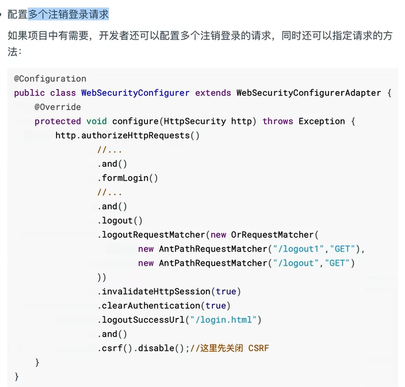
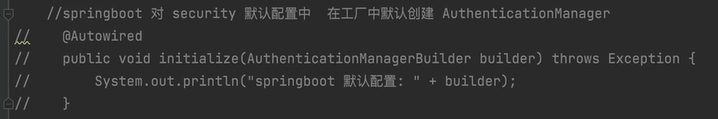
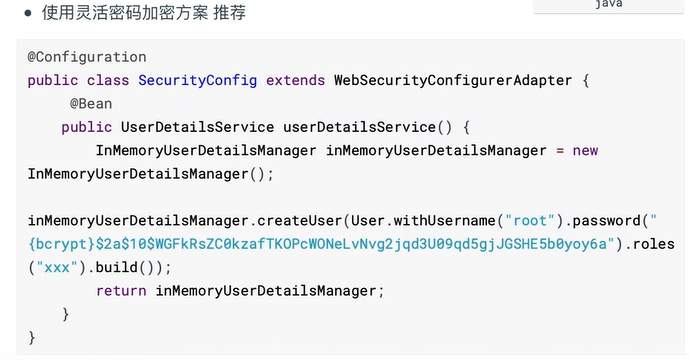
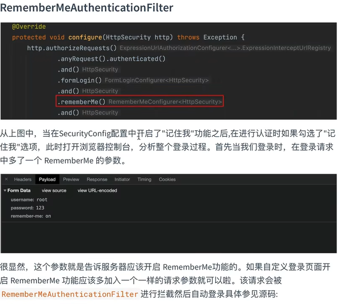
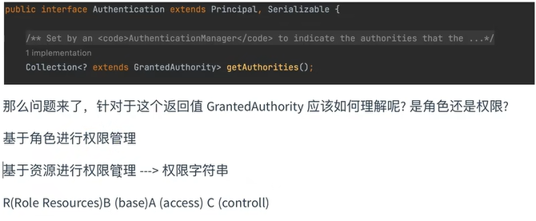
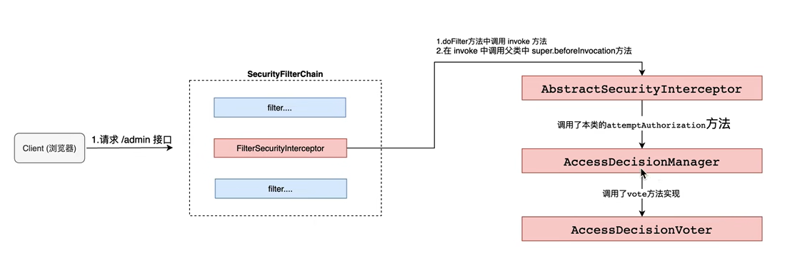

# SpringSecurity

## 权限管理

基本上涉及到用户参与的系统都要进行权限管理，权限管理属于系统安全的范畴，权限管理实现对用户访问系统的控制，按照安全规则或者安全策略控制用户可以访问而且只能访问自己被授权的资源。
权限管理包括用户身份认证和授权两部分，简称认证授权。对于需要访问控制的资源用户首先经过身份认证，认证通过后用户具有该资源的访问权限方可访问。

### 认证

身份认证，就是判断一个用户是否为合法用户的处理过程。最常用的简单身份认证方式是系统通过核对用户输入的用户名和口令，看其是否与系统中存储的该用户的用户名和口令一致，来判断用户身份是否正确。对于采用指纹等系统，则出示指纹;对于硬件Key等刷卡系统，则需要刷卡。

### 授权

授权，即访问控制，控制谁能访问哪些资源。主体进行身份认证后需要分配权限方可访问系统的资源,对于某些资源没有权限是无法访问的

### 整体架构

在 Spring Security 的架构设计中，认证(Authentication）和授权(Authorization）是分开的，无论使用什么样的认证方式，都不会影响授权，这是两个独立的存在，这种独立带来的好处之一，就是Spring Security可以非常方便地整合一些外部的认证方案。


### 认证

#### AuthenticationManager

在Spring Seourity中认证是由**AuthenticationManager**接口来负责的，接口定义为:

````java
public interface AuthenticationManager {
Authentication authenticate(Authentication authentication) throws AuthenticationException ;
}
````

- 返回Authentication表示认证成功
- 返回AuthenticationException异常，表示认证失败。

AuthenticationManager主要实现类为ProviderManager，在ProviderManager中管理了众多AuthenticationProvider实例。在一次完整的认证流程中，Spring Security 允许存在多个AuthenticationProvider，用来实现多种认证方式，这些AuthenticationProvider都是由ProviderManager进行统一管理的。

#### Authentication

认证以及认证成功的信息主要是由Authentication的实现类进行保存的，其接口定义为:


````java
public interface Authentication extends Principal，Serializable {
    collection<? extends GrantedAuthority> getAuthorities();
	object getCredentials();
	object getDetails();
    object getPrincipal();
    boolean isAuthenticated( );
	void setAuthenticated(boolean isAuthenticated) throws IllegalArgumentException;
}
````

- getAuthorities				获取用户权限信息

- getCredentials				获取用户凭证信息，一般指密码
- getDetails						获取用户详细信息
- getPrincipal					获取用户身份信息，用户名、用户对象等
- isAuthenticated 			用户是否认证成功

#### SecurityContextHolder

SecurityContextHolderg用来获取登录之后用户信息。Spring Security 会将登录用户数据保存在Session中。但是，为了使用方便,Spring Security在此基础上还做了一些改进，其中最主要的一个变化就是线程绑定。当用户登录成功后,Spring Security 会将登录成功的用户信息保存到SecurityContextHolder中。SecurityContextHolder中的数据保存默认是通过ThreadLocal来实现的，使用ThreadLocal创建的变量只能被当前线程访问，不能被其他线程访问和修改，也就是用户数据和请求线程绑定在一起。当登录请求处理完毕后，Spring Security 会将SecurityContextHolder中的数据拿出来保存到Session中，同时将SecurityContexHolder中的数据清空。以后每当有请求到来时，Spring Security就会先从Session中取出用户登录数据，保存到SecurityContextHolder中，方便在该请求的后续处理过程中使用，同时在请求结束时将SecurityContextHolder中的数据拿出来保存到Session中，然后将SecurityContextHolder中的数据清空。这一策略非常方便用户在Controller、Service层以及任何代码中获取当前登录用户数据。

### 授权

#### AccessDecisionManager

> AccessDecisionManager(访问决策管理器)，用来决定此次访问是否被允许。


#### AccessDecisionVoter

> AccessDecisionVoter (访问决定投票器)，投票器会检查用户是否具备应有的角色，进而投出赞成、反对或者弃权票。


AccessDecisionVoter和 AccessDecisionManager都有众多的实现类，在AccessDecisionManager中会挨个遍历AccessDecisionVoter，进而决定是否允许用户访问，因而AveasDecisionVoter和AccessDecisionManager两者的关系类似于AuthenticationProvider和ProviderManager的关系。

#### configAttribute

> ConfigAttribute，用来保存授权时的角色信息


在Spring Security中，用户请求一个资源(通常是一个接口或者一个Java方法)需要的角色会被封装成一个ConfigAttribute对象，在ConfigAttribute中只有一个getAttribute方法，该方法返回一个 String字符串，就是角色的名称。一般来说，角色名称都带有一个`ROLE_`前缀，投票器AccessDecisiorVoter所做的事情，其实就是比较用户所具各的角色和请求某个资源所需的ConfigAtuibute之间的关系。

### 原理-过滤器

#### DelegatingFilterProxy


#### SecurityFilterChain


默认过滤器并不是直接放在Web项目的原生过滤器链中，而是通过一个FlterChainProxy来统一管理。Spring Security中的过滤器链通过FilterChainProxy嵌入到Web项目的原生过滤器链中。FilterChainProxy作为一个顶层的管理者，将统一管理SecurityFilter。FilterChainProxy本身是通过Spring框架提供的DelegatingFilterProxy整合到原生的过滤器链中。

### 过滤器


Spring Security提供了30多个过滤器。默认情况下Spring Boot在对SpringSecurity进入自动化配置时，会创建一个名为SpringSecurityFilerChain的过滤器，并注入到Spring容器中，这个过滤器将负责所有的安全管理，包括用户认证、授权、重定向到登录页面等。具体可以参考WebSecurityConfiguration的源码: 


### 总结

AuthenticationManager、ProviderManager、AuthenticationProvider关系


 **WebSecurityConfigurerAdapter**扩展SpringSecurity所有默认配置


**UserDetailService**用来修改默认认证的数据源信息


## 自定义认证

### 自定义规则资源限制

/index公共资源
/hello受保护资源
在项目中添加如下配置实现对资源权限规则设定:

````java
@Configuration
public class SourceConfig extends WebSecurityConfigurerAdapter {

    @Override
    protected void configure(HttpSecurity http) throws Exception {
        http.authorizeRequests()
                .mvcMatchers("/index").permitAll()//放行资源写在前面
                .mvcMatchers("/hello").authenticated()
                .and()
                .formLogin();
    }
}
````

新版写法

````java
@Configuration
@EnableWebSecurity
public class NewSourceConfig {
    @Bean
    public SecurityFilterChain securityFilterChain(HttpSecurity http) throws Exception {
        http.authorizeRequests()
                .mvcMatchers("/index").permitAll()//放行资源写在前面
                .mvcMatchers("/hello").authenticated()
                .and()
                .formLogin();
        return http.build();
    }
}
````

### 自定义登陆界面

````java
http. ... 
    .formLogin()
    .loginPage("/login")//指定默认登陆页面(路径) 注意:一旦自定义登录页面以后必须指定登录url
    .loginProcessingUrl("/doLogin")//与页面中的地址一致
    .usernameParameter("username")
    .passwordParameter("password")//更改默认接受的表单参数name
    //.successForwardUrl("/index")//认证成功forward 跳转路径    始终在认证成功之后跳转到指定请求
    //.defaultSuccessUrl("/hello")//认证成功redirect跳转		根据上一保存请求进行成功跳转
    //.failureForwardUrl("/login")//认证失败之后 forward 跳转
	//.failureUrl("/login")//认证失败之后redirect跳转
````

页面

````
method="post" action="/doLogin"
input name=username
input name=password
````

security默认method="post"，接收username password

### 认证成功处理

````java
public class MyAuthenticationSuccessHandler implements AuthenticationSuccessHandler {
    @Override
    public void onAuthenticationSuccess(HttpServletRequest httpServletRequest, HttpServletResponse httpServletResponse, Authentication authentication) throws IOException, ServletException {
        HashMap<String, Object> hashMap = new HashMap<>();
        hashMap.put("code",200);
        hashMap.put("msg","请求成功");
        hashMap.put("data","MyAuthenticationSuccessHandler");
        httpServletResponse.setContentType("application/json;charset=UTF-8");
        String s = new ObjectMapper().writeValueAsString(hashMap);
        httpServletResponse.getWriter().println(s);
        //httpServletResponse.getWriter().write(s);
    }
}
````

````
.successHandler(new MyAuthenticationSuccessHandler())//认证成功时处理 前后端分离解决方案
````

````java
//或者
//认证成功处理
        loginFilter.setAuthenticationSuccessHandler((request, response, authentication) -> {
            HashMap<String, Object> hashMap = new HashMap<>();
            //hashMap.put("code","200");
            hashMap.put("msg","success");
            hashMap.put("信息",authentication.getPrincipal());
            String s = new ObjectMapper().writeValueAsString(hashMap);
            response.setContentType(MediaType.APPLICATION_JSON_UTF8_VALUE);
            response.setStatus(HttpStatus.OK.value());
            response.getWriter().println(s);
        });
````

### 认证失败处理


````
.failureHandler(new MyAuthenticationFailureHandler())//认证失败时处理 前后端分离解决方案
````

````java
//或者
//认证失败处理
        loginFilter.setAuthenticationFailureHandler((request, response, ex) -> {
            HashMap<String, Object> hashMap = new HashMap<>();
            //hashMap.put("code","500");
            hashMap.put("msg","failure");
            hashMap.put("ex","异常信息:"+ex);
            String s = new ObjectMapper().writeValueAsString(hashMap);
            response.setContentType(MediaType.APPLICATION_JSON_UTF8_VALUE);
            response.setStatus(HttpStatus.INTERNAL_SERVER_ERROR.value());
            response.getWriter().println(s);
        });
````


### 注销登录

````java
.and()
.formLogin()
//...
.and()
.logout()
.logoutUrl("/logout")
````




**前后端分离注销登录配置**
如果是前后端分离开发，注销成功之后就不需要页面跳转了，只需要将注销成功的信息返回前端即可，此时我们可以通过自定义LogoutSuccessHandler 实现来返回内容注销之后信息︰


### 登录用户数据获取

#### SecurityContextHolder

Spring Security 会将登录用户数据保存在Session中，但是，为了使用方便,Spring Security在此基础上还做了一些改进，其中最主要的一个变化就是线程绑定。当用户登录成功后,Spring Security会将登录成功的用户信息保存到SecurityContextHolder中。
SecurityContextHolder中的数据保存默认是通过ThreadLocal 来实现的，使用ThreadLocal创建的变量只能被当前线程访问，不能被其他线程访问和修改，也就是用户数据和请求线程绑定在一起。当登录请求处理完毕后，Spring Security 会将SecurityContextHolder中的数据拿出来保存到Session中，同时将SecurityContexHolder中的数据清空。以后每当有请求到来时，Spring Security就会先从 Session中取出用户登录数据，保存到SecurityContextHolder中，方便在该请求的后续处理过程中使用，同时在请求结束时将SecurityContextHolder中的数据拿出来保存到Session中，然后将Security SecurityContextHolder中的数据清空。实际上SecurityContextHolder中存储是SecurityContext，在SecurityContext中存储是Authentication。


#### 页面上获取用户信息


### 自定义认证数据源

#### 认证流程分析


- 发起认证请求，请求中携带用户名、密码，该请求会被**UsernamePasswordAuthenticationFilter**拦截
- 在**UsernamePasswordAuthenticationFilter**的**attemptAuthentication**方法中将请求中用户名和密码，封装为**Authentication**对象，并交给**AuthenticationManager**进行认证
- 认证成功，将认证信息存储到**SecurityContextHodler**以及调用记住我等，并回调**AuthenticationSuccessHandler**处理
- 认证失败，清除**SecurityContextHodler** 以及记住我中信息，回调**AuthenticationFailureHandler**处理

AuthenticationManager是一个认证管理器，它定义了 spring security过滤器要执行认证操作。
ProviderManager 是AuthenticationManager接口的实现类。Spring Security认证时默认使用就是ProviderManager。
AuthenticationProvider 就是针对不同的身份类型执行的具体的身份认证。


在Spring Seourity中，允许系统同时支持多种不同的认证方式，例如同时支持用户名/密码认证、ReremberMe 认证、手机号码动态认证等，而不同的认证方式对应了不同的AuthenticationProvider，所以一个完整的认证流程可能由多个AuthenticationProvider来提供。
多个AuthenticationProvider将组成一个列表，这个列表将由ProviderManager代理。换句话说，在ProviderManager中存在一个AuthenticationProvider列表，在Provider Manager中遍历列表中的每一个AuthenticationProvider去执行身份认证，最终得到认证结果。

ProviderManager本身也可以再配置一个AuthenticationManager作为parent，这样当ProviderManager认证失败之后，就可以进入到parent 中再次进行认证。理论上来说，ProviderManager的 parent可以是任意类型的AuthenticationManager，但是通常都是由ProviderManager来扮演parent 的角色，也就是ProviderManager是ProviderManager的parent。

ProviderManager本身也可以有多个，多个ProviderManager共用同一个parent。有时，一个应用程序有受保护资源的逻辑组（例如，所有符合路径模式的网络资源，如/api/**)，每个组可以有自己的专用AuthenticationManager。通常，每个组都是一个ProviderManager,它们共享一个父级。然后，父级是一种全局资源，作为所有提供者的后备资源。


**总结: AuthenticationManager是认证管理器，在 Spring Security中有全局AuthenticationManager，也可以有局部AuthenticationManager。全局的AuthenticationManager用来对全局认证进行处理，局部的AuthenticationManager用来对某些特殊资源认证处理。当然无论是全局认证管理器还是局部认证管理器都是由ProviderManger进行实现。每一个ProviderManger中都代理一个AuthenticationProvider的列表，列表中每一个实现代表一种身份认证方式。认证时底层数据源需要调用UserDetailService来实现。**

#### 配置AuthenticationManager

##### 覆盖默认配置AuthenticationManager

不用注入initialize方法

````java
@Bean
public UserDetailsService userDetailsService() {
InMemoryUserDetailsManager userDetailsService = new InMemoryUserDetailsManager();
userDetailsService.createUser(User.withUsername("user").password("{noop}123").roles("admin").build());
    return userDetailsService;
}
````



##### 自定义AuthenticationManager

````java
@Override
    protected void configure(AuthenticationManagerBuilder auth) throws Exception {
        auth.userDetailsService(userDetailsService());
    }
````

##### 新版AuthenticationManager写法

````java
	@Autowired
    AuthenticationConfiguration authenticationConfiguration;

	@Bean
    public AuthenticationManager authenticationManager() throws Exception {
        return authenticationConfiguration.getAuthenticationManager();
    }

    @Bean
    public LoginFilter loginFilter() throws Exception {
        LoginFilter loginFilter = new LoginFilter();
        loginFilter.setFilterProcessesUrl("/doLogin");
        loginFilter.setUsernameParameter("name");
        loginFilter.setPasswordParameter("pwd");
        loginFilter.setAuthenticationManager(authenticationManager());
        return loginFilter;
    }
````

**数据库实现**

写一个类继承UserDetailsService，实现loadUserByUsername方法,查询数据库，判断用户是否存在，获取角色信息

**总结**
1.一旦通过configure方法自定义AuthenticationManager实现就会将工厂中自动配置AuthenticationManager进行覆盖
2.一旦通过configure方法自定义AuthenticationManager实现需要在实现中指定认证数据源对象UserDetaiService 实例
3.一旦通过configure方法自定义AuthenticationManager实现这种方式创建AuthenticationManager对象工厂内部本地一个 AuthenticationManager对象不允许在其他自定义组件中进行注入

````java
	//作用:用来将自定义AuthenticationManager在工厂中进行暴露,可以在任何位置注入
	@Override
    @Bean
    public AuthenticationManager authenticationManagerBean() throws Exception {
        return super.authenticationManagerBean();
    }
````


#### 前后端分离发送请求认证

```java
public class LoginFilter extends UsernamePasswordAuthenticationFilter {
    @Override
    public Authentication attemptAuthentication(HttpServletRequest request, HttpServletResponse response) throws AuthenticationException {
        //判断是否是 post方式请求
        if (!request.getMethod().equals("POST")) {
            throw new AuthenticationServiceException("Authentication method not supported: " + request.getMethod());
        }
        //判断是否是json格式请求类型
        if (request.getContentType().equalsIgnoreCase(MediaType.APPLICATION_JSON_VALUE)) {
            try {
                Map<String, String> map = new ObjectMapper().readValue(request.getInputStream(), Map.class);
                String username = map.get(getUsernameParameter());
                String password = map.get(getPasswordParameter());
                String remember = map.get(AbstractRememberMeServices.DEFAULT_PARAMETER);
                if (!ObjectUtils.isEmpty(remember)){
                    request.setAttribute(AbstractRememberMeServices.DEFAULT_PARAMETER,remember);
                }

                UsernamePasswordAuthenticationToken authRequest = new UsernamePasswordAuthenticationToken(username, password);
                this.setDetails(request, authRequest);
                return this.getAuthenticationManager().authenticate(authRequest);
            } catch (IOException e) {
                e.printStackTrace();
            }
        }

        return super.attemptAuthentication(request, response);
    }
}
```

````java
//自定义 filter交给工厂管理Bean
@Bean
public LoginFilter loginFilter()throws Exception {
	LoginFilter loginFilter = new LoginFilter();
    loginFilter.setAuthenticationManager(authenticationManagerBean());
    return loginFilter;
}
````

````java
http.addFilterAt(loginFilter(), UsernamePasswordAuthenticationFilter.class);
//自定义替换UsernamePasswordAuthenticationFilter，保证过滤器链的执行顺序
````

自定义UserDetailsService

````java
	@Bean
    public UserDetailsService userDetailsService(){
        InMemoryUserDetailsManager inMemoryUserDetailsManager = new InMemoryUserDetailsManager();
        inMemoryUserDetailsManager.createUser(User.withUsername("root").password("{noop}123").authorities("ADMIN").build());
        return inMemoryUserDetailsManager;
    }
````

自定义AuthenticationManager并暴露

````java
	@Override
    protected void configure(AuthenticationManagerBuilder auth) throws Exception {
        auth.userDetailsService(userDetailsService());
    }
    @Override
    @Bean
    public AuthenticationManager authenticationManagerBean() throws Exception {
        return super.authenticationManagerBean();
    }
````

### 添加认证验证码

````xml
<!-- https://mvnrepository.com/artifact/com.github.penggle/kaptcha -->
<dependency>
    <groupId>com.github.penggle</groupId>
    <artifactId>kaptcha</artifactId>
    <version>2.3.2</version>
</dependency>
````

````java
@Configuration
public class KaptchaConfig {
	@Bean
	public Producer kaptcha() {
		Properties properties = new Properties();
		properties.setProperty("kaptcha.image.width", "150");
    	properties.setProperty("kaptcha.image.height","50");
		properties.setProperty("kaptcha.textproducer.char.string","0123456789");
		properties.setProperty("kaptcha.textproducer.char.length","4");
   		Config config = new Config(properties);
		DefaultKaptcha defaultKaptcha = new DefaultKaptcha();
    	defaultKaptcha.setConfig(config);
		return defaultKaptcha;
        }
}
````


## 密码加密

### PasswordEncoder

通过对认证流程源码分析得知，实际密码比较是由PasswordEncoder完成的，因此只需要使用PasswordEncoder不同实现就可以实现不同方式加密。

````java
public interface PasswordEncoder{
	string encode(CharSequence rawPassword);
	boolean matches(CharSequence rawPassword,String encodedPassword);
	default boolean upgradeEncoding(String encodedPassword){
	return false;
	}
}
````

- encode用来进行明文加密的

- matches 用来比较密码的方法

-  upgradeEncoding用来给密码进行升级的方法


### 使用固定密码加密方案

````java
@Bean
public PasswordEncoder BcryptPasswordEncoder() {
return new BCryptPasswordEncoder();
}
````

### 灵活加密



### 密码升级


## ReMember Me

````java
.rememberMe()
.rememberMeServices(rememberMeServices())//设置自动登录用哪个 rememberMeServices  cookie内容比对
````

界面

````html
记住我:<input name="remember-me" type="checkbox" value="true">
````




#### 自定义

````java
public class LoginFilter extends UsernamePasswordAuthenticationFilter {

    @Override
    public Authentication attemptAuthentication(HttpServletRequest request, HttpServletResponse response) throws AuthenticationException {
        if (!request.getMethod().equals("POST")) {
            throw new AuthenticationServiceException("Authentication method not supported: " + request.getMethod());
        }
        String contentType = request.getContentType();
        if (contentType.equalsIgnoreCase(MediaType.APPLICATION_JSON_VALUE)||
                contentType.equalsIgnoreCase(MediaType.APPLICATION_JSON_UTF8_VALUE)){
            try {
                Map<String, String> map = new ObjectMapper().readValue(request.getInputStream(), Map.class);
                String username = map.get(getUsernameParameter());
                String password = map.get(getPasswordParameter());
                //remember-me
                String remember = map.get(AbstractRememberMeServices.DEFAULT_PARAMETER);
                if (!ObjectUtils.isEmpty(remember)){
                    request.setAttribute(AbstractRememberMeServices.DEFAULT_PARAMETER,remember);
                }

                UsernamePasswordAuthenticationToken authRequest = new UsernamePasswordAuthenticationToken(username, password);
                this.setDetails(request, authRequest);
                return this.getAuthenticationManager().authenticate(authRequest);
            } catch (IOException e) {
                e.printStackTrace();
            }

        }
        return super.attemptAuthentication(request, response);
    }
}
````

````java
public class MyRememberMeService extends PersistentTokenBasedRememberMeServices {
    public MyRememberMeService(String key, UserDetailsService userDetailsService, PersistentTokenRepository tokenRepository) {
        super(key, userDetailsService, tokenRepository);
    }

    /**
     * 前后端分离获取remember-me
     */
    @Override
    protected boolean rememberMeRequested(HttpServletRequest request, String parameter) {
        Object param = request.getAttribute(parameter);
        if (ObjectUtils.isEmpty(param)){
            return false;
        }
        String paramValue = param.toString();
        if (paramValue != null && (paramValue.equalsIgnoreCase("true") ||
                paramValue.equalsIgnoreCase("on") ||
                paramValue.equalsIgnoreCase("yes") || paramValue.equals("1"))) {
            return true;
        }
        return false;

    }
}
````

````java
    @Bean
    public RememberMeServices rememberMeServices(){
        return new MyRememberMeService(UUID.randomUUID().toString(),
                userDetailsService(),persistentTokenRepository());
    }

	@Autowired
    private DataSource dataSource;

	@Bean
    public PersistentTokenRepository persistentTokenRepository(){
        JdbcTokenRepositoryImpl jdbcTokenRepository = new JdbcTokenRepositoryImpl();
        jdbcTokenRepository.setDataSource(dataSource);
        jdbcTokenRepository.setCreateTableOnStartup(true);//启动时创建表结构
        return jdbcTokenRepository;
    }
````

````
.rememberMeServices(rememberMeServices())
````

````
loginFilter.setrememberMeServices(rememberMeServices());//设置认证成功时使用自定义rememberMeServices
````

## 会话管理

当浏览器调用登录接口登录成功后，服务端会和浏览器之间建立一个会话(Session)浏览器在每次发送请求时都会携带一个Sessionld，服务端则根据这个Sessionld来判断用户身份。当浏览器关闭后，服务端的Session并不会自动销毁，需要开发者手动在服务端调用Session销毁方法,或者等Session过期时间到了自动销毁。在Spring Security中，与HttpSession相关的功能由SessionManagemenFiter和Session AutheaticationStrateey接口来处理，SessionManagomentFilter过滤器将Session相关操作委托给SessionAuthenticationStrategy接口去完成。

#### 会话失效

传统web

````
.sessionManagement()
.maximumSessions(1)
.expiredUrl("/login")//会话过期处理
````

前后端分离

```
.sessionManagement()//开启会话管理 
.maximumSessions(1)//会话最大并发
.expiredSessionStrategy(event -> {//会话过期处理
    HttpServletResponse response = event.getResponse();
    HashMap<String, Object> hashMap = new HashMap<>();
    hashMap.put("message","会话失效");
    hashMap.put("info:",event.getSessionInformation());
    response.setContentType(MediaType.APPLICATION_JSON_UTF8_VALUE);
    response.setStatus(HttpStatus.INTERNAL_SERVER_ERROR.value());
    String s = new ObjectMapper().writeValueAsString(hashMap);
    response.getWriter().println(s);
    response.flushBuffer();
})
.maxSessionsPreventsLogin(true)//登陆后禁止再次登录
.sessionRegistry(sessionRegistry())


    //创建session 同步到 redis 中的方案
    @Bean
    public SpringSessionBackedSessionRegistry sessionRegistry(){
        return new SpringSessionBackedSessionRegistry();
    }
    private final FindByIndexNameSessionRepository findByIndexNameSessionRepository;
    @Autowired(required = false)
    public SecurityConfig(FindByIndexNameSessionRepository findByIndexNameSessionRepository){
        this.findByIndexNameSessionRepository = findByIndexNameSessionRepository;
    }
```

## CSRF

CSRF(Cross-Site Request Forgery跨站请求伪造)，也可称为一键式攻击(one-click-attack) ,通常缩写为CSRF或者XSRF。

CSRF攻击是一种挟持用户在当前已登录的浏览器上发送恶意请求的攻击方法。相对于XSS利用用户对指定网站的信任，CSRF则是利用网站对用户网页浏览器的信任。简单来说，CSRF是致击者通过一些技术手段欺骗用户的浏览器，去访问一个用户曾经认证过的网站并执行恶意请求，例如发送邮件、发消息、甚至财产操作(如转账和购买商品)。由于客户端(浏览器)已经在该网站上认证过，所以该网站会认为是真正用户在操作而执行请求（实际上这个并非用户的本意)。


### CSRF防御

CSRF攻击的根源在于浏览器默认的身份验证机制(自动携带当前网站的Cookie信息)，这种机制虽然可以保证请求是来自用户的某个浏览器，但是无法确保这请求是用户授权发送。攻击者和用户发送的请求一模一样，这意味着我们没有办法去直接拒绝这里的某一个请求。如果能在合法清求中额外携带一个攻击者无法获取的参数，就可以成功区分出两种不同的请求，进而直接拒绝掉恶意请求。在SpringSecurity中就提供了这种机制来防御CSRF 攻击，这种机制我们称之为令牌同步模式。

#### 令牌同步模式

这是目前主流的CSRF 攻击防御方案。具体的操作方式就是在每一个HTTP请求中，除了默认自动携带的Cookie参数之外，再提供一个安全的、随机生成的宇符串，我们称之为CSRF令牌。这个CSRF令牌由服务端生成，生成后在HttpSession中保存一份。当前端请求到达后，将请求携带的CSRF令牌信息和服务端中保存的令牌进行对比，如果两者不相等，则拒绝掉该HITTP请求。

> 注意:考虑到会有一些外部站点链接到我们的网站，所以我们要求请求是幂等的，这样对子HEAD、OPTIONS、TRACE等方法就没有必要使用CSRF 令牌了，强行使用可能会导致令牌泄露!

### 传统web

默认开启

### 前后端分离

````
.csrf()
.csrfTokenRepository(CookieCsrfTokenRepository.withHttpOnlyFalse())//将令牌保存到cookie中 允许cookie前端获取
.ignoringAntMatchers("/doLogin");//登录请求不获取csrf Token
````

## CORS


````
.and.cors().configurationSource(corsConfigurationSource())
````

````java
	//cors
    CorsConfigurationSource corsConfigurationSource() {
        CorsConfiguration corsConfiguration = new CorsConfiguration();
        corsConfiguration.setAllowedHeaders(Arrays.asList("*"));
        corsConfiguration.setAllowedMethods(Arrays.asList("*"));
        corsConfiguration.setAllowedOrigins(Arrays.asList("*"));
        corsConfiguration.setMaxAge(3600L);
        UrlBasedCorsConfigurationSource source = new UrlBasedCorsConfigurationSource();
        source.registerCorsConfiguration("/**", corsConfiguration);
        return source;
    }
````


## 授权

### 极限管理

#### 认证

身份认证，就是判断一个用户是否为合法用户的处理过程。Spring Security中支持多种不同方式的认证，但是无论开发者使用那种方式认证，都不会影响授权功能使用。因为SpringSecurity很好做到了认证和授权解耦。

#### 授权

授权，即访问控制，控制谁能访问哪些资源。简单的理解授权就是根据系统提前设置好的规则，给用户分配可以访问某一个资源的权限，用户根据自己所具有权限，去执行相应操作。

### 授权管理核心概念

认证成功之后会将当前登录用户信息保存到Authentication对象中，Authentication对象中有一个getAuthorities()方法，用来返回当前登录用户具备的权限信息，也就是当前用户具有权限信息。该方法的返回值为 Collection<?extends GrantedAuthority>，当需要进行权限判断时，就回根据集合返回权限信息调用相应方法进行判断。



我们针对于授权可以是基于角色权限管理和基于资源权限管理，从设计层面上来说，角色和权限是两个完全不同的东西︰权限是一些具体操作，角色则是某些权限集合。如:READ_BOOK和ROLE_ADMIN是完全不同的。因此至于返回值是什么取决于你的业务设计情况:

- 基于角色权限设计就是:`用户<=>角色<=>资源`三者关系返回就是用户的角色

- 基于资源权限设计就是:用户<=>权限<=>资源三者关系返回就是用户的权限
- 基于角色和资源权限设计就是:用户<=>角色<=>权限<=>资源返回统称为用户的权限

为什么可以统称为权限，因为从代码层面角色和权限没有太大不同都是权限，特别是在Spring Security中，角色和权限处理方式基本上都是一样的。唯一区别SpringSecurity在很多时候会自动给角色添加一个ROLE_前缀，而权限则不会自动添加。

### 权限管理策略

Spring Security中提供的权限管理策略主要有两种类型:

- 基于过滤器的权限管理(FilterSecuritylnterceptor)
  - 基于过滤器的权限管理主要是用来拦截HTTP请求，拦截下来之后，根据HTTP 请求地址进行权限校验。
  
- 基于AOP的权限管理(MethodSecurityInterceptor)
- 基于AOP 权限管理主要是用来处理方法级别的权限问题。当需要调用某一个方法时，通过AOP将操作拦截下来，然后判断用户是否具备相关的权限。

#### 基于过滤器的权限管理策略

````
.mvcMatchers("/admin").hasRole("ADMIN")//具有 admin角色
.mvcMatchers("/user").hasRole("USER"")//具有user角色
.mvcMatchers("/getInfo").hasAuthority("READ_INFQ")//READ_INFO权限
````

#### 权限表达式


#### 基于AOP的权限管理

基于方法的权限管理主要是通过AOP来实现的，Spring Security中通过MethodSecurityInterceptor 来提供相关的实现。不同在于Filter SecurityInterceptor只是在请求之前进行前置处理，MethodSecurityinterceptor除了前置处理之外还可以进行后置处理。前置处理就是在请求之前判断是否具备相应的权限，后置处理则是对方法的执行结果进行二次过滤。前置处理和后置处理分别对应了不同的实现类。

##### @EnableGlobalMethodSecurity

EnableGlobalMethodsecurity该注解是用来开启权限注解，用法如下:
````java
@Configuration
@EnableGlobalMethodSecurity(prePostEnabled=true, securedEnabled=true,jsr258Enabled=true)
public class SecurityConfig extends WebsecurityConfigurerAdapter{}
````

- perPostEnabled:开启Spring Security提供的四个权限注解，@PostAuthorize、@PostFilter、@PreAuthorize以及@PreFilter。
- securedEnabled:开启Spring Security提供的@Secured注解支持，该注解不支持权限表达式
- jsr250Enabled:开启JSR-250提供的注解，主要是@DenyAll、@PermitAll、@RolesAll同样这些注解也不支持权限表达式

````
#以上注解含义如下:
- @PostAuthorize:在目前标方法执行之后进行权限校验。
- @PostFiter:在目标方法执行之后对方法的返回结果进行过滤。
- @PreAuthorize:在目标方法执行之前进行权限校验。@PreAuthorize("hasAuthorize('admin')")
- @PreFiter:在目标方法执行之前对方法参数进行过滤。
- secured:访问目标方法必须具各相应的角色。
- @DenyAll:拒绝所有访问。
- @PermitAll:允许所有访问。
- @RolesAllowed:访问目标方法必须具备相应的角色。
````

这些基于方法的权限管理相关的注解，一般来说只要设置 prePostEnabled=true就够用了。

### 原理



ConfigAttribute 在 Spring Security中，用户请求一个资源(通常是一个接口或者一个Java 方法)需要的角色会被封装成一个ConfigAttribute对象，在ConfigAttribute 中只有一个getAttribute方法，该方法返回一个String 字符串，就是角色的名称。一般来说，角色名称都带有一个ROLE_前缀，投票器AccessDecisionVoter所做的事情，其实就是比较用户所具各的角色和请求某个资源所需的
ConfigAtuibute 之间的关系。
AccesDecisionVoter和AccessDecisionNanager都有众多的实现类，在AccessDecisionManager中会换个遍历AccessDecisionVoter，进而决定是否允许用户访问，因而 AaccesDecisionVoter和AccessDecisionManager 两者的关系类似于AuthenticationProvider和ProviderManager的关系。

### 动态管理权限

之前配置的URL拦截规则和请求URL所需要的权限都是通过代码来配置的，这样就比较死板，如果想要调整访问某一个URL所需要的权限，就需要修改代码。
动态管理权限规则就是我们将URL拦截规则和访问URI所需要的权限都保存在数据库中，这样，在不修改源代码的情况下，只需要修改数据库中的数据，就可以对权限进行调整。
用户<—中间表->角色<—中间表—>菜单


**其他**

SecurityConfig

````
@EnableGlobalMethodSecurity(prePostEnabled = true)
````

Controller

```java
@PreAuthorize("@ps.hasPermission('content:category:export')")
@GetMapping("/export")
public void excelExport(HttpServletResponse response){
    categoryService.excelExport(response);
}
```

自定义权限认证

PermissionService

```java
@Service("ps")
public class PermissionService {
    /**
     * 判断当前用户是否具有某个权限
     *
     * @param permission 要判断的权限
     * @return
     */
    public boolean hasPermission(String permission) {
        //如果是超级管理员,默认拥有所有权限
        if (SecurityUtils.isAdmin()) {
            return true;
        }
        List<String> permissions = SecurityUtils.getLoginUser().getPermissions();
        return permissions.contains(permission);
    }
}
```

## 异常处理

#### 认证异常

````java
@Component
public class MyAuthenticationEntryPoint implements AuthenticationEntryPoint {
    @Override
    public void commence(HttpServletRequest httpServletRequest, HttpServletResponse httpServletResponse, AuthenticationException e) throws IOException, ServletException {
        ResponseResult result = null;
        if (e instanceof BadCredentialsException) {//401
            result = ResponseResult.errorResult(AppHttpCodeEnum.LOGIN_ERROR.getCode(), e.getMessage());
        }else if (e instanceof InsufficientAuthenticationException){//505
            result = ResponseResult.errorResult(AppHttpCodeEnum.NEED_LOGIN.getCode(), e.getMessage());
        }else {//500
            result = ResponseResult.errorResult(AppHttpCodeEnum.SYSTEM_ERROR.getCode(), "认证或授权失败");
        }
        WebUtils.renderString(httpServletResponse,new ObjectMapper().writeValueAsString(result));
    }
}
````

#### 授权异常

````java
@Component
public class MyAccessDeniedHandler implements AccessDeniedHandler {
    @Override
    public void handle(HttpServletRequest httpServletRequest, HttpServletResponse httpServletResponse, AccessDeniedException e) throws IOException, ServletException {
        ResponseResult result = ResponseResult.errorResult(AppHttpCodeEnum.NO_OPERATOR_AUTH);
        WebUtils.renderString(httpServletResponse, JSON.toJSONString(result));
    }
}
````

````
		security.exceptionHandling()
                .authenticationEntryPoint(authenticationEntryPoint)
                .accessDeniedHandler(accessDeniedHandler);
````

## OAuth2

### 简介

OAuth 是一个开放标准，该标准允许用户让第三方应用访问该用户在某一网站上存储的私密资源（如头像、照片、视频等)，并且在这个过程中无须将用户名和密码提供给第三方应用。通过令牌(token)可以实现这一功能，每一个令牌授权一个特定的网站在特定的时段内允许可特定的资源。OAuth让用户可以授权第三方网站灵活访问它们存储在另外一些资源服务器上的特定信息，而非所有内容。对于用户而言，我们在互联网应用中最常见的OAuth应用就是各种第三方登录，例如QQ授权登录、微信授权登录、微博授权登录、GitHub授权登录等。
例如用户想登录 Ruby China，传统方式是使用用户名密码但是这样并不安全，因为网站会存储你的用户名密码，这样可能会导致密码泄露。这种授权方式安全隐患很大，如果使用OAuth协议就能很好地解决这一问题。

### 四种授权模式

参考：http://www.ruanyifeng.com/blog/2019/04/oauth-grant-types.html

1.**授权码模式**：常见的第三方平台登录功能基本都是使用这种模式。
2.**简化模式**：简化模式是不需要第三方服务端参与，直接在浏览器中向授权服务器申请令牌(token),如果网站是纯静态页面，则可以采用这种方式。
3.**密码模式**：密码模式是用户把用户名/密码直接告诉客户端，客户端使用这些信息后授权服务器申请令牌(token)。这需要用户对客户端高度信任，例如客户端应用和服务提供商就是同一家公司。
4.**客户端模式**：客户端模式是指客户端使用自己的名义而不是用户的名义向服务提估者申请授权。严格来说，客户端模式并不能算作OAUth协议解决问题的一种解决方案，但是对于开发者而言，在一些为移动端提供的授权服务器上使用这种模式还是非常方便的。

无论哪种授权模式，其授权流程都是相似的，只不过在个别步骤上有万差异而已。流程图如下:


````
(A)用户打开客户端以后，客户端要求用户给予授权。
(B)用户同意给予客户端授权。
(C)客户端使用上一步获得的授权，向认证服务器申请令牌。
(D)认证服务器对客户端进行认证以后，确认无误，同意发放令牌。
(E)客户端使用令牌，向资源服务器申请获取资源。
(F)资源服务器确认令牌无误，同意向客户端开放资源。
````

### 标准接口

- /oauth/authorize:授权端点
- /oauth/token:获取令牌端点
- /oauth/confirm_access:用户确认授权提交端点
- /oauth/error:授权服务错误信息端点
- /oauth/check_token:用于资源服务访问的令牌解析端点
- /oauth/token_key:提供公有密匙的端点，如果使用JWT令牌的话

### Oauth Client

依赖

````xml
<dependency>
<groupId>org.springframework.boot</groupId>
<artifactId>spring-boot-starter-oauth2-client</artifactId>
</dependency>
````

测试类

````java
@RestController
oublic class HelloController{
@GetMapping("/hello")
public DefaultOAuth2User hello(){
System.out.println("hello");
Authentication authentication = SecurityContextHolder.getContext().getAuthentication();
return (DefaultOAuth2User)authentication.getPrincipal();
````

security-config

````java
//用来对spring security进行自定义配置
@Configuration
public class SecurityConfig extends WebSecurityConfigurerAdapter{
@Override
protected void configure(HttpSecurity http)throws Exception{
http.authorizeRequests()
.anyRequest().authenticated()
.and()
.oauth2Login();//使用oauth 2 认证   置文件中配置认证服务
````

配置

````xml
spring.security.oauth2.client.registration.github.client-id=86ed3f9d89225f7c09bf
spring.security.oauth2.client.registration.github.client-secret=aaa44b2675a7b636b1b43371e509e88ee9013816
#一定要与重定向回调URL一致
spring.security.oauth2.client.registration.github.redirect-uri=http://localhost:8080/login/oauth2/code/github
````


## JWT

````xml
        <!--jwt依赖-->
        <dependency>
            <groupId>io.jsonwebtoken</groupId>
            <artifactId>jjwt</artifactId>
        </dependency>
````

### jwt工具类

````java
import io.jsonwebtoken.Claims;
import io.jsonwebtoken.Jwts;
import io.jsonwebtoken.SignatureAlgorithm;
import javax.crypto.SecretKey;
import javax.crypto.spec.SecretKeySpec;
import java.util.Base64;
import java.util.Date;
import java.util.UUID;

/**
 * JWT工具类
 */
public class JwtUtils {
    //JWT有效期
    public static final Long JWT_TTL = 60 * 60 *1000L *24;// 60 * 60 *1000  一个小时
    //设置签名信息(秘钥明文)
    public static final String JWT_KEY = "wind";

    /**
     * 生成uuid
     * @return {@link String}
     */
    public static String getUUID(){
        String token = UUID.randomUUID().toString().replaceAll("-", "");
        return token;
    }

    /**
     * 生成jtw，无过期时间，则使用设置的时间
     * @param subject token中要存放的数据（json格式）
     * @return
     */
    public static String createJWT(String subject) {
        return getJwtBuilder(subject, JwtUtils.JWT_TTL, getUUID());
    }

    /**
     * 生成jtw，有过期时间。默认为1个小时
     * @param subject token中要存放的数据（json格式）
     * @param ttlMillis token超时时间
     * @return
     */
    public static String createJWT(String subject, Long ttlMillis) {
        return getJwtBuilder(subject, ttlMillis, getUUID());// 设置过期时间
    }


    /**
     * 生成jtw，自定义过期时间。
     * @param id
     * @param subject
     * @param ttlMillis
     * @return
     */
    public static String createJWT(String id, String subject, Long ttlMillis) {
        return getJwtBuilder(subject, ttlMillis, id);// 设置过期时间
    }


    /**
     * 创建JWT
     * @param subject   主题
     * @param ttlMillis ttl米尔斯
     * @param uuid      uuid
     * @return {@link String}
     */
    private static String getJwtBuilder(String subject, Long ttlMillis, String uuid) {
//        1.根据签名信息生成加密后的秘钥 secretKey
        SecretKey secretKey = generalKey();
//        2.获取到当前时间戳
        long nowMillis = System.currentTimeMillis();
//        3.签发时间
        Date now = new Date(nowMillis);
//        4.JWT的过期时间：当前时间戳+JWT过期时间
        long expMillis = nowMillis + ttlMillis;
        Date expDate = new Date(expMillis);

        return Jwts.builder()
//                唯一ID
                .setId(uuid)
//                主题：可以是JSON数据
                .setSubject(subject)
//                签发者
                .setIssuer("journey")
//                签发时间
                .setIssuedAt(now)
//                使用HS256对称加密算法签名，第二个参数为秘钥，根据密钥进行加密
                .signWith(SignatureAlgorithm.HS256, secretKey)
//                设置JWT过期时间
                .setExpiration(expDate)
//                对JWT的三部分进行拼接
                .compact();
    }

    /**
     * 根据签名信息生成加密后的秘钥 secretKey
     * @return
     */
    public static SecretKey generalKey() {
        byte[] encodedKey = Base64.getDecoder().decode(JwtUtils.JWT_KEY);
        SecretKey key = new SecretKeySpec(encodedKey, 0, encodedKey.length, "AES");
        return key;
    }

    /**
     * 解析JWT
     * @param jwt
     * @return
     * @throws Exception
     */
    public static Claims parseJWT(String jwt) throws Exception {
//        根据签名信息生成加密后的秘钥 secretKey
        SecretKey secretKey = generalKey();
        return Jwts.parser()
//                根据密钥进行解密
                .setSigningKey(secretKey)
//                JWT对象
                .parseClaimsJws(jwt)
                .getBody();
    }
}
````

### 过滤器

````java
import com.alibaba.fastjson.JSONObject;
import com.blog.domain.entity.LoginUser;
import com.blog.utils.JwtUtils;
import com.blog.utils.RedisCache;
import com.blog.utils.ResponseResult;
import com.blog.utils.WebUtils;
import io.jsonwebtoken.Claims;
import org.springframework.security.authentication.UsernamePasswordAuthenticationToken;
import org.springframework.security.core.GrantedAuthority;
import org.springframework.security.core.context.SecurityContextHolder;
import org.springframework.stereotype.Component;
import org.springframework.util.StringUtils;
import org.springframework.web.filter.OncePerRequestFilter;
import javax.annotation.Resource;
import javax.servlet.FilterChain;
import javax.servlet.ServletException;
import javax.servlet.http.HttpServletRequest;
import javax.servlet.http.HttpServletResponse;
import java.io.IOException;
import java.util.Collection;
import java.util.Objects;
import static com.blog.constants.CommonConstants.ADMIN_USER_TOKEN_KEY;
import static com.blog.enums.AppHttpCodeEnum.NEED_LOGIN;

@Component
public class JwtAuthenticationTokenFilter extends OncePerRequestFilter {

    @Resource
    private RedisCache redisCache 

    /**
     * 解析token过滤器
     * @param request
     * @param response
     * @param filterChain
     * @throws ServletException
     * @throws IOException
     */
    @Override
    protected void doFilterInternal(HttpServletRequest request, HttpServletResponse response, FilterChain filterChain) throws ServletException, IOException {
        //1.获取请求头中的token
        String token = request.getHeader("token");
        if (!StringUtils.hasText(token)) {
            //1.1没有token直接放行
            filterChain.doFilter(request, response);
            return;
        }
        //2.解析获得userId
        Claims claims = null;
        try {
            claims = JwtUtils.parseJWT(token);
        } catch (Exception e) {
            e.printStackTrace();
            //2.1token已经过期(过期时间为1h)
            ResponseResult errorResult = ResponseResult.errorResult(NEED_LOGIN);
            WebUtils.renderString(response, JSONObject.toJSONString(errorResult));
            return;
        }
        String userId = claims.getSubject();

        //3.从redis中获取到用户信息
        LoginUser loginUser = redisCache.getCacheObject(ADMIN_USER_TOKEN_KEY + userId);
        if (Objects.isNull(loginUser)) {
            //3.1缓存过期
            ResponseResult errorResult = ResponseResult.errorResult(NEED_LOGIN);
            WebUtils.renderString(response, JSONObject.toJSONString(errorResult));
            return;
        }

        //4.获取用户权限
        Collection<? extends GrantedAuthority> authorities = loginUser.getAuthorities();
        //5.封装Authentication对象，将用户信息存入SecurityContextHolder中
        UsernamePasswordAuthenticationToken usernamePasswordAuthenticationToken
                = new UsernamePasswordAuthenticationToken(loginUser, null, authorities);
        SecurityContextHolder.getContext().setAuthentication(usernamePasswordAuthenticationToken);
        filterChain.doFilter(request, response);
    }
}
````

````java
security.addFilterBefore(filter, UsernamePasswordAuthenticationFilter.class);
````


## 流程


